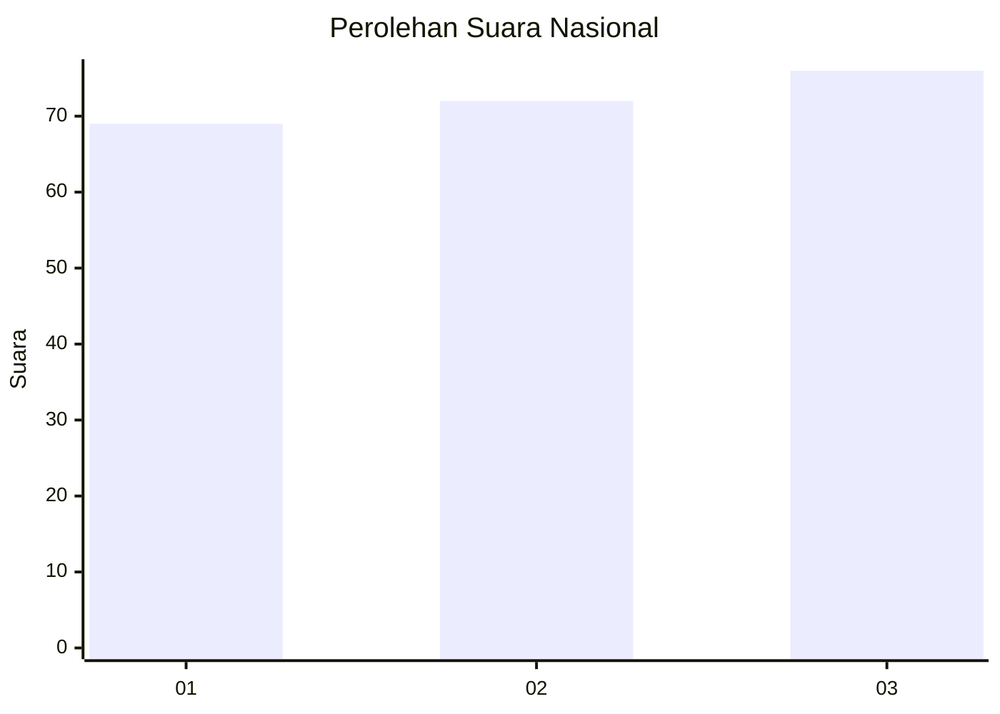
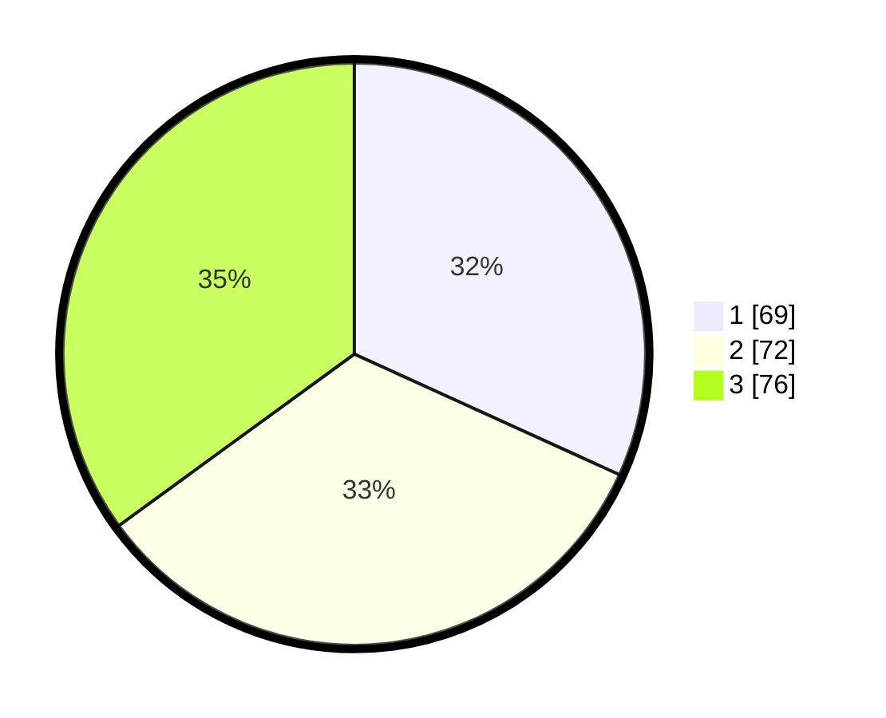

# Hasil

## Grafik

## Tabel

| No.    | Nama Paslon    | Suara | Suara (raw) | Persentase |
|:------ |:-------------- | -----:| -----------:| ----------:|
| 100025 | ANIES MUHAIMIN | 69    | [69][p-1]   | 31,80      |
| 100026 | PRABOWO GIBRAN | 72    | [72][p-2]   | 33,18      |
| 100027 | GANJAR MAHFUD  | 76    | [76][p-3]   | 35,02      |

[p-1]: https://github.com/gigit-pemilu/pemilu-2024/blob/main/pilpres/hitung-suara/sub/31-dki-jakarta/sub/73-jakarta-barat/sub/08-kembangan/sub/1004-srengseng/sub/058-tps/sub/paslon-1.txt
[p-2]: https://github.com/gigit-pemilu/pemilu-2024/blob/main/pilpres/hitung-suara/sub/31-dki-jakarta/sub/73-jakarta-barat/sub/08-kembangan/sub/1004-srengseng/sub/058-tps/sub/paslon-2.txt
[p-3]: https://github.com/gigit-pemilu/pemilu-2024/blob/main/pilpres/hitung-suara/sub/31-dki-jakarta/sub/73-jakarta-barat/sub/08-kembangan/sub/1004-srengseng/sub/058-tps/sub/paslon-3.txt

## Foto C Plano

https://sirekap-obj-formc.kpu.go.id/fdd0/pemilu/ppwp/31/73/08/10/04/3173081004058-20240214-235739--194acde3-bec2-41a9-9a88-7d80633a96a3.jpg

https://sirekap-obj-formc.kpu.go.id/fdd0/pemilu/ppwp/31/73/08/10/04/3173081004058-20240214-235858--f4f0b193-a798-4e0e-8dc9-e34036b90593.jpg

https://sirekap-obj-formc.kpu.go.id/fdd0/pemilu/ppwp/31/73/08/10/04/3173081004058-20240214-235858--f75aabda-13fd-4857-b871-6370c0e7a82c.jpg

## Metadata

| Key        | Value               |
| ---------- | ------------------- |
| Time Stamp | 2024-02-19 06:16:00 |

