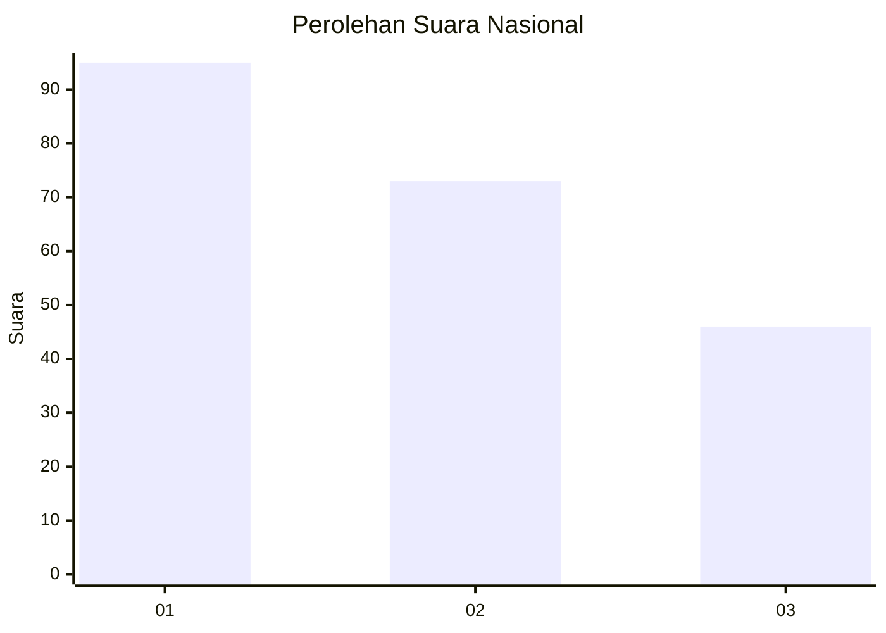
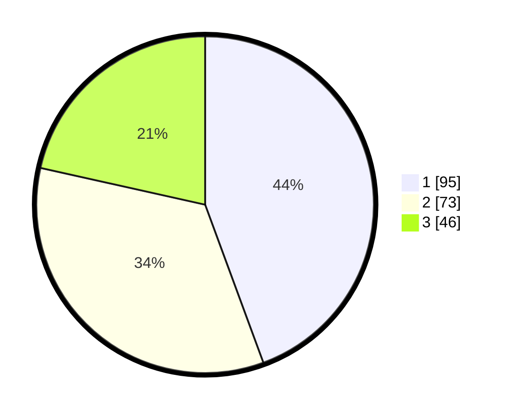

# Hasil

## Grafik

## Tabel

| No.    | Nama Paslon    | Suara | Suara (raw) | Persentase |
|:------ |:-------------- | -----:| -----------:| ----------:|
| 100025 | ANIES MUHAIMIN | 95    | [95][p-1]   | 44,39      |
| 100026 | PRABOWO GIBRAN | 73    | [73][p-2]   | 34,11      |
| 100027 | GANJAR MAHFUD  | 46    | [46][p-3]   | 21,50      |

[p-1]: https://github.com/gigit-pemilu/pemilu-2024/blob/main/pilpres/hitung-suara/sub/31-dki-jakarta/sub/73-jakarta-barat/sub/08-kembangan/sub/1004-srengseng/sub/069-tps/sub/paslon-1.txt
[p-2]: https://github.com/gigit-pemilu/pemilu-2024/blob/main/pilpres/hitung-suara/sub/31-dki-jakarta/sub/73-jakarta-barat/sub/08-kembangan/sub/1004-srengseng/sub/069-tps/sub/paslon-2.txt
[p-3]: https://github.com/gigit-pemilu/pemilu-2024/blob/main/pilpres/hitung-suara/sub/31-dki-jakarta/sub/73-jakarta-barat/sub/08-kembangan/sub/1004-srengseng/sub/069-tps/sub/paslon-3.txt

## Foto C Plano

https://sirekap-obj-formc.kpu.go.id/f7de/pemilu/ppwp/31/73/08/10/04/3173081004069-20240214-234409--de14b45a-38d5-4b3c-8919-f20a66144814.jpg

https://sirekap-obj-formc.kpu.go.id/f7de/pemilu/ppwp/31/73/08/10/04/3173081004069-20240214-234739--50f47e3b-d1be-45c4-86e6-9962d31c3541.jpg

https://sirekap-obj-formc.kpu.go.id/f7de/pemilu/ppwp/31/73/08/10/04/3173081004069-20240214-234904--ae468e48-5191-4e1b-b5f8-cfad94a77db8.jpg

## Metadata

| Key        | Value               |
| ---------- | ------------------- |
| Time Stamp | 2024-02-19 06:16:00 |

