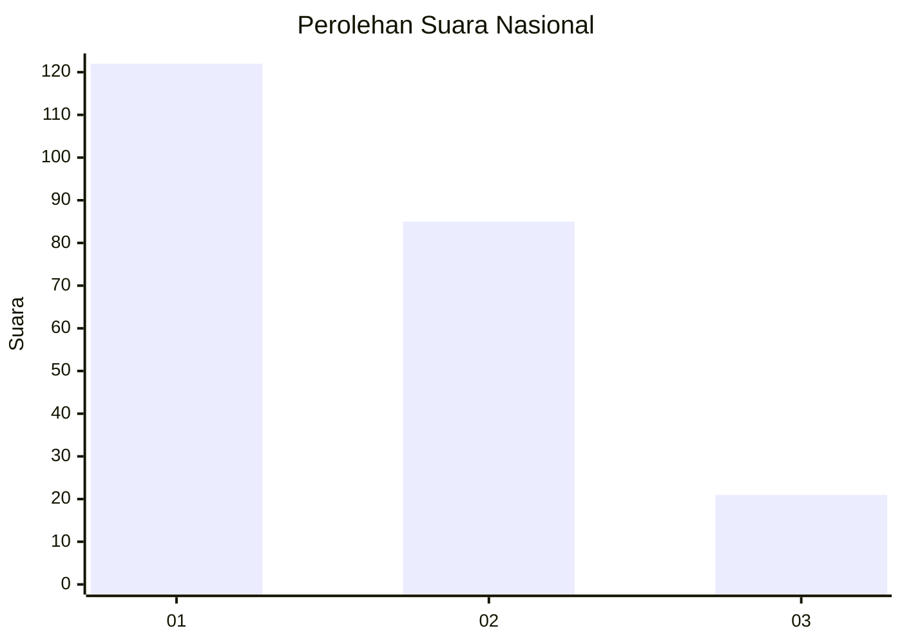
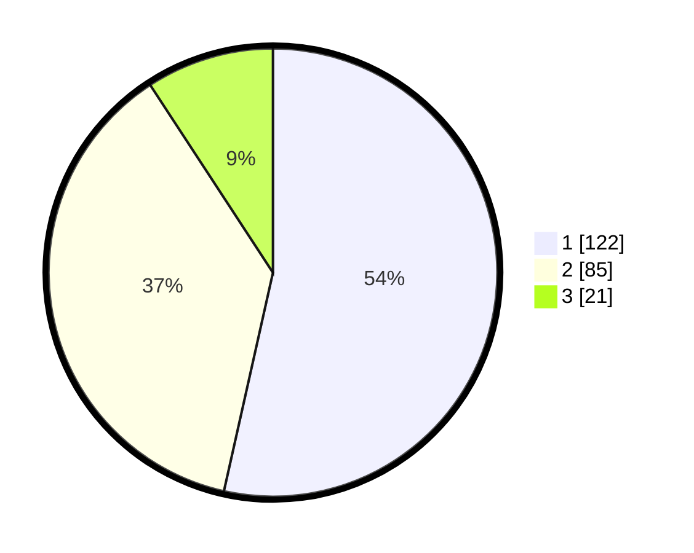

# Hasil

## Grafik

## Tabel

| No.    | Nama Paslon    | Suara | Suara (raw) | Persentase |
|:------ |:-------------- | -----:| -----------:| ----------:|
| 100025 | ANIES MUHAIMIN | 122   | [122][p-1]  | 53,51      |
| 100026 | PRABOWO GIBRAN | 85    | [85][p-2]   | 37,28      |
| 100027 | GANJAR MAHFUD  | 21    | [21][p-3]   | 9,21       |

[p-1]: https://github.com/gigit-pemilu/pemilu-2024/blob/main/pilpres/hitung-suara/sub/31-dki-jakarta/sub/73-jakarta-barat/sub/08-kembangan/sub/1004-srengseng/sub/076-tps/sub/paslon-1.txt
[p-2]: https://github.com/gigit-pemilu/pemilu-2024/blob/main/pilpres/hitung-suara/sub/31-dki-jakarta/sub/73-jakarta-barat/sub/08-kembangan/sub/1004-srengseng/sub/076-tps/sub/paslon-2.txt
[p-3]: https://github.com/gigit-pemilu/pemilu-2024/blob/main/pilpres/hitung-suara/sub/31-dki-jakarta/sub/73-jakarta-barat/sub/08-kembangan/sub/1004-srengseng/sub/076-tps/sub/paslon-3.txt

## Foto C Plano

https://sirekap-obj-formc.kpu.go.id/d71e/pemilu/ppwp/31/73/08/10/04/3173081004076-20240214-231055--e5f05993-c8d6-4a28-bd8c-05fbe7f61942.jpg

https://sirekap-obj-formc.kpu.go.id/d71e/pemilu/ppwp/31/73/08/10/04/3173081004076-20240214-231145--9130ca37-7662-43c1-b928-38dffdcd16fb.jpg

https://sirekap-obj-formc.kpu.go.id/d71e/pemilu/ppwp/31/73/08/10/04/3173081004076-20240214-231214--1f6917df-cc5a-469a-a220-ab4e040c099d.jpg

## Metadata

| Key        | Value               |
| ---------- | ------------------- |
| Time Stamp | 2024-02-19 06:16:00 |

