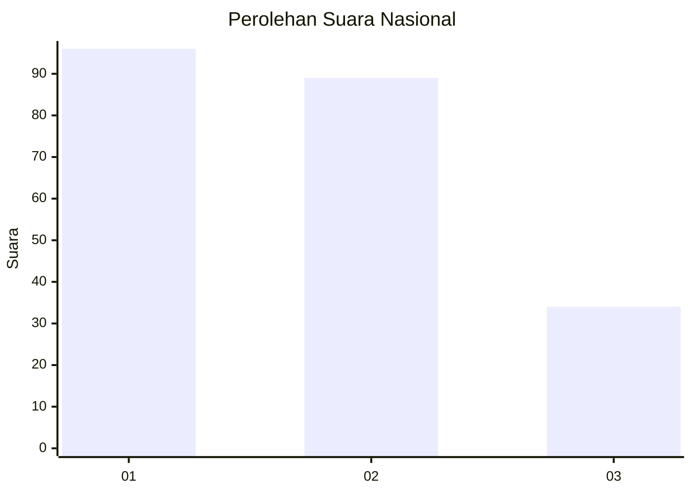
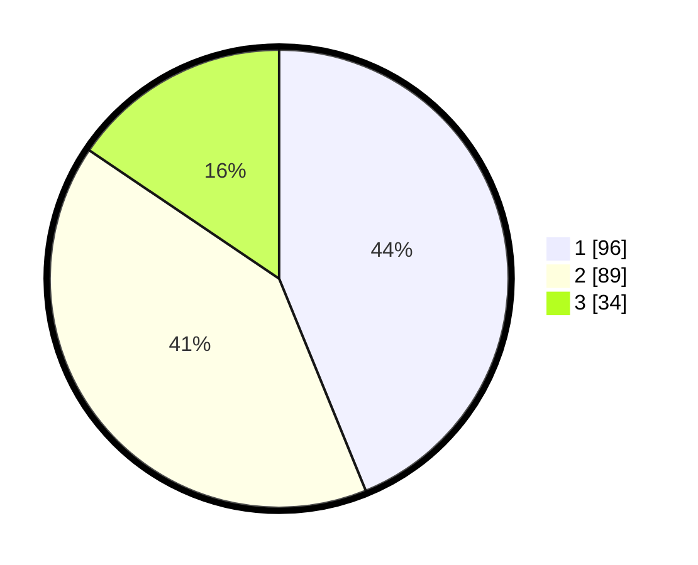

# Hasil

## Grafik

## Tabel

| No.    | Nama Paslon    | Suara | Suara (raw) | Persentase |
|:------ |:-------------- | -----:| -----------:| ----------:|
| 100025 | ANIES MUHAIMIN | 96    | [96][p-1]   | 43,84      |
| 100026 | PRABOWO GIBRAN | 89    | [89][p-2]   | 40,64      |
| 100027 | GANJAR MAHFUD  | 34    | [34][p-3]   | 15,53      |

[p-1]: https://github.com/gigit-pemilu/pemilu-2024/blob/main/pilpres/hitung-suara/sub/31-dki-jakarta/sub/73-jakarta-barat/sub/08-kembangan/sub/1004-srengseng/sub/080-tps/sub/paslon-1.txt
[p-2]: https://github.com/gigit-pemilu/pemilu-2024/blob/main/pilpres/hitung-suara/sub/31-dki-jakarta/sub/73-jakarta-barat/sub/08-kembangan/sub/1004-srengseng/sub/080-tps/sub/paslon-2.txt
[p-3]: https://github.com/gigit-pemilu/pemilu-2024/blob/main/pilpres/hitung-suara/sub/31-dki-jakarta/sub/73-jakarta-barat/sub/08-kembangan/sub/1004-srengseng/sub/080-tps/sub/paslon-3.txt

## Foto C Plano

https://sirekap-obj-formc.kpu.go.id/6bc1/pemilu/ppwp/31/73/08/10/04/3173081004080-20240214-232856--102d0f54-906f-48a0-93d8-ce4184d596da.jpg

https://sirekap-obj-formc.kpu.go.id/6bc1/pemilu/ppwp/31/73/08/10/04/3173081004080-20240214-231930--fe02b9b6-4717-463b-988c-9c41f0ed494b.jpg

https://sirekap-obj-formc.kpu.go.id/6bc1/pemilu/ppwp/31/73/08/10/04/3173081004080-20240214-232016--f8695ee8-5659-48a1-8f98-ac43530667ab.jpg

## Metadata

| Key        | Value               |
| ---------- | ------------------- |
| Time Stamp | 2024-02-19 06:16:00 |

