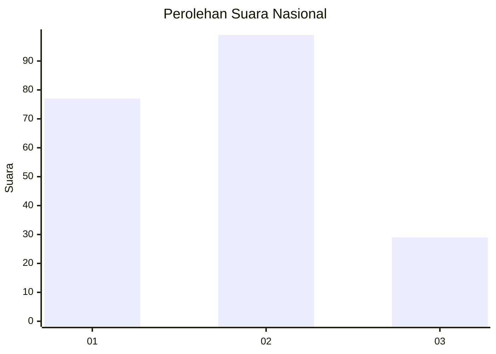
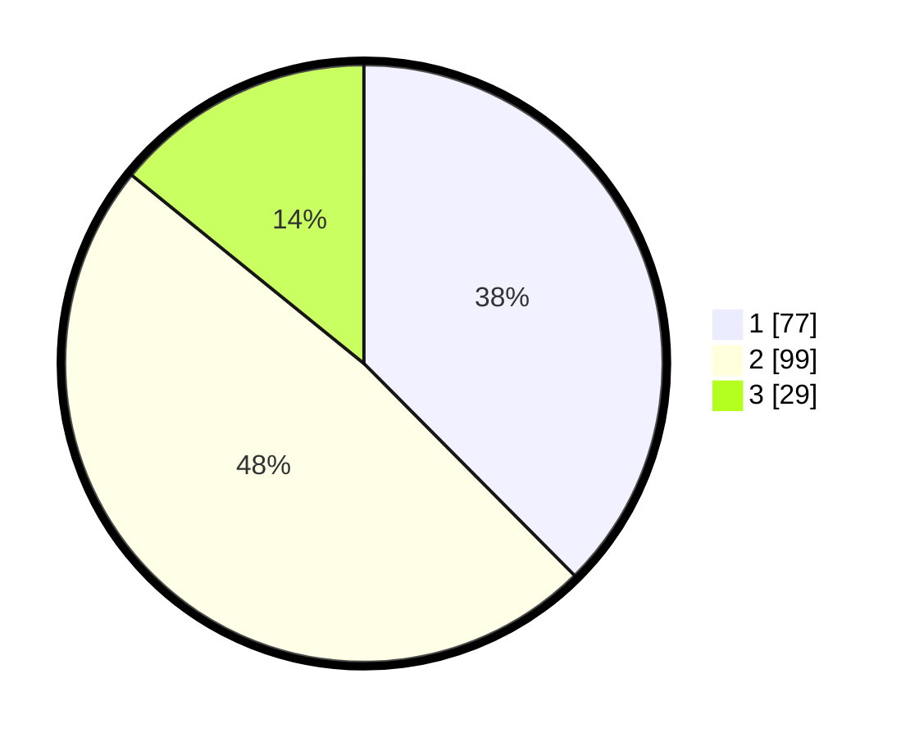

# Hasil

## Grafik

## Tabel

| No.    | Nama Paslon    | Suara | Suara (raw) | Persentase |
|:------ |:-------------- | -----:| -----------:| ----------:|
| 100025 | ANIES MUHAIMIN | 77    | [77][p-1]   | 37,56      |
| 100026 | PRABOWO GIBRAN | 99    | [99][p-2]   | 48,29      |
| 100027 | GANJAR MAHFUD  | 29    | [29][p-3]   | 14,15      |

[p-1]: https://github.com/gigit-pemilu/pemilu-2024/blob/main/pilpres/hitung-suara/sub/31-dki-jakarta/sub/73-jakarta-barat/sub/08-kembangan/sub/1004-srengseng/sub/082-tps/sub/paslon-1.txt
[p-2]: https://github.com/gigit-pemilu/pemilu-2024/blob/main/pilpres/hitung-suara/sub/31-dki-jakarta/sub/73-jakarta-barat/sub/08-kembangan/sub/1004-srengseng/sub/082-tps/sub/paslon-2.txt
[p-3]: https://github.com/gigit-pemilu/pemilu-2024/blob/main/pilpres/hitung-suara/sub/31-dki-jakarta/sub/73-jakarta-barat/sub/08-kembangan/sub/1004-srengseng/sub/082-tps/sub/paslon-3.txt

## Foto C Plano

https://sirekap-obj-formc.kpu.go.id/d7d7/pemilu/ppwp/31/73/08/10/04/3173081004082-20240214-233222--c4b297f2-70ce-44fe-a902-2665e17c4d4f.jpg

https://sirekap-obj-formc.kpu.go.id/d7d7/pemilu/ppwp/31/73/08/10/04/3173081004082-20240214-233349--f7c4a342-704b-4287-8c39-8fa0a56f582c.jpg

https://sirekap-obj-formc.kpu.go.id/d7d7/pemilu/ppwp/31/73/08/10/04/3173081004082-20240214-233443--e5f8c874-dd32-4f94-94d6-4608afcb0edf.jpg

## Metadata

| Key        | Value               |
| ---------- | ------------------- |
| Time Stamp | 2024-02-16 03:00:26 |

