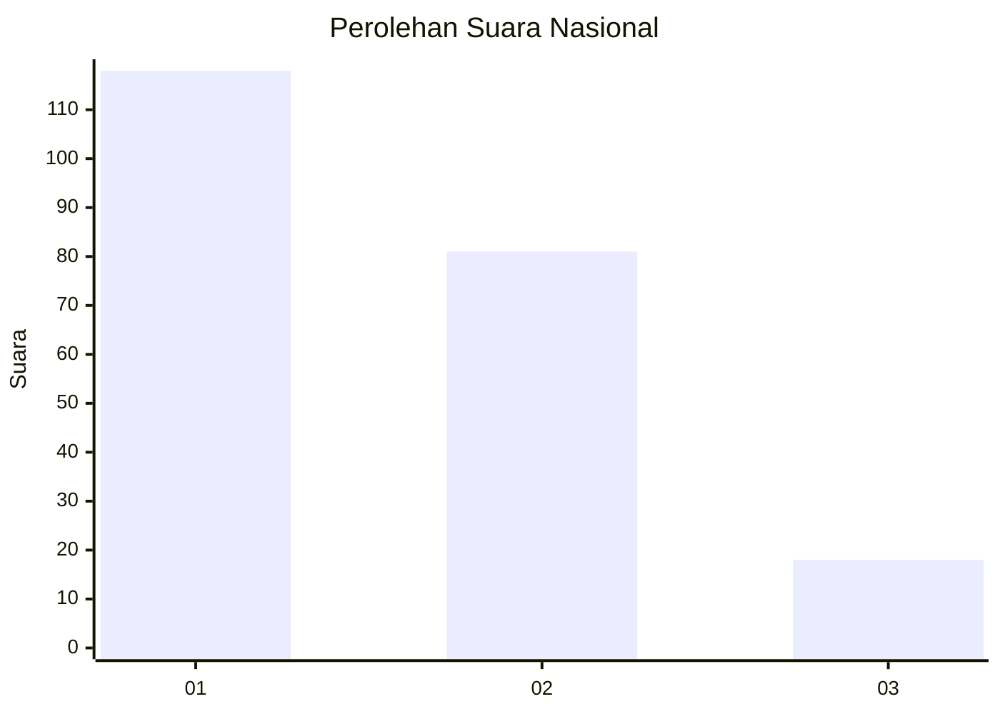
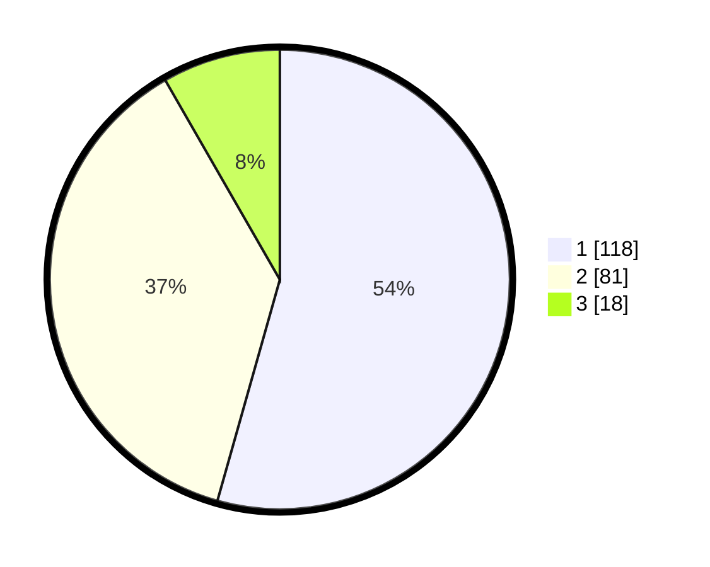

# Hasil

## Grafik

## Tabel

| No.    | Nama Paslon    | Suara | Suara (raw) | Persentase |
|:------ |:-------------- | -----:| -----------:| ----------:|
| 100025 | ANIES MUHAIMIN | 118   | [118][p-1]  | 54,38      |
| 100026 | PRABOWO GIBRAN | 81    | [81][p-2]   | 37,33      |
| 100027 | GANJAR MAHFUD  | 18    | [18][p-3]   | 8,29       |

[p-1]: https://github.com/gigit-pemilu/pemilu-2024/blob/main/pilpres/hitung-suara/sub/31-dki-jakarta/sub/73-jakarta-barat/sub/08-kembangan/sub/1004-srengseng/sub/083-tps/sub/paslon-1.txt
[p-2]: https://github.com/gigit-pemilu/pemilu-2024/blob/main/pilpres/hitung-suara/sub/31-dki-jakarta/sub/73-jakarta-barat/sub/08-kembangan/sub/1004-srengseng/sub/083-tps/sub/paslon-2.txt
[p-3]: https://github.com/gigit-pemilu/pemilu-2024/blob/main/pilpres/hitung-suara/sub/31-dki-jakarta/sub/73-jakarta-barat/sub/08-kembangan/sub/1004-srengseng/sub/083-tps/sub/paslon-3.txt

## Foto C Plano

https://sirekap-obj-formc.kpu.go.id/b523/pemilu/ppwp/31/73/08/10/04/3173081004083-20240214-215150--c3d2cc6e-2718-439d-92ce-078a7b639a4d.jpg

https://sirekap-obj-formc.kpu.go.id/b523/pemilu/ppwp/31/73/08/10/04/3173081004083-20240214-210037--2fe0c440-c501-4c57-afdd-82bf25662aaf.jpg

https://sirekap-obj-formc.kpu.go.id/b523/pemilu/ppwp/31/73/08/10/04/3173081004083-20240214-210133--c2e21b28-3c79-45e5-b837-31a9ce69de46.jpg

## Metadata

| Key        | Value               |
| ---------- | ------------------- |
| Time Stamp | 2024-02-19 06:16:00 |

