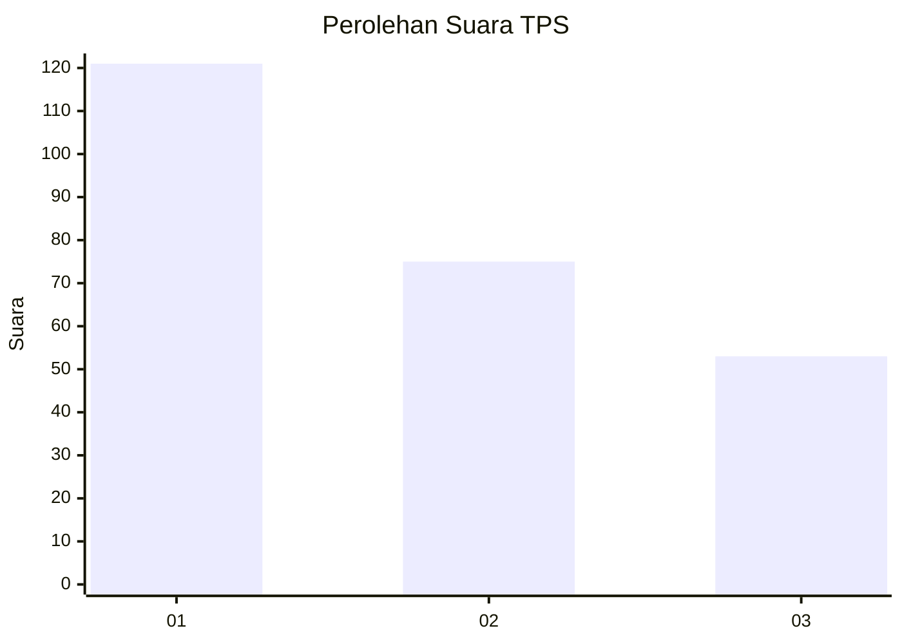
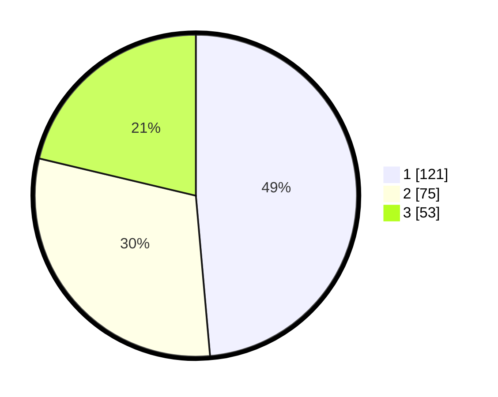

# Hasil

## Grafik

## Tabel

| No. | Nama Paslon    | Suara | Suara (raw) | Persentase |
|:--- |:-------------- | -----:| -----------:| ----------:|
| 1   | ANIES MUHAIMIN | 121   | [121][p-1]  | 48,59      |
| 2   | PRABOWO GIBRAN | 75    | [75][p-2]   | 30,12      |
| 3   | GANJAR MAHFUD  | 53    | [53][p-3]   | 21,29      |

[p-1]: https://github.com/gigit-pemilu/pemilu-2024-31-dki-jakarta/blob/main/pilpres/hitung-suara/sub/31-dki-jakarta/sub/73-jakarta-barat/sub/08-kembangan/sub/1004-srengseng/sub/094-tps/sub/paslon-1.txt
[p-2]: https://github.com/gigit-pemilu/pemilu-2024-31-dki-jakarta/blob/main/pilpres/hitung-suara/sub/31-dki-jakarta/sub/73-jakarta-barat/sub/08-kembangan/sub/1004-srengseng/sub/094-tps/sub/paslon-2.txt
[p-3]: https://github.com/gigit-pemilu/pemilu-2024-31-dki-jakarta/blob/main/pilpres/hitung-suara/sub/31-dki-jakarta/sub/73-jakarta-barat/sub/08-kembangan/sub/1004-srengseng/sub/094-tps/sub/paslon-3.txt

## Foto C Plano

https://sirekap-obj-formc.kpu.go.id/9ca9/pemilu/ppwp/31/73/08/10/04/3173081004094-20240214-211923--a42aff5b-ee88-4a8a-8ef2-85c0185ca69f.jpg

https://sirekap-obj-formc.kpu.go.id/9ca9/pemilu/ppwp/31/73/08/10/04/3173081004094-20240214-212053--d2b1b1fb-c5e4-4c9d-b929-a80f366107fd.jpg

https://sirekap-obj-formc.kpu.go.id/9ca9/pemilu/ppwp/31/73/08/10/04/3173081004094-20240214-231430--0cc72253-5a09-4ef9-9ae3-9ad77fe43c84.jpg

## Metadata

| Key        | Value               |
| ---------- | ------------------- |
| Time Stamp | 2024-02-15 00:41:44 |

