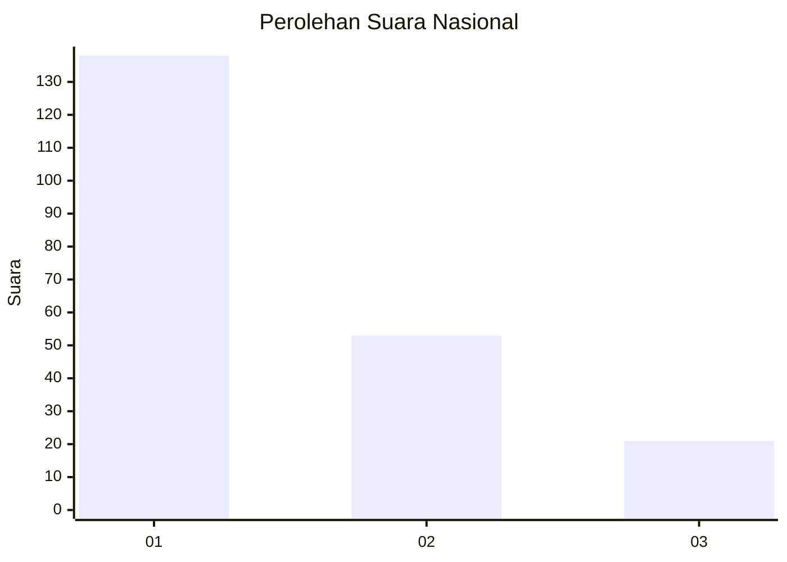
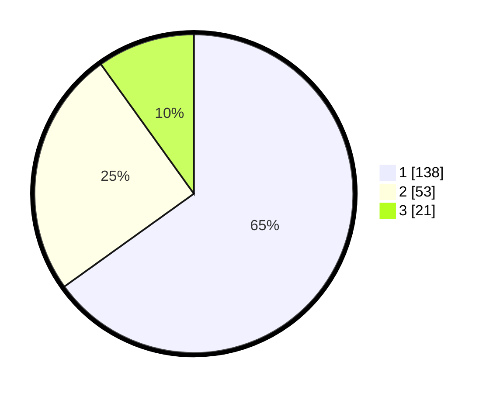

# Hasil

## Grafik

## Tabel

| No.    | Nama Paslon    | Suara | Suara (raw) | Persentase |
|:------ |:-------------- | -----:| -----------:| ----------:|
| 100025 | ANIES MUHAIMIN | 138   | [138][p-1]  | 65,09      |
| 100026 | PRABOWO GIBRAN | 53    | [53][p-2]   | 25,00      |
| 100027 | GANJAR MAHFUD  | 21    | [21][p-3]   | 9,91       |

[p-1]: https://github.com/gigit-pemilu/pemilu-2024/blob/main/pilpres/hitung-suara/sub/31-dki-jakarta/sub/73-jakarta-barat/sub/08-kembangan/sub/1004-srengseng/sub/101-tps/sub/paslon-1.txt
[p-2]: https://github.com/gigit-pemilu/pemilu-2024/blob/main/pilpres/hitung-suara/sub/31-dki-jakarta/sub/73-jakarta-barat/sub/08-kembangan/sub/1004-srengseng/sub/101-tps/sub/paslon-2.txt
[p-3]: https://github.com/gigit-pemilu/pemilu-2024/blob/main/pilpres/hitung-suara/sub/31-dki-jakarta/sub/73-jakarta-barat/sub/08-kembangan/sub/1004-srengseng/sub/101-tps/sub/paslon-3.txt

## Foto C Plano

https://sirekap-obj-formc.kpu.go.id/7210/pemilu/ppwp/31/73/08/10/04/3173081004101-20240216-165245--58417cca-036d-47b7-8cbe-d08d51a45d66.jpg

https://sirekap-obj-formc.kpu.go.id/7210/pemilu/ppwp/31/73/08/10/04/3173081004101-20240215-020301--57434313-7c8c-478b-9c69-35bfab7baad3.jpg

https://sirekap-obj-formc.kpu.go.id/7210/pemilu/ppwp/31/73/08/10/04/3173081004101-20240215-020351--035221a0-8a06-4ee0-8a04-e747782029b3.jpg

## Metadata

| Key        | Value               |
| ---------- | ------------------- |
| Time Stamp | 2024-02-16 17:00:00 |

