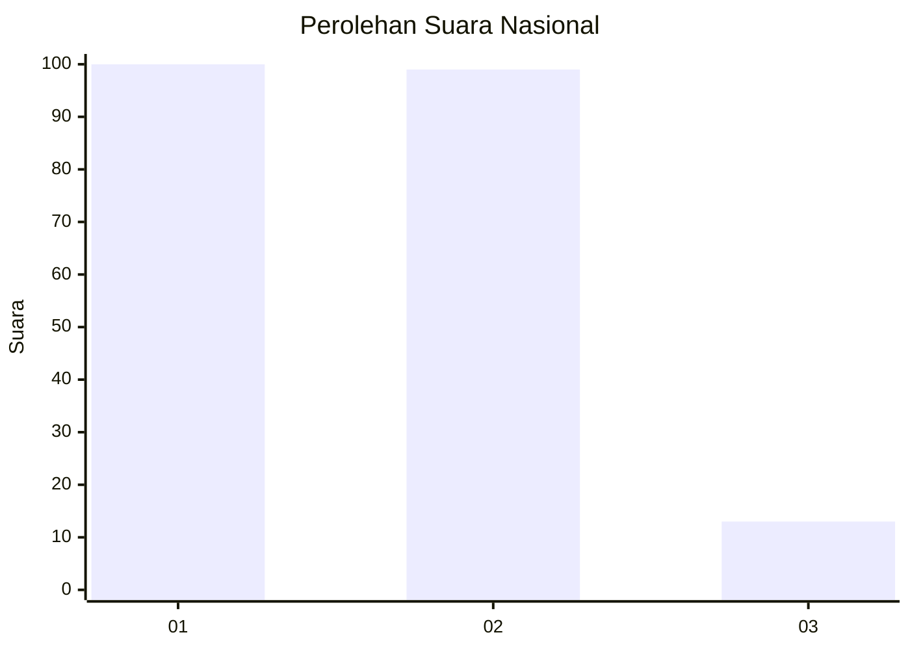
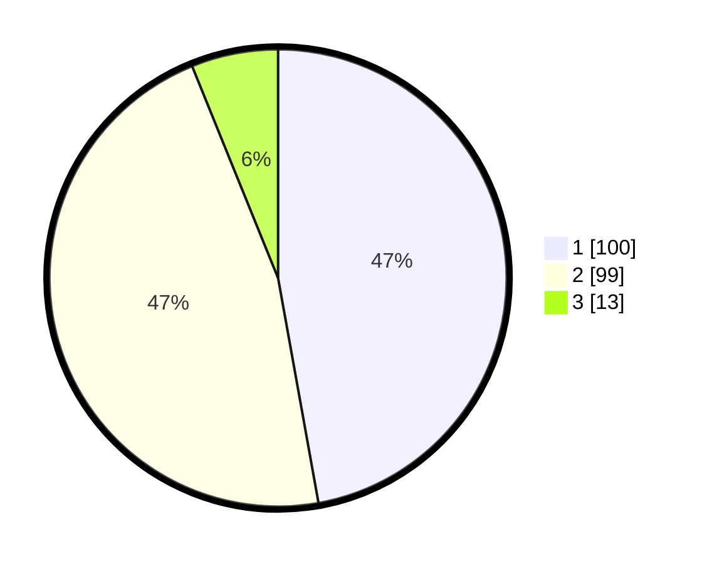

# Hasil

## Grafik

## Tabel

| No.    | Nama Paslon    | Suara | Suara (raw) | Persentase |
|:------ |:-------------- | -----:| -----------:| ----------:|
| 100025 | ANIES MUHAIMIN | 100   | [100][p-1]  | 47,17      |
| 100026 | PRABOWO GIBRAN | 99    | [99][p-2]   | 46,70      |
| 100027 | GANJAR MAHFUD  | 13    | [13][p-3]   | 6,13       |

[p-1]: https://github.com/gigit-pemilu/pemilu-2024/blob/main/pilpres/hitung-suara/sub/31-dki-jakarta/sub/73-jakarta-barat/sub/08-kembangan/sub/1004-srengseng/sub/118-tps/sub/paslon-1.txt
[p-2]: https://github.com/gigit-pemilu/pemilu-2024/blob/main/pilpres/hitung-suara/sub/31-dki-jakarta/sub/73-jakarta-barat/sub/08-kembangan/sub/1004-srengseng/sub/118-tps/sub/paslon-2.txt
[p-3]: https://github.com/gigit-pemilu/pemilu-2024/blob/main/pilpres/hitung-suara/sub/31-dki-jakarta/sub/73-jakarta-barat/sub/08-kembangan/sub/1004-srengseng/sub/118-tps/sub/paslon-3.txt

## Foto C Plano

https://sirekap-obj-formc.kpu.go.id/4796/pemilu/ppwp/31/73/08/10/04/3173081004118-20240215-015200--4c812f1c-5213-425d-ae16-53f94cda411d.jpg

https://sirekap-obj-formc.kpu.go.id/4796/pemilu/ppwp/31/73/08/10/04/3173081004118-20240215-015049--fa80f36a-146a-4e4d-8cb0-403f396eae60.jpg

https://sirekap-obj-formc.kpu.go.id/4796/pemilu/ppwp/31/73/08/10/04/3173081004118-20240215-015128--7831da77-2906-4fee-ae7f-cc3e4eace633.jpg

## Metadata

| Key        | Value               |
| ---------- | ------------------- |
| Time Stamp | 2024-02-19 06:16:00 |

