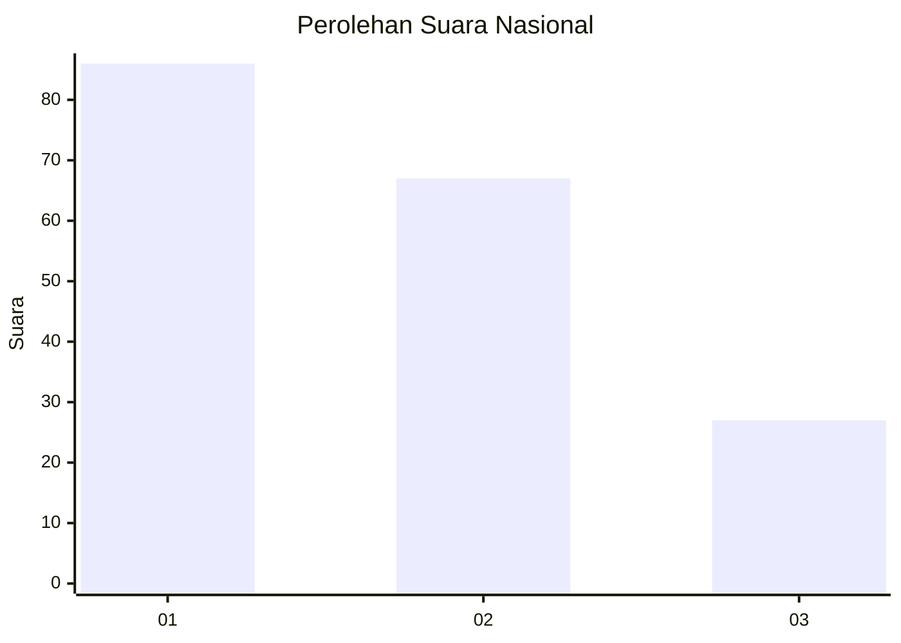
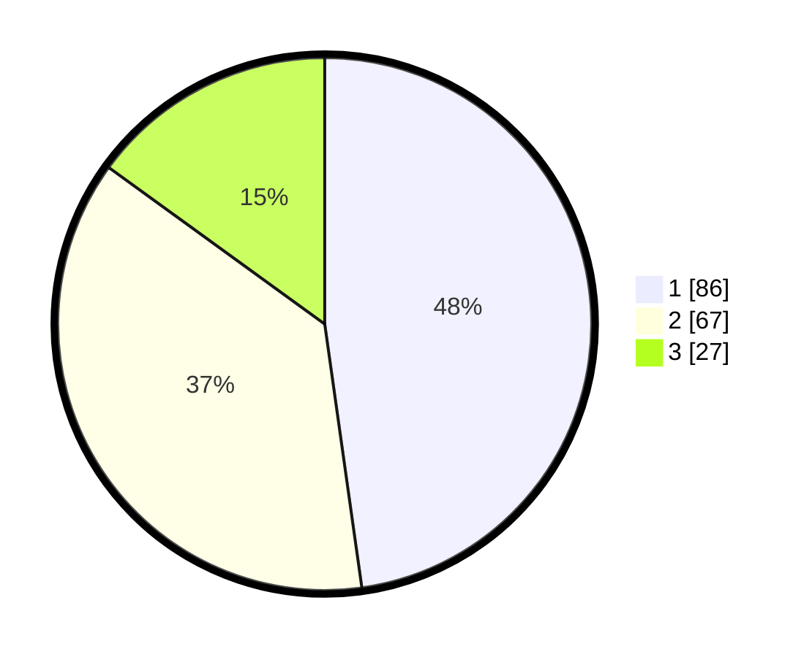

# Hasil

## Grafik

## Tabel

| No.    | Nama Paslon    | Suara | Suara (raw) | Persentase |
|:------ |:-------------- | -----:| -----------:| ----------:|
| 100025 | ANIES MUHAIMIN | 86    | [86][p-1]   | 47,78      |
| 100026 | PRABOWO GIBRAN | 67    | [67][p-2]   | 37,22      |
| 100027 | GANJAR MAHFUD  | 27    | [27][p-3]   | 15,00      |

[p-1]: https://github.com/gigit-pemilu/pemilu-2024/blob/main/pilpres/hitung-suara/sub/31-dki-jakarta/sub/73-jakarta-barat/sub/08-kembangan/sub/1004-srengseng/sub/120-tps/sub/paslon-1.txt
[p-2]: https://github.com/gigit-pemilu/pemilu-2024/blob/main/pilpres/hitung-suara/sub/31-dki-jakarta/sub/73-jakarta-barat/sub/08-kembangan/sub/1004-srengseng/sub/120-tps/sub/paslon-2.txt
[p-3]: https://github.com/gigit-pemilu/pemilu-2024/blob/main/pilpres/hitung-suara/sub/31-dki-jakarta/sub/73-jakarta-barat/sub/08-kembangan/sub/1004-srengseng/sub/120-tps/sub/paslon-3.txt

## Foto C Plano

https://sirekap-obj-formc.kpu.go.id/72e3/pemilu/ppwp/31/73/08/10/04/3173081004120-20240215-022639--4ab91a0c-b8a1-4fb9-bec6-928c2923137e.jpg

https://sirekap-obj-formc.kpu.go.id/72e3/pemilu/ppwp/31/73/08/10/04/3173081004120-20240215-022746--47c61192-38b3-4545-a8cd-645275026b12.jpg

https://sirekap-obj-formc.kpu.go.id/72e3/pemilu/ppwp/31/73/08/10/04/3173081004120-20240215-022842--8d24865c-f990-454d-9e62-4c3c129965c3.jpg

## Metadata

| Key        | Value               |
| ---------- | ------------------- |
| Time Stamp | 2024-02-16 03:00:26 |

