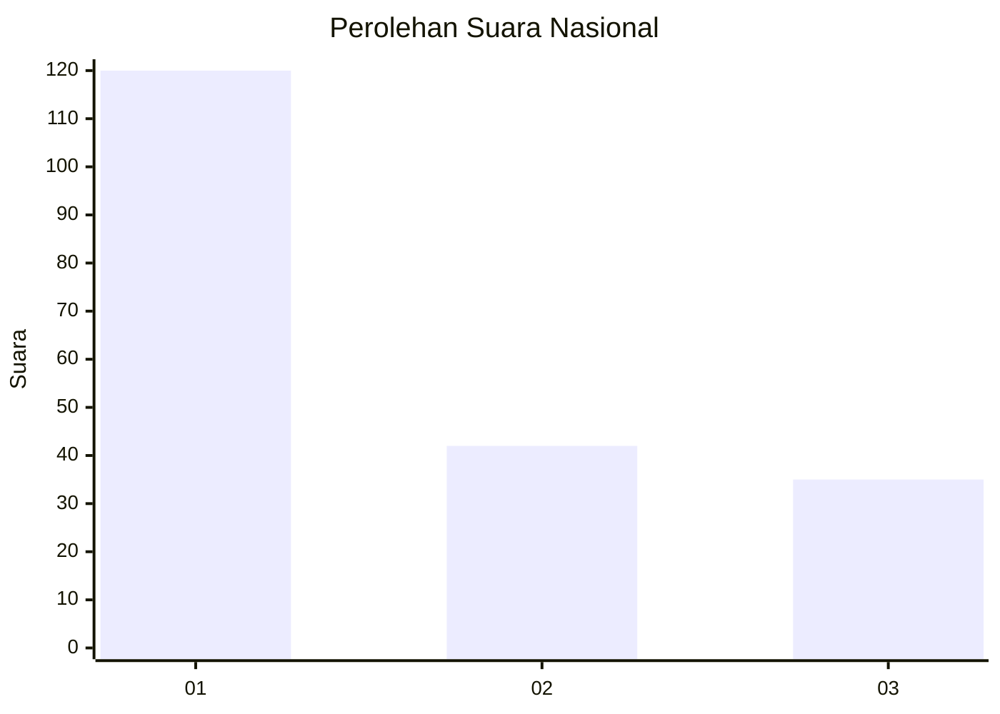
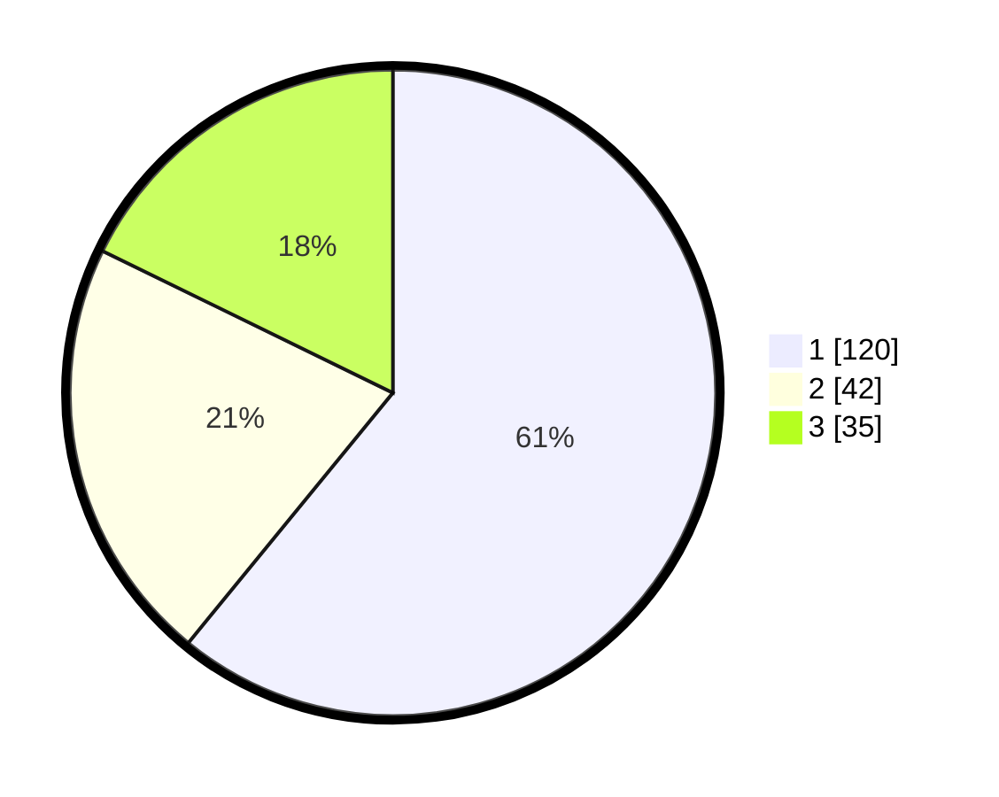

# Hasil

## Grafik

## Tabel

| No.    | Nama Paslon    | Suara | Suara (raw) | Persentase |
|:------ |:-------------- | -----:| -----------:| ----------:|
| 100025 | ANIES MUHAIMIN | 120   | [120][p-1]  | 60,91      |
| 100026 | PRABOWO GIBRAN | 42    | [42][p-2]   | 21,32      |
| 100027 | GANJAR MAHFUD  | 35    | [35][p-3]   | 17,77      |

[p-1]: https://github.com/gigit-pemilu/pemilu-2024/blob/main/pilpres/hitung-suara/sub/31-dki-jakarta/sub/73-jakarta-barat/sub/08-kembangan/sub/1004-srengseng/sub/122-tps/sub/paslon-1.txt
[p-2]: https://github.com/gigit-pemilu/pemilu-2024/blob/main/pilpres/hitung-suara/sub/31-dki-jakarta/sub/73-jakarta-barat/sub/08-kembangan/sub/1004-srengseng/sub/122-tps/sub/paslon-2.txt
[p-3]: https://github.com/gigit-pemilu/pemilu-2024/blob/main/pilpres/hitung-suara/sub/31-dki-jakarta/sub/73-jakarta-barat/sub/08-kembangan/sub/1004-srengseng/sub/122-tps/sub/paslon-3.txt

## Foto C Plano

https://sirekap-obj-formc.kpu.go.id/c634/pemilu/ppwp/31/73/08/10/04/3173081004122-20240215-010006--850c19bb-a568-4986-9539-72c7f17eddfe.jpg

https://sirekap-obj-formc.kpu.go.id/c634/pemilu/ppwp/31/73/08/10/04/3173081004122-20240215-010130--36d9192b-4d8d-4bcf-8bac-b1af4a0487ab.jpg

https://sirekap-obj-formc.kpu.go.id/c634/pemilu/ppwp/31/73/08/10/04/3173081004122-20240215-010222--261fb50d-4177-4db6-b938-06a4bb0bef8c.jpg

## Metadata

| Key        | Value               |
| ---------- | ------------------- |
| Time Stamp | 2024-02-16 03:00:26 |

