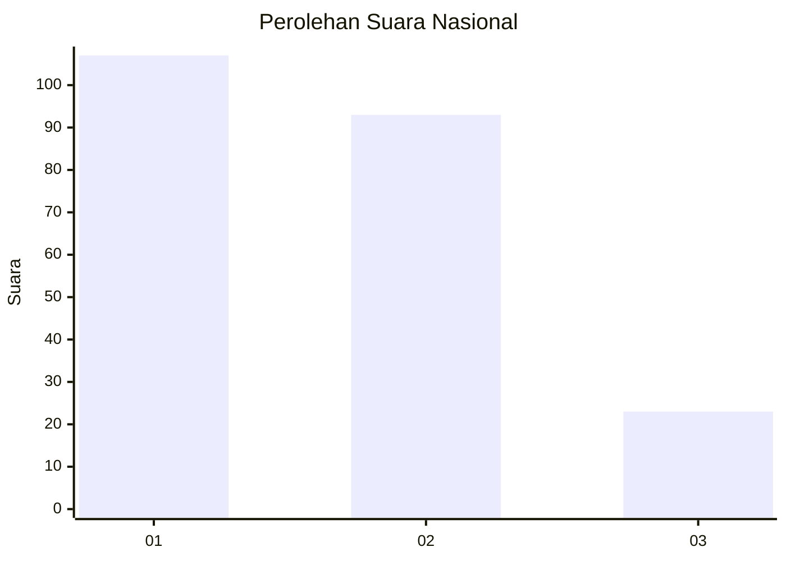
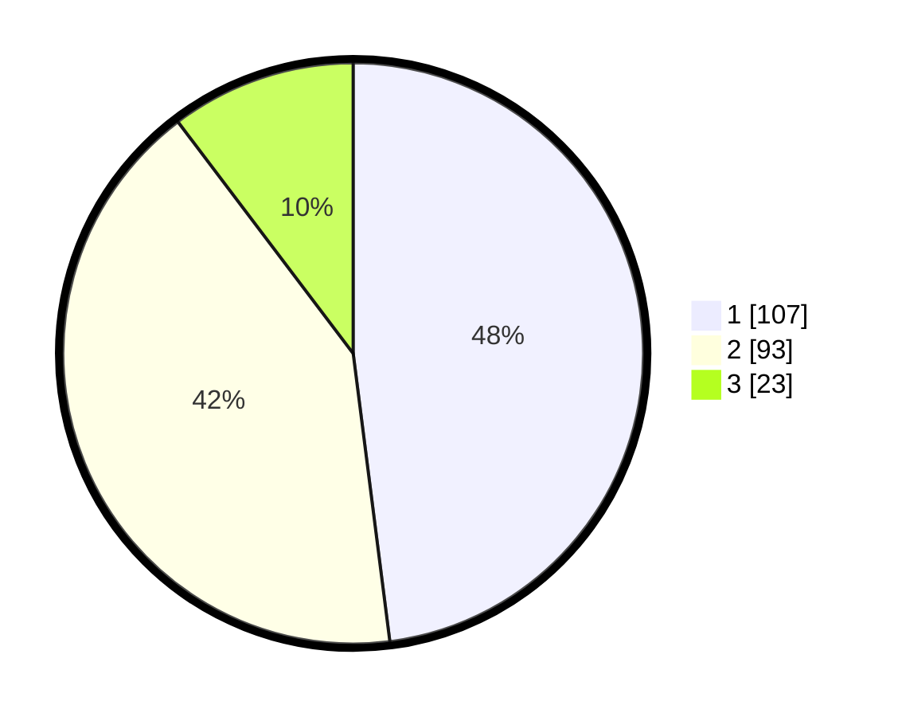

# Hasil

## Grafik

## Tabel

| No.    | Nama Paslon    | Suara | Suara (raw) | Persentase |
|:------ |:-------------- | -----:| -----------:| ----------:|
| 100025 | ANIES MUHAIMIN | 107   | [107][p-1]  | 47,98      |
| 100026 | PRABOWO GIBRAN | 93    | [93][p-2]   | 41,70      |
| 100027 | GANJAR MAHFUD  | 23    | [23][p-3]   | 10,31      |

[p-1]: https://github.com/gigit-pemilu/pemilu-2024/blob/main/pilpres/hitung-suara/sub/31-dki-jakarta/sub/73-jakarta-barat/sub/08-kembangan/sub/1004-srengseng/sub/125-tps/sub/paslon-1.txt
[p-2]: https://github.com/gigit-pemilu/pemilu-2024/blob/main/pilpres/hitung-suara/sub/31-dki-jakarta/sub/73-jakarta-barat/sub/08-kembangan/sub/1004-srengseng/sub/125-tps/sub/paslon-2.txt
[p-3]: https://github.com/gigit-pemilu/pemilu-2024/blob/main/pilpres/hitung-suara/sub/31-dki-jakarta/sub/73-jakarta-barat/sub/08-kembangan/sub/1004-srengseng/sub/125-tps/sub/paslon-3.txt

## Foto C Plano

https://sirekap-obj-formc.kpu.go.id/d1c7/pemilu/ppwp/31/73/08/10/04/3173081004125-20240214-155424--1a3aebb5-7c5d-4509-b39e-d6dd12457dec.jpg

https://sirekap-obj-formc.kpu.go.id/d1c7/pemilu/ppwp/31/73/08/10/04/3173081004125-20240214-155528--03400b7c-d864-43d7-abc6-7d7962d15fa9.jpg

https://sirekap-obj-formc.kpu.go.id/d1c7/pemilu/ppwp/31/73/08/10/04/3173081004125-20240214-222915--061f9960-f593-46f5-a236-0f1a2cfe2b3c.jpg

## Metadata

| Key        | Value               |
| ---------- | ------------------- |
| Time Stamp | 2024-02-15 00:41:44 |

