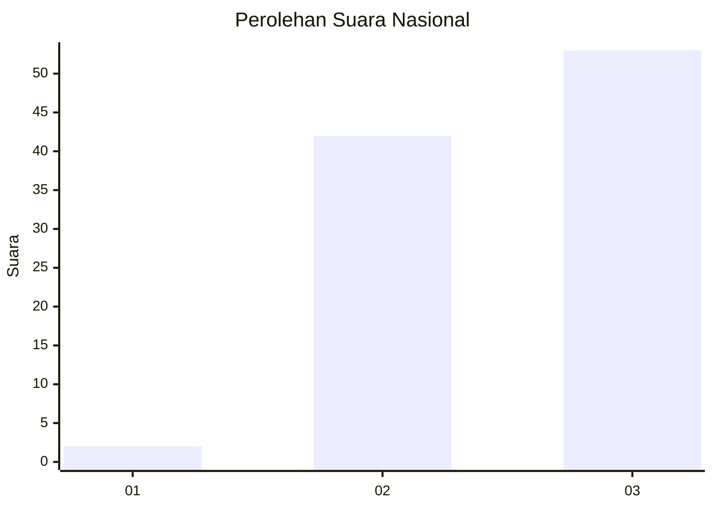
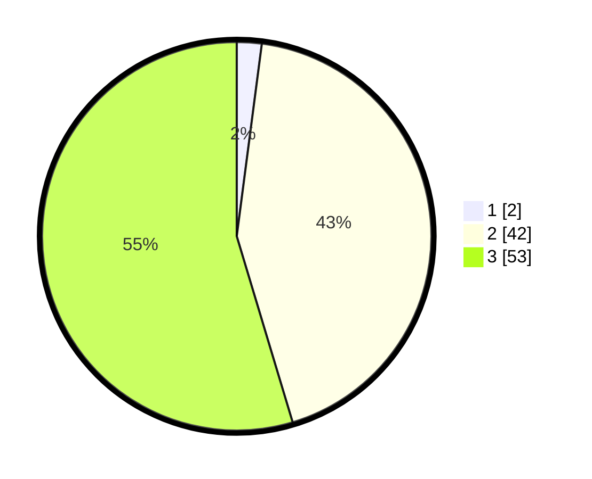

# Hasil

## Grafik

## Tabel

| No.    | Nama Paslon    | Suara | Suara (raw) | Persentase |
|:------ |:-------------- | -----:| -----------:| ----------:|
| 100025 | ANIES MUHAIMIN | 2     | [2][p-1]    | 2,06       |
| 100026 | PRABOWO GIBRAN | 42    | [42][p-2]   | 43,30      |
| 100027 | GANJAR MAHFUD  | 53    | [53][p-3]   | 54,64      |

[p-1]: https://github.com/gigit-pemilu/pemilu-2024/blob/main/pilpres/hitung-suara/sub/31-dki-jakarta/sub/73-jakarta-barat/sub/08-kembangan/sub/1004-srengseng/sub/151-tps/sub/paslon-1.txt
[p-2]: https://github.com/gigit-pemilu/pemilu-2024/blob/main/pilpres/hitung-suara/sub/31-dki-jakarta/sub/73-jakarta-barat/sub/08-kembangan/sub/1004-srengseng/sub/151-tps/sub/paslon-2.txt
[p-3]: https://github.com/gigit-pemilu/pemilu-2024/blob/main/pilpres/hitung-suara/sub/31-dki-jakarta/sub/73-jakarta-barat/sub/08-kembangan/sub/1004-srengseng/sub/151-tps/sub/paslon-3.txt

## Foto C Plano

https://sirekap-obj-formc.kpu.go.id/de8c/pemilu/ppwp/31/73/08/10/04/3173081004151-20240214-160107--bf68f04e-cf04-4136-8828-c1435e5be6e0.jpg

https://sirekap-obj-formc.kpu.go.id/de8c/pemilu/ppwp/31/73/08/10/04/3173081004151-20240214-190540--7853f12a-c814-4637-9847-db06cc2e4cae.jpg

https://sirekap-obj-formc.kpu.go.id/de8c/pemilu/ppwp/31/73/08/10/04/3173081004151-20240214-190744--a2090e62-14b5-4898-b822-55cc4f7b0ff3.jpg

## Metadata

| Key        | Value               |
| ---------- | ------------------- |
| Time Stamp | 2024-02-14 21:46:01 |

## DATA PEMILIH TETAP

Jumlah pemilih dalam DPT: **124**.
 * L: **58**.
 * P: **55**.

## DATA PENGGUNA HAK PILIH

Jumlah pengguna hak pilih dalam DPT: **41**.
 * L: **42**.
 * P: **49**.

Jumlah pengguna hak pilih dalam DPTb: **2**.
 * L: **552**.
 * P: **555**.

Jumlah pengguna hak pilih dalam DPK: **4**.
 * L: **7**.
 * P: **1**.

Jumlah pengguna hak pilih: **47**.
 * L: **47**.
 * P: **50**.

## JUMLAH SUARA SAH DAN TIDAK SAH

JUMLAH SELURUH SUARA SAH: **47**.

JUMLAH SUARA TIDAK SAH: **400**.

JUMLAH SELURUH SUARA SAH DAN SUARA TIDAK SAH: **47**.

