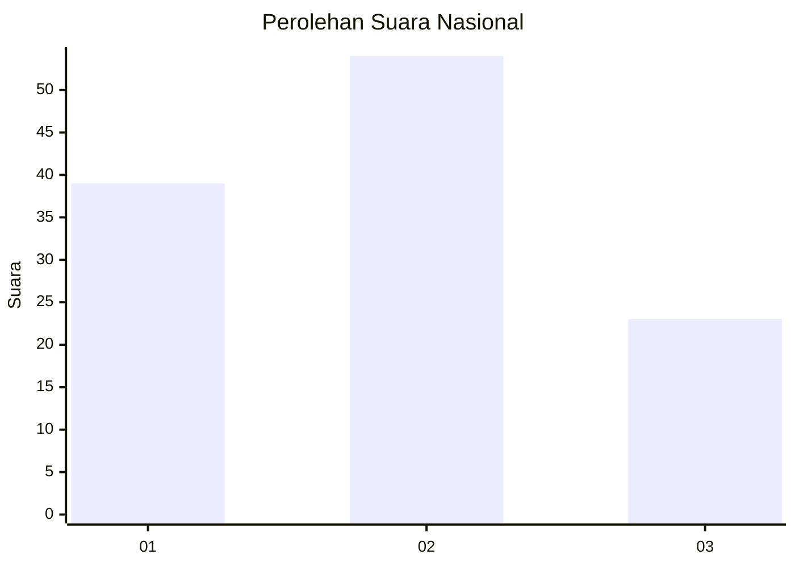
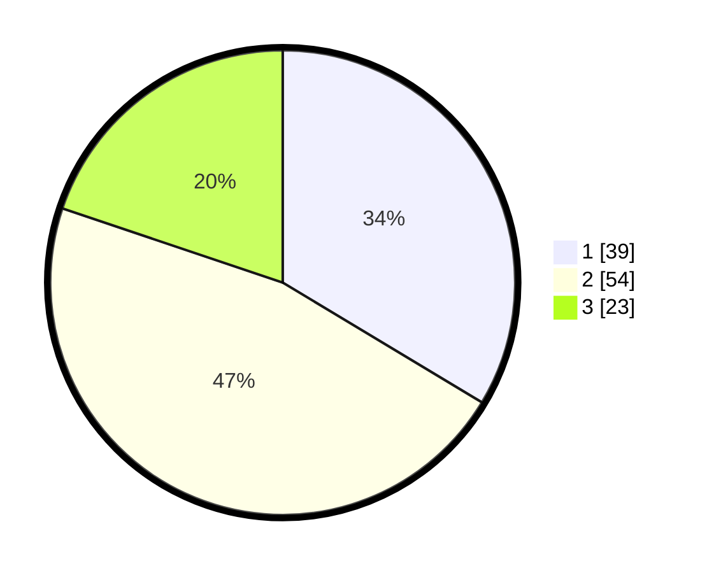

# Hasil

## Grafik

## Tabel

| No. | Nama Paslon    | Suara | Suara (raw) | Persentase |
|:--- |:-------------- | -----:| -----------:| ----------:|
| 1   | ANIES MUHAIMIN | 39    | [39][p-1]   | 33,62      |
| 2   | PRABOWO GIBRAN | 54    | [54][p-2]   | 46,55      |
| 3   | GANJAR MAHFUD  | 23    | [23][p-3]   | 19,83      |

[p-1]: https://github.com/gigit-pemilu/pemilu-2024/blob/main/pilpres/hitung-suara/sub/31-dki-jakarta/sub/73-jakarta-barat/sub/08-kembangan/sub/1004-srengseng/sub/158-tps/sub/paslon-1.txt
[p-2]: https://github.com/gigit-pemilu/pemilu-2024/blob/main/pilpres/hitung-suara/sub/31-dki-jakarta/sub/73-jakarta-barat/sub/08-kembangan/sub/1004-srengseng/sub/158-tps/sub/paslon-2.txt
[p-3]: https://github.com/gigit-pemilu/pemilu-2024/blob/main/pilpres/hitung-suara/sub/31-dki-jakarta/sub/73-jakarta-barat/sub/08-kembangan/sub/1004-srengseng/sub/158-tps/sub/paslon-3.txt

## Foto C Plano

https://sirekap-obj-formc.kpu.go.id/ed3b/pemilu/ppwp/31/73/08/10/04/3173081004158-20240214-235629--d8ed138f-d340-43cf-bc2b-a0d678290f46.jpg

https://sirekap-obj-formc.kpu.go.id/ed3b/pemilu/ppwp/31/73/08/10/04/3173081004158-20240214-235741--6dff2a33-e6c1-4e14-9e6a-9abd23e520b4.jpg

https://sirekap-obj-formc.kpu.go.id/ed3b/pemilu/ppwp/31/73/08/10/04/3173081004158-20240214-235949--c077e25d-3739-4ff4-a24b-b45e6fcc23b2.jpg

## Metadata

| Key        | Value               |
| ---------- | ------------------- |
| Time Stamp | 2024-02-19 06:16:00 |

