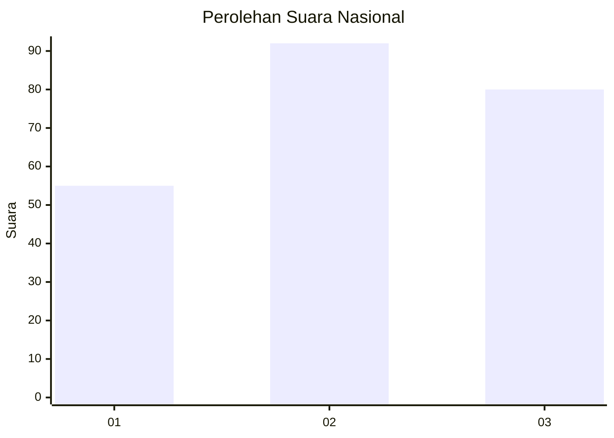
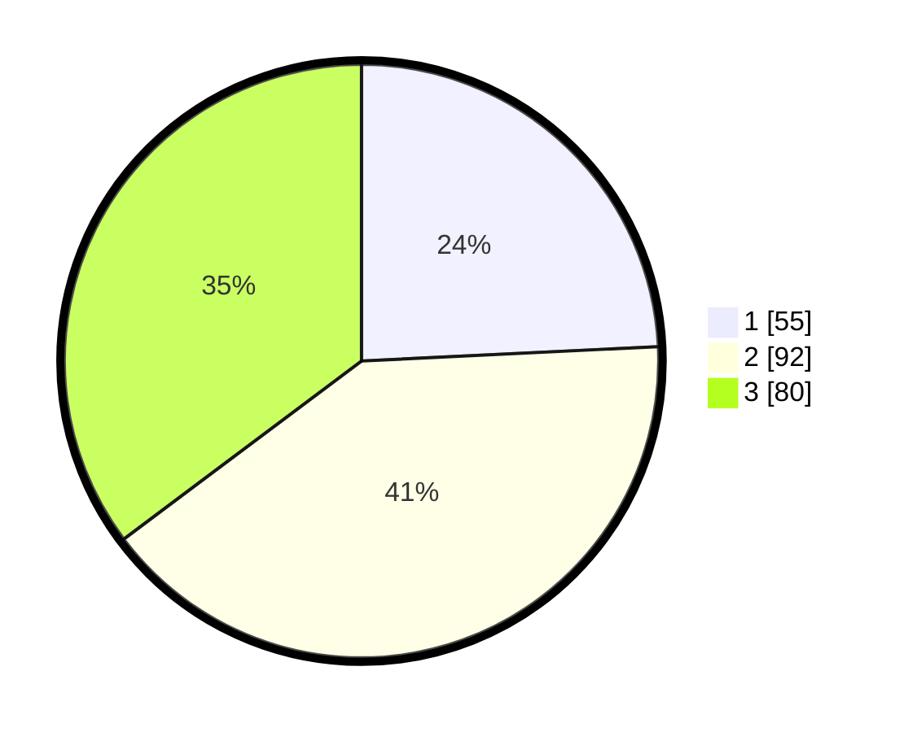

# Hasil

## Grafik

## Tabel

| No.    | Nama Paslon    | Suara | Suara (raw) | Persentase |
|:------ |:-------------- | -----:| -----------:| ----------:|
| 100025 | ANIES MUHAIMIN | 55    | [55][p-1]   | 24,23      |
| 100026 | PRABOWO GIBRAN | 92    | [92][p-2]   | 40,53      |
| 100027 | GANJAR MAHFUD  | 80    | [80][p-3]   | 35,24      |

[p-1]: https://github.com/gigit-pemilu/pemilu-2024/blob/main/pilpres/hitung-suara/sub/31-dki-jakarta/sub/73-jakarta-barat/sub/08-kembangan/sub/1005-joglo/sub/013-tps/sub/paslon-1.txt
[p-2]: https://github.com/gigit-pemilu/pemilu-2024/blob/main/pilpres/hitung-suara/sub/31-dki-jakarta/sub/73-jakarta-barat/sub/08-kembangan/sub/1005-joglo/sub/013-tps/sub/paslon-2.txt
[p-3]: https://github.com/gigit-pemilu/pemilu-2024/blob/main/pilpres/hitung-suara/sub/31-dki-jakarta/sub/73-jakarta-barat/sub/08-kembangan/sub/1005-joglo/sub/013-tps/sub/paslon-3.txt

## Foto C Plano

https://sirekap-obj-formc.kpu.go.id/2e99/pemilu/ppwp/31/73/08/10/05/3173081005013-20240214-230236--df9b4c61-f23d-4554-8c80-61a241abb63a.jpg

https://sirekap-obj-formc.kpu.go.id/2e99/pemilu/ppwp/31/73/08/10/05/3173081005013-20240214-211301--e351df3b-9700-4534-b37c-465e3f546d37.jpg

https://sirekap-obj-formc.kpu.go.id/2e99/pemilu/ppwp/31/73/08/10/05/3173081005013-20240214-213319--0abc4baa-a5ce-497a-bc24-2e993af354ce.jpg

## Metadata

| Key        | Value               |
| ---------- | ------------------- |
| Time Stamp | 2024-02-19 06:16:00 |

