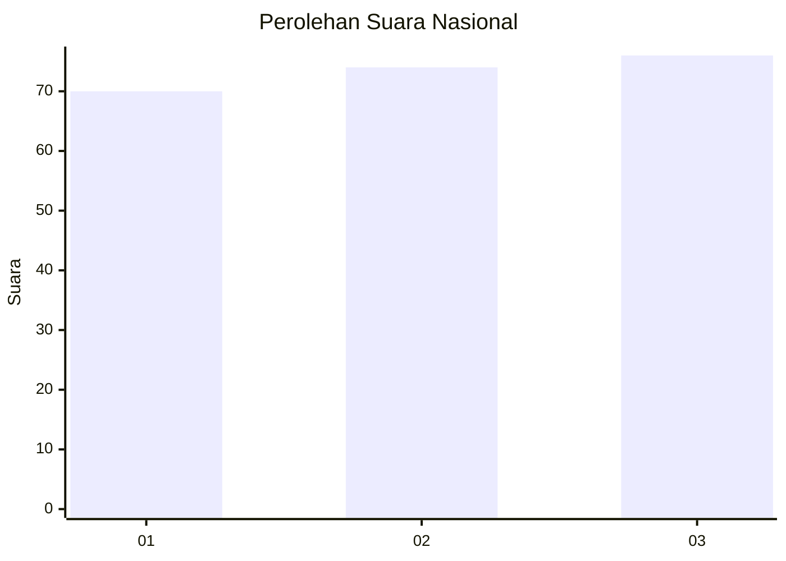
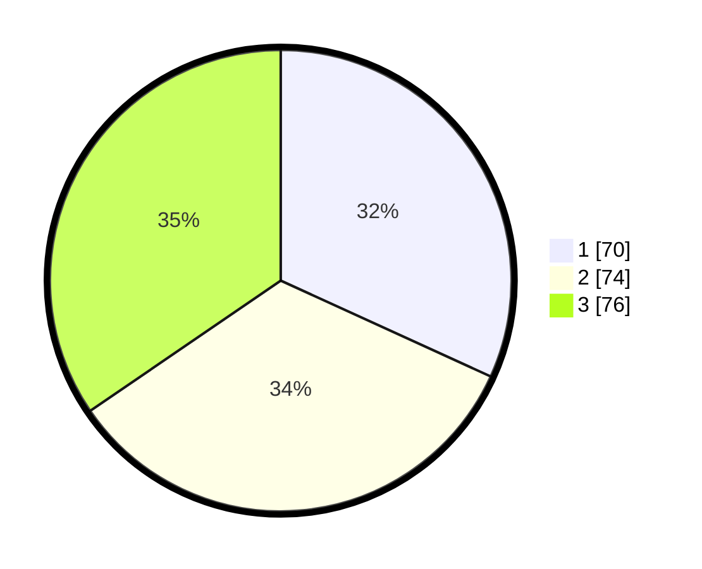

# Hasil

## Grafik

## Tabel

| No.    | Nama Paslon    | Suara | Suara (raw) | Persentase |
|:------ |:-------------- | -----:| -----------:| ----------:|
| 100025 | ANIES MUHAIMIN | 70    | [70][p-1]   | 31,82      |
| 100026 | PRABOWO GIBRAN | 74    | [74][p-2]   | 33,64      |
| 100027 | GANJAR MAHFUD  | 76    | [76][p-3]   | 34,55      |

[p-1]: https://github.com/gigit-pemilu/pemilu-2024/blob/main/pilpres/hitung-suara/sub/31-dki-jakarta/sub/73-jakarta-barat/sub/08-kembangan/sub/1005-joglo/sub/017-tps/sub/paslon-1.txt
[p-2]: https://github.com/gigit-pemilu/pemilu-2024/blob/main/pilpres/hitung-suara/sub/31-dki-jakarta/sub/73-jakarta-barat/sub/08-kembangan/sub/1005-joglo/sub/017-tps/sub/paslon-2.txt
[p-3]: https://github.com/gigit-pemilu/pemilu-2024/blob/main/pilpres/hitung-suara/sub/31-dki-jakarta/sub/73-jakarta-barat/sub/08-kembangan/sub/1005-joglo/sub/017-tps/sub/paslon-3.txt

## Foto C Plano

https://sirekap-obj-formc.kpu.go.id/7972/pemilu/ppwp/31/73/08/10/05/3173081005017-20240215-231642--1917f1e8-0d29-41a7-886d-b4f16705c31e.jpg

https://sirekap-obj-formc.kpu.go.id/7972/pemilu/ppwp/31/73/08/10/05/3173081005017-20240214-231822--91a9e2b4-16ea-499f-9780-fd1bf536b67d.jpg

https://sirekap-obj-formc.kpu.go.id/7972/pemilu/ppwp/31/73/08/10/05/3173081005017-20240214-232024--27d4f80c-a315-44bc-9bb9-4a15d5b2e5d7.jpg

## Metadata

| Key        | Value               |
| ---------- | ------------------- |
| Time Stamp | 2024-02-16 03:00:26 |

