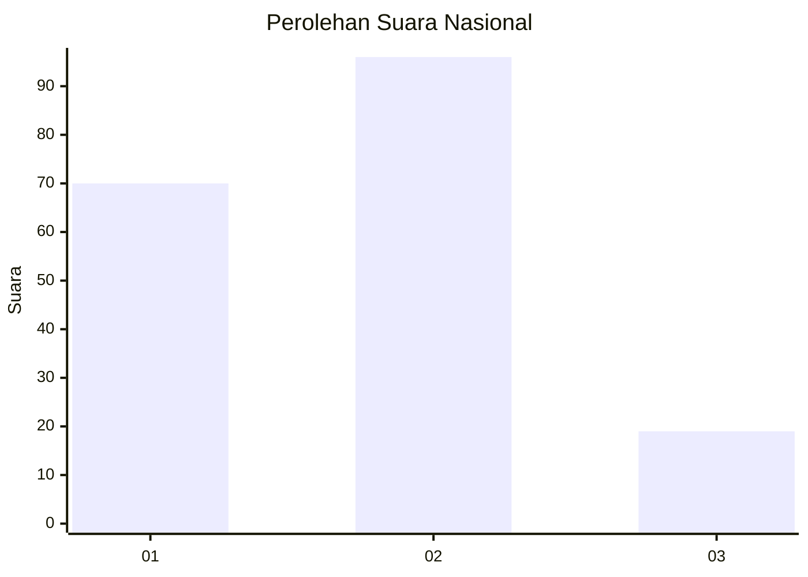
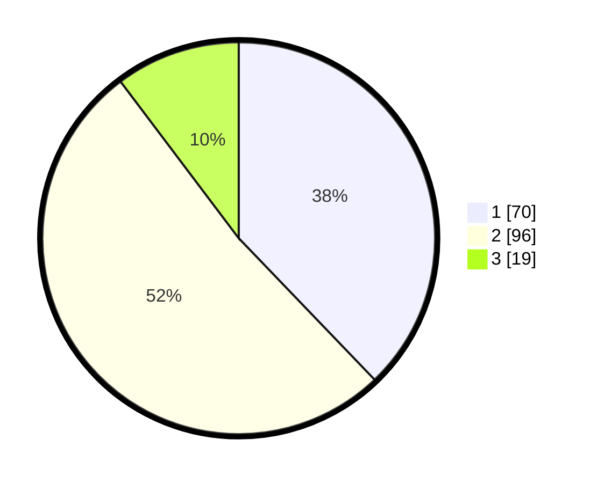

# Hasil

## Grafik

## Tabel

| No.    | Nama Paslon    | Suara | Suara (raw) | Persentase |
|:------ |:-------------- | -----:| -----------:| ----------:|
| 100025 | ANIES MUHAIMIN | 70    | [70][p-1]   | 37,84      |
| 100026 | PRABOWO GIBRAN | 96    | [96][p-2]   | 51,89      |
| 100027 | GANJAR MAHFUD  | 19    | [19][p-3]   | 10,27      |

[p-1]: https://github.com/gigit-pemilu/pemilu-2024/blob/main/pilpres/hitung-suara/sub/31-dki-jakarta/sub/73-jakarta-barat/sub/08-kembangan/sub/1005-joglo/sub/024-tps/sub/paslon-1.txt
[p-2]: https://github.com/gigit-pemilu/pemilu-2024/blob/main/pilpres/hitung-suara/sub/31-dki-jakarta/sub/73-jakarta-barat/sub/08-kembangan/sub/1005-joglo/sub/024-tps/sub/paslon-2.txt
[p-3]: https://github.com/gigit-pemilu/pemilu-2024/blob/main/pilpres/hitung-suara/sub/31-dki-jakarta/sub/73-jakarta-barat/sub/08-kembangan/sub/1005-joglo/sub/024-tps/sub/paslon-3.txt

## Foto C Plano

https://sirekap-obj-formc.kpu.go.id/3be3/pemilu/ppwp/31/73/08/10/05/3173081005024-20240214-230547--50238b70-ee67-4809-99ec-becc2a327450.jpg

https://sirekap-obj-formc.kpu.go.id/3be3/pemilu/ppwp/31/73/08/10/05/3173081005024-20240214-230739--fa122e1a-fb50-4a15-8436-ae5c1f0c85cb.jpg

https://sirekap-obj-formc.kpu.go.id/3be3/pemilu/ppwp/31/73/08/10/05/3173081005024-20240214-230905--fb4d8e65-9cc8-404d-8bbf-63d71b00a6a6.jpg

## Metadata

| Key        | Value               |
| ---------- | ------------------- |
| Time Stamp | 2024-02-19 06:16:00 |

