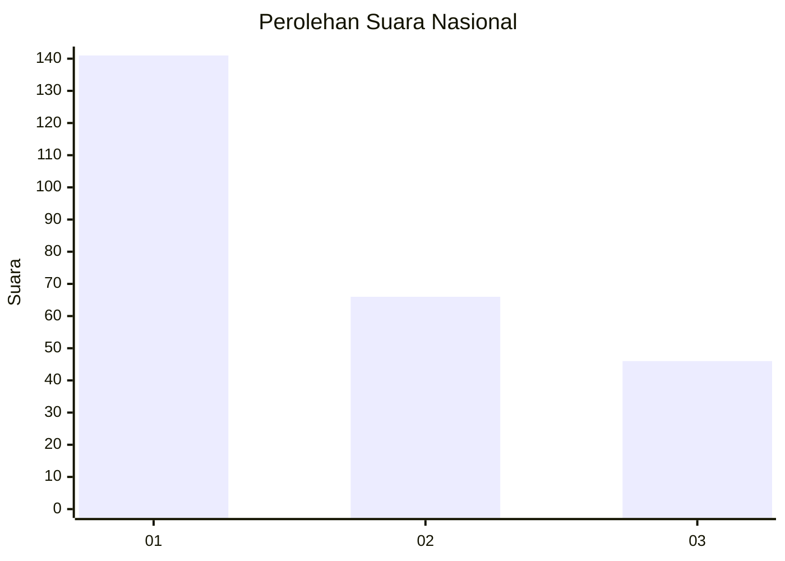
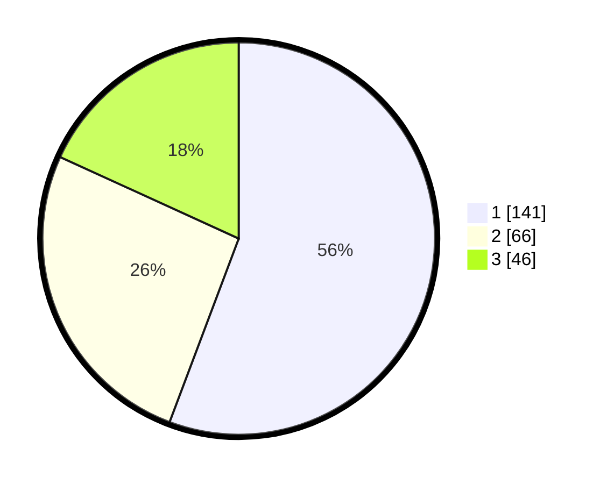

# Hasil

## Grafik

## Tabel

| No. | Nama Paslon    | Suara | Suara (raw) | Persentase |
|:--- |:-------------- | -----:| -----------:| ----------:|
| 1   | ANIES MUHAIMIN | 141   | [141][p-1]  | 55,73      |
| 2   | PRABOWO GIBRAN | 66    | [66][p-2]   | 26,09      |
| 3   | GANJAR MAHFUD  | 46    | [46][p-3]   | 18,18      |

[p-1]: https://github.com/gigit-pemilu/pemilu-2024/blob/main/pilpres/hitung-suara/sub/31-dki-jakarta/sub/73-jakarta-barat/sub/08-kembangan/sub/1005-joglo/sub/032-tps/sub/paslon-1.txt
[p-2]: https://github.com/gigit-pemilu/pemilu-2024/blob/main/pilpres/hitung-suara/sub/31-dki-jakarta/sub/73-jakarta-barat/sub/08-kembangan/sub/1005-joglo/sub/032-tps/sub/paslon-2.txt
[p-3]: https://github.com/gigit-pemilu/pemilu-2024/blob/main/pilpres/hitung-suara/sub/31-dki-jakarta/sub/73-jakarta-barat/sub/08-kembangan/sub/1005-joglo/sub/032-tps/sub/paslon-3.txt

## Foto C Plano

https://sirekap-obj-formc.kpu.go.id/0082/pemilu/ppwp/31/73/08/10/05/3173081005032-20240214-194054--20de6d17-184f-4bf9-b9bf-6bfa20b1835d.jpg

https://sirekap-obj-formc.kpu.go.id/0082/pemilu/ppwp/31/73/08/10/05/3173081005032-20240214-194117--b4b2eca1-f320-4bfc-83d4-b4c27a64e4df.jpg

https://sirekap-obj-formc.kpu.go.id/0082/pemilu/ppwp/31/73/08/10/05/3173081005032-20240214-194120--01d56cee-e3fa-4ce9-9d52-b38958da6213.jpg

## Metadata

| Key        | Value               |
| ---------- | ------------------- |
| Time Stamp | 2024-02-21 18:00:00 |

