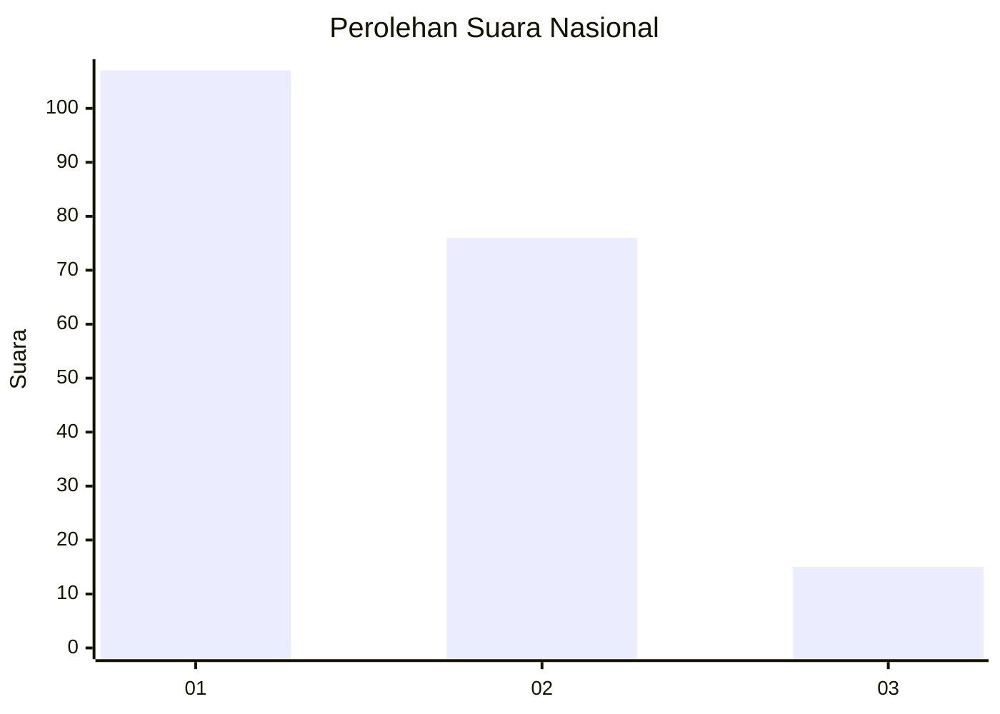
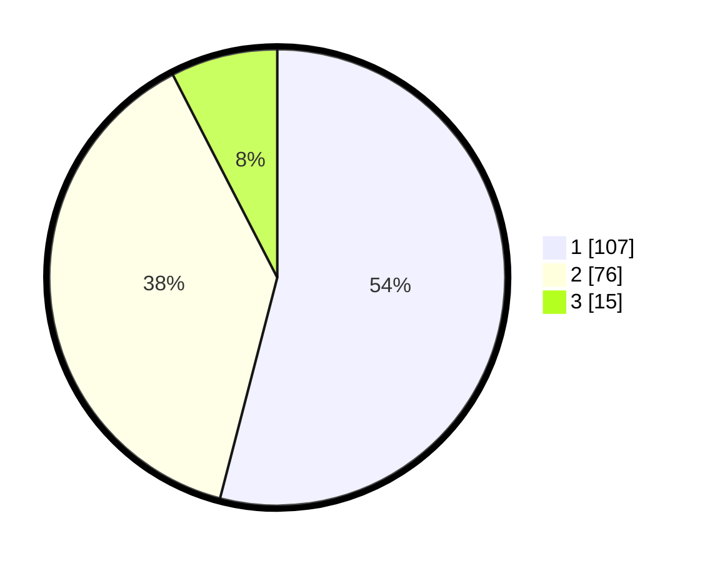

# Hasil

## Grafik

## Tabel

| No.    | Nama Paslon    | Suara | Suara (raw) | Persentase |
|:------ |:-------------- | -----:| -----------:| ----------:|
| 100025 | ANIES MUHAIMIN | 107   | [107][p-1]  | 54,04      |
| 100026 | PRABOWO GIBRAN | 76    | [76][p-2]   | 38,38      |
| 100027 | GANJAR MAHFUD  | 15    | [15][p-3]   | 7,58       |

[p-1]: https://github.com/gigit-pemilu/pemilu-2024/blob/main/pilpres/hitung-suara/sub/31-dki-jakarta/sub/73-jakarta-barat/sub/08-kembangan/sub/1005-joglo/sub/054-tps/sub/paslon-1.txt
[p-2]: https://github.com/gigit-pemilu/pemilu-2024/blob/main/pilpres/hitung-suara/sub/31-dki-jakarta/sub/73-jakarta-barat/sub/08-kembangan/sub/1005-joglo/sub/054-tps/sub/paslon-2.txt
[p-3]: https://github.com/gigit-pemilu/pemilu-2024/blob/main/pilpres/hitung-suara/sub/31-dki-jakarta/sub/73-jakarta-barat/sub/08-kembangan/sub/1005-joglo/sub/054-tps/sub/paslon-3.txt

## Foto C Plano

https://sirekap-obj-formc.kpu.go.id/a2c6/pemilu/ppwp/31/73/08/10/05/3173081005054-20240214-230019--67e9e611-7a2a-4791-956e-c7f52e7ffb39.jpg

https://sirekap-obj-formc.kpu.go.id/a2c6/pemilu/ppwp/31/73/08/10/05/3173081005054-20240214-230058--c1434283-78c1-457e-b96a-077a360632dc.jpg

https://sirekap-obj-formc.kpu.go.id/a2c6/pemilu/ppwp/31/73/08/10/05/3173081005054-20240214-230149--aff29385-a7a2-4e1d-bc82-c22f545eea42.jpg

## Metadata

| Key        | Value               |
| ---------- | ------------------- |
| Time Stamp | 2024-02-19 06:16:00 |

