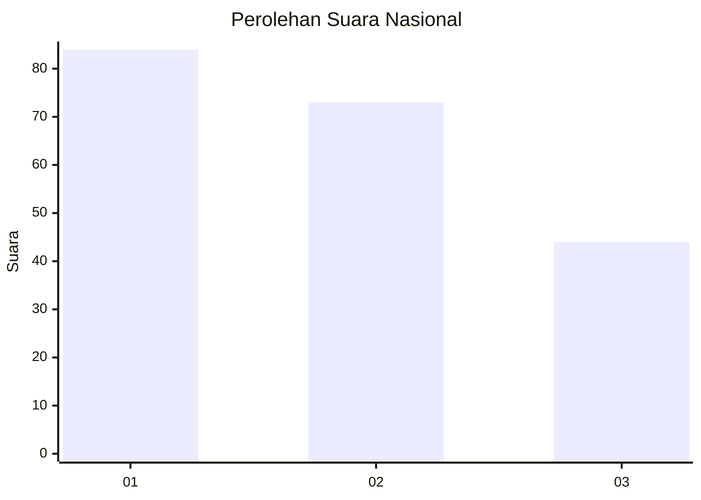
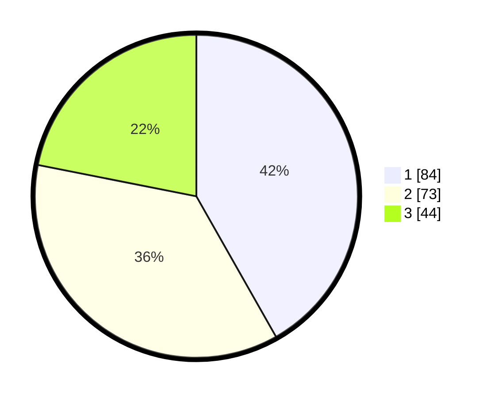

# Hasil

## Grafik

## Tabel

| No.    | Nama Paslon    | Suara | Suara (raw) | Persentase |
|:------ |:-------------- | -----:| -----------:| ----------:|
| 100025 | ANIES MUHAIMIN | 84    | [84][p-1]   | 41,79      |
| 100026 | PRABOWO GIBRAN | 73    | [73][p-2]   | 36,32      |
| 100027 | GANJAR MAHFUD  | 44    | [44][p-3]   | 21,89      |

[p-1]: https://github.com/gigit-pemilu/pemilu-2024/blob/main/pilpres/hitung-suara/sub/31-dki-jakarta/sub/73-jakarta-barat/sub/08-kembangan/sub/1005-joglo/sub/086-tps/sub/paslon-1.txt
[p-2]: https://github.com/gigit-pemilu/pemilu-2024/blob/main/pilpres/hitung-suara/sub/31-dki-jakarta/sub/73-jakarta-barat/sub/08-kembangan/sub/1005-joglo/sub/086-tps/sub/paslon-2.txt
[p-3]: https://github.com/gigit-pemilu/pemilu-2024/blob/main/pilpres/hitung-suara/sub/31-dki-jakarta/sub/73-jakarta-barat/sub/08-kembangan/sub/1005-joglo/sub/086-tps/sub/paslon-3.txt

## Foto C Plano

https://sirekap-obj-formc.kpu.go.id/efa4/pemilu/ppwp/31/73/08/10/05/3173081005086-20240214-175309--d5965968-3ab0-4215-9ee5-181a9b84b620.jpg

https://sirekap-obj-formc.kpu.go.id/efa4/pemilu/ppwp/31/73/08/10/05/3173081005086-20240214-232344--d4d7fff2-21cd-496b-84e3-fccb3b346759.jpg

https://sirekap-obj-formc.kpu.go.id/efa4/pemilu/ppwp/31/73/08/10/05/3173081005086-20240214-175316--e353eaf4-466d-4945-9fe1-fc9b7686eb6b.jpg

## Metadata

| Key        | Value               |
| ---------- | ------------------- |
| Time Stamp | 2024-02-19 06:16:00 |

