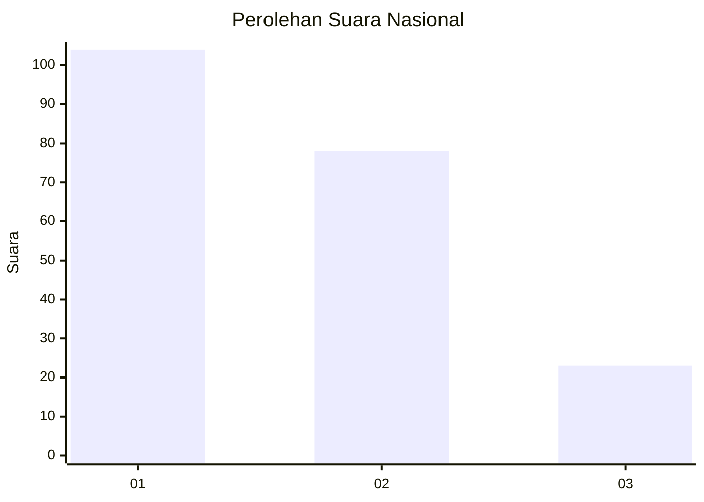
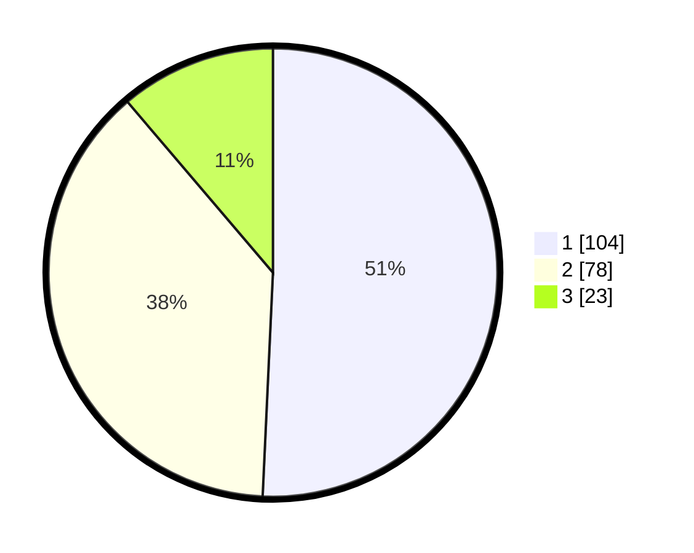

# Hasil

## Grafik

## Tabel

| No.    | Nama Paslon    | Suara | Suara (raw) | Persentase |
|:------ |:-------------- | -----:| -----------:| ----------:|
| 100025 | ANIES MUHAIMIN | 104   | [104][p-1]  | 50,73      |
| 100026 | PRABOWO GIBRAN | 78    | [78][p-2]   | 38,05      |
| 100027 | GANJAR MAHFUD  | 23    | [23][p-3]   | 11,22      |

[p-1]: https://github.com/gigit-pemilu/pemilu-2024/blob/main/pilpres/hitung-suara/sub/31-dki-jakarta/sub/73-jakarta-barat/sub/08-kembangan/sub/1005-joglo/sub/092-tps/sub/paslon-1.txt
[p-2]: https://github.com/gigit-pemilu/pemilu-2024/blob/main/pilpres/hitung-suara/sub/31-dki-jakarta/sub/73-jakarta-barat/sub/08-kembangan/sub/1005-joglo/sub/092-tps/sub/paslon-2.txt
[p-3]: https://github.com/gigit-pemilu/pemilu-2024/blob/main/pilpres/hitung-suara/sub/31-dki-jakarta/sub/73-jakarta-barat/sub/08-kembangan/sub/1005-joglo/sub/092-tps/sub/paslon-3.txt

## Foto C Plano

https://sirekap-obj-formc.kpu.go.id/31be/pemilu/ppwp/31/73/08/10/05/3173081005092-20240214-192708--75af99c9-1e4e-444e-ab1f-c7e949789280.jpg

https://sirekap-obj-formc.kpu.go.id/31be/pemilu/ppwp/31/73/08/10/05/3173081005092-20240214-193042--ec5a83ba-ecfb-4d3a-a321-d5da4c6116c0.jpg

https://sirekap-obj-formc.kpu.go.id/31be/pemilu/ppwp/31/73/08/10/05/3173081005092-20240214-193207--7a15c01a-e50a-46ce-a061-be7f35fa49da.jpg

## Metadata

| Key        | Value               |
| ---------- | ------------------- |
| Time Stamp | 2024-02-16 16:25:10 |

