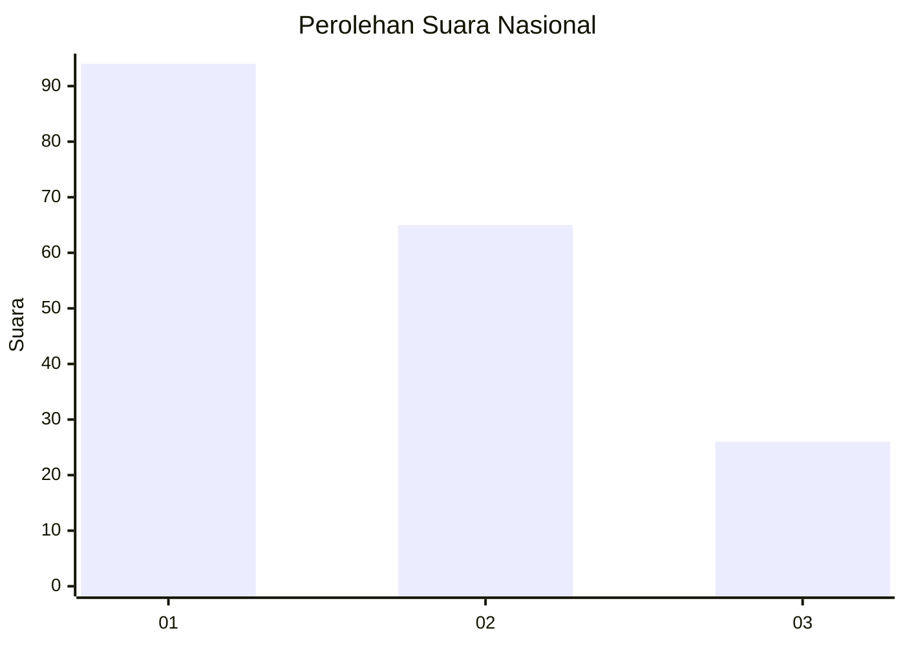
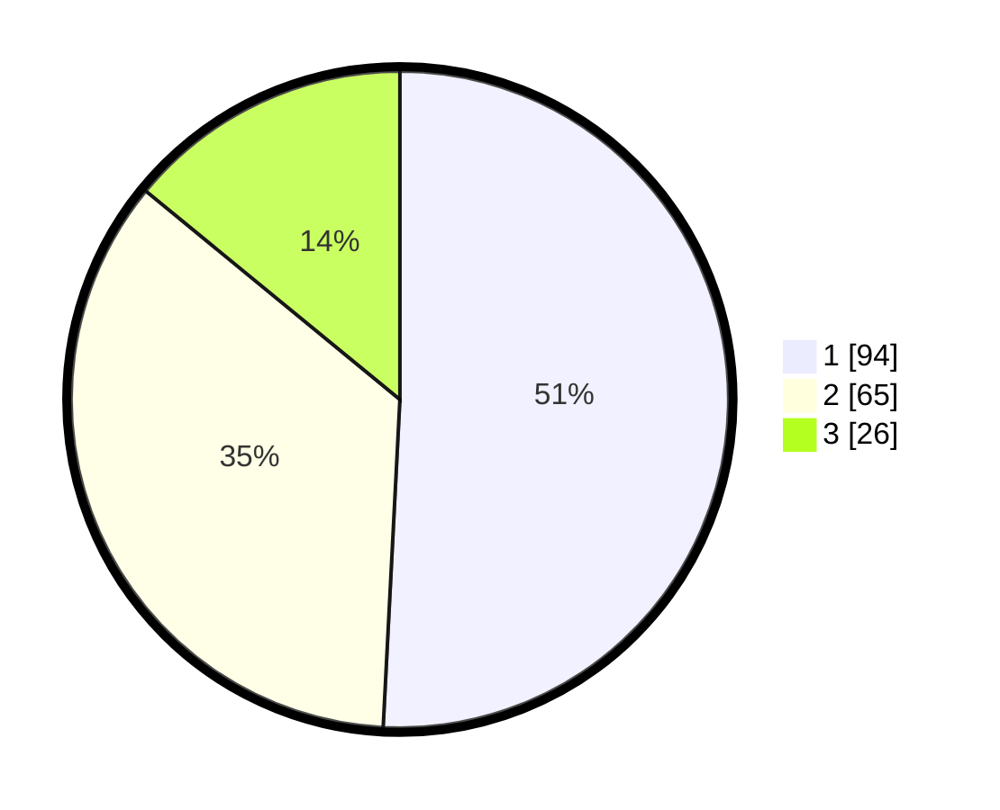

# Hasil

## Grafik

## Tabel

| No.    | Nama Paslon    | Suara | Suara (raw) | Persentase |
|:------ |:-------------- | -----:| -----------:| ----------:|
| 100025 | ANIES MUHAIMIN | 94    | [94][p-1]   | 50,81      |
| 100026 | PRABOWO GIBRAN | 65    | [65][p-2]   | 35,14      |
| 100027 | GANJAR MAHFUD  | 26    | [26][p-3]   | 14,05      |

[p-1]: https://github.com/gigit-pemilu/pemilu-2024/blob/main/pilpres/hitung-suara/sub/31-dki-jakarta/sub/73-jakarta-barat/sub/08-kembangan/sub/1005-joglo/sub/096-tps/sub/paslon-1.txt
[p-2]: https://github.com/gigit-pemilu/pemilu-2024/blob/main/pilpres/hitung-suara/sub/31-dki-jakarta/sub/73-jakarta-barat/sub/08-kembangan/sub/1005-joglo/sub/096-tps/sub/paslon-2.txt
[p-3]: https://github.com/gigit-pemilu/pemilu-2024/blob/main/pilpres/hitung-suara/sub/31-dki-jakarta/sub/73-jakarta-barat/sub/08-kembangan/sub/1005-joglo/sub/096-tps/sub/paslon-3.txt

## Foto C Plano

https://sirekap-obj-formc.kpu.go.id/3557/pemilu/ppwp/31/73/08/10/05/3173081005096-20240214-155645--758f1548-4fad-4f93-86af-9f2fc92590a2.jpg

https://sirekap-obj-formc.kpu.go.id/3557/pemilu/ppwp/31/73/08/10/05/3173081005096-20240214-214119--9d692509-e5c6-464b-a5eb-17ee44de6eeb.jpg

https://sirekap-obj-formc.kpu.go.id/3557/pemilu/ppwp/31/73/08/10/05/3173081005096-20240214-160058--6f5a17f7-e939-4a83-9390-8f4307e8ba2b.jpg

## Metadata

| Key        | Value               |
| ---------- | ------------------- |
| Time Stamp | 2024-02-19 06:16:00 |

