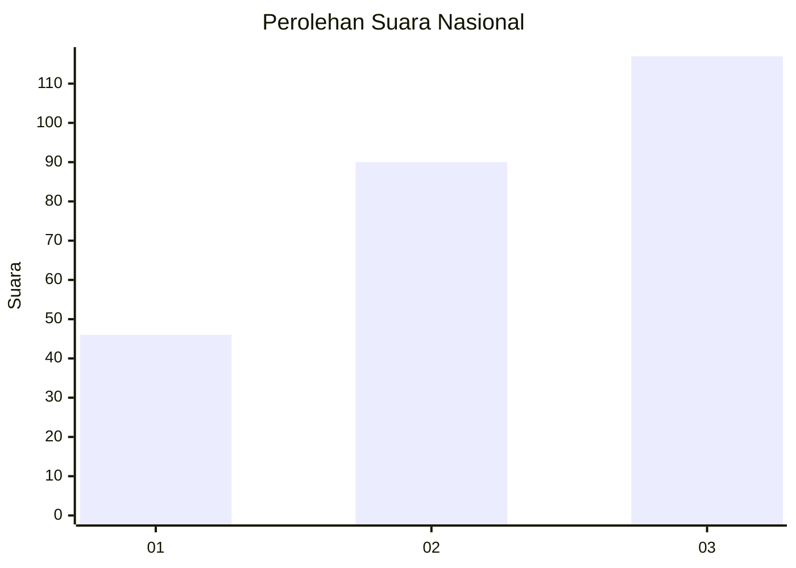
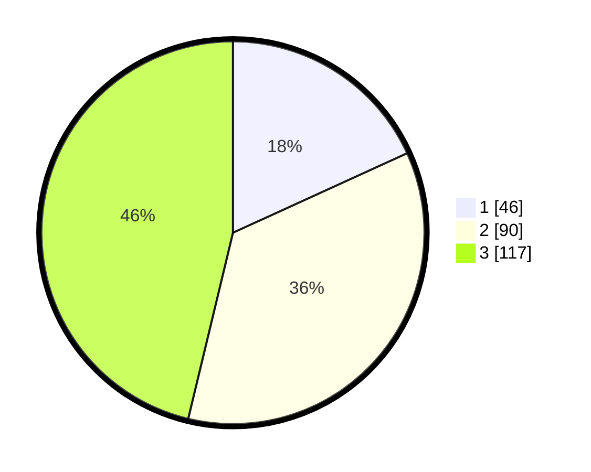

# Hasil

## Grafik

## Tabel

| No.    | Nama Paslon    | Suara | Suara (raw) | Persentase |
|:------ |:-------------- | -----:| -----------:| ----------:|
| 100025 | ANIES MUHAIMIN | 46    | [46][p-1]   | 18,18      |
| 100026 | PRABOWO GIBRAN | 90    | [90][p-2]   | 35,57      |
| 100027 | GANJAR MAHFUD  | 117   | [117][p-3]  | 46,25      |

[p-1]: https://github.com/gigit-pemilu/pemilu-2024/blob/main/pilpres/hitung-suara/sub/31-dki-jakarta/sub/73-jakarta-barat/sub/08-kembangan/sub/1005-joglo/sub/116-tps/sub/paslon-1.txt
[p-2]: https://github.com/gigit-pemilu/pemilu-2024/blob/main/pilpres/hitung-suara/sub/31-dki-jakarta/sub/73-jakarta-barat/sub/08-kembangan/sub/1005-joglo/sub/116-tps/sub/paslon-2.txt
[p-3]: https://github.com/gigit-pemilu/pemilu-2024/blob/main/pilpres/hitung-suara/sub/31-dki-jakarta/sub/73-jakarta-barat/sub/08-kembangan/sub/1005-joglo/sub/116-tps/sub/paslon-3.txt

## Foto C Plano

https://sirekap-obj-formc.kpu.go.id/b353/pemilu/ppwp/31/73/08/10/05/3173081005116-20240214-234554--57e7151b-077d-4edd-8c1a-db76a699020a.jpg

https://sirekap-obj-formc.kpu.go.id/b353/pemilu/ppwp/31/73/08/10/05/3173081005116-20240214-215904--9ce7c5b2-800f-4afd-9264-9061552b581f.jpg

https://sirekap-obj-formc.kpu.go.id/b353/pemilu/ppwp/31/73/08/10/05/3173081005116-20240214-215927--22f991f2-61d1-492e-87c7-937b3f32bce3.jpg

## Metadata

| Key        | Value               |
| ---------- | ------------------- |
| Time Stamp | 2024-02-19 06:16:00 |

