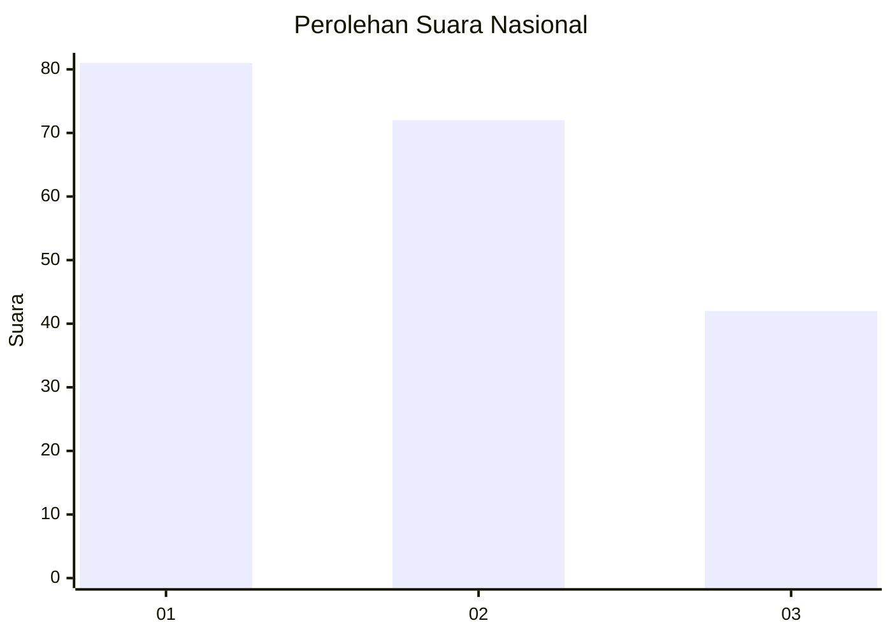
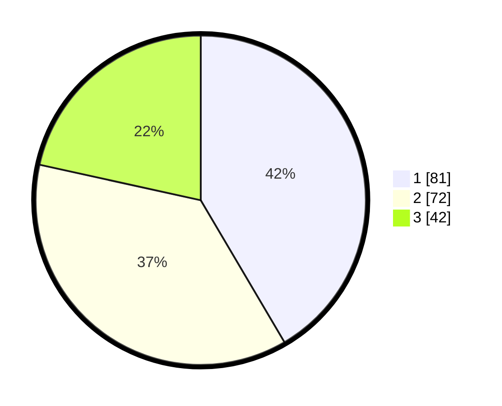

# Hasil

## Grafik

## Tabel

| No.    | Nama Paslon    | Suara | Suara (raw) | Persentase |
|:------ |:-------------- | -----:| -----------:| ----------:|
| 100025 | ANIES MUHAIMIN | 81    | [81][p-1]   | 41,54      |
| 100026 | PRABOWO GIBRAN | 72    | [72][p-2]   | 36,92      |
| 100027 | GANJAR MAHFUD  | 42    | [42][p-3]   | 21,54      |

[p-1]: https://github.com/gigit-pemilu/pemilu-2024/blob/main/pilpres/hitung-suara/sub/31-dki-jakarta/sub/73-jakarta-barat/sub/08-kembangan/sub/1005-joglo/sub/122-tps/sub/paslon-1.txt
[p-2]: https://github.com/gigit-pemilu/pemilu-2024/blob/main/pilpres/hitung-suara/sub/31-dki-jakarta/sub/73-jakarta-barat/sub/08-kembangan/sub/1005-joglo/sub/122-tps/sub/paslon-2.txt
[p-3]: https://github.com/gigit-pemilu/pemilu-2024/blob/main/pilpres/hitung-suara/sub/31-dki-jakarta/sub/73-jakarta-barat/sub/08-kembangan/sub/1005-joglo/sub/122-tps/sub/paslon-3.txt

## Foto C Plano

https://sirekap-obj-formc.kpu.go.id/271a/pemilu/ppwp/31/73/08/10/05/3173081005122-20240214-212532--00b1976e-0c07-4c13-8fa4-51f3affd4166.jpg

https://sirekap-obj-formc.kpu.go.id/271a/pemilu/ppwp/31/73/08/10/05/3173081005122-20240214-212806--b7e498b1-34c0-4866-a6de-38373e15ba6e.jpg

https://sirekap-obj-formc.kpu.go.id/271a/pemilu/ppwp/31/73/08/10/05/3173081005122-20240214-212914--e0a19547-7333-4f64-9c57-e0dea0a3c969.jpg

## Metadata

| Key        | Value               |
| ---------- | ------------------- |
| Time Stamp | 2024-02-15 04:00:24 |

