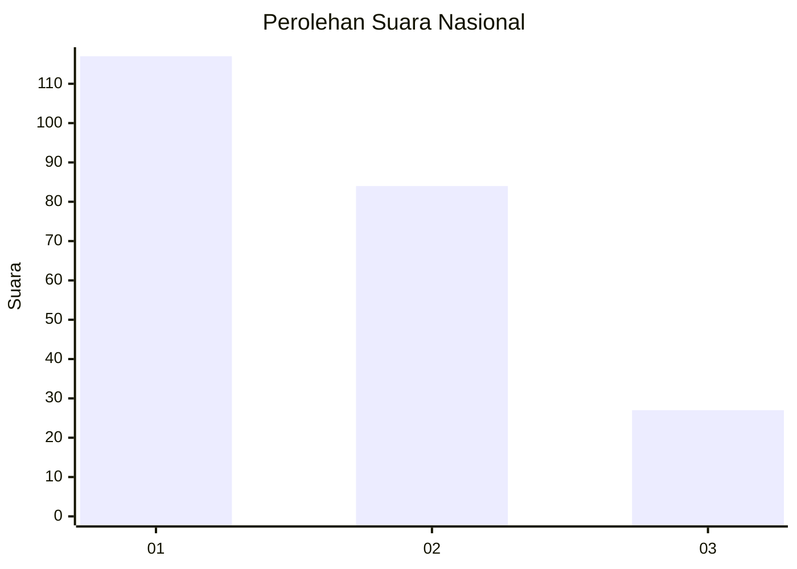
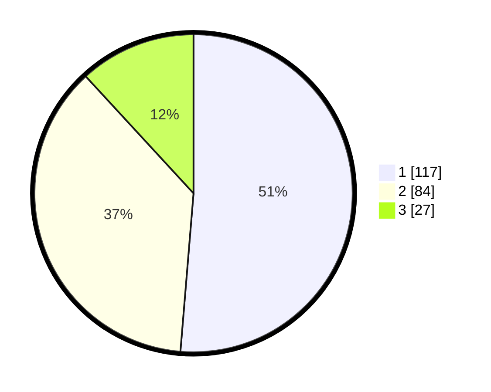

# Hasil

## Grafik

## Tabel

| No.    | Nama Paslon    | Suara | Suara (raw) | Persentase |
|:------ |:-------------- | -----:| -----------:| ----------:|
| 100025 | ANIES MUHAIMIN | 117   | [117][p-1]  | 51,32      |
| 100026 | PRABOWO GIBRAN | 84    | [84][p-2]   | 36,84      |
| 100027 | GANJAR MAHFUD  | 27    | [27][p-3]   | 11,84      |

[p-1]: https://github.com/gigit-pemilu/pemilu-2024/blob/main/pilpres/hitung-suara/sub/31-dki-jakarta/sub/73-jakarta-barat/sub/08-kembangan/sub/1005-joglo/sub/128-tps/sub/paslon-1.txt
[p-2]: https://github.com/gigit-pemilu/pemilu-2024/blob/main/pilpres/hitung-suara/sub/31-dki-jakarta/sub/73-jakarta-barat/sub/08-kembangan/sub/1005-joglo/sub/128-tps/sub/paslon-2.txt
[p-3]: https://github.com/gigit-pemilu/pemilu-2024/blob/main/pilpres/hitung-suara/sub/31-dki-jakarta/sub/73-jakarta-barat/sub/08-kembangan/sub/1005-joglo/sub/128-tps/sub/paslon-3.txt

## Foto C Plano

https://sirekap-obj-formc.kpu.go.id/b73e/pemilu/ppwp/31/73/08/10/05/3173081005128-20240214-235228--834915ca-2b07-4bd3-9fdb-8c0eb8351908.jpg

https://sirekap-obj-formc.kpu.go.id/b73e/pemilu/ppwp/31/73/08/10/05/3173081005128-20240214-235520--e8472bb9-319c-4e9a-a423-653762a36bc2.jpg

https://sirekap-obj-formc.kpu.go.id/b73e/pemilu/ppwp/31/73/08/10/05/3173081005128-20240214-235720--fc35ec3c-9acf-4887-88bf-7b5c88d5d431.jpg

## Metadata

| Key        | Value               |
| ---------- | ------------------- |
| Time Stamp | 2024-02-16 16:25:10 |

