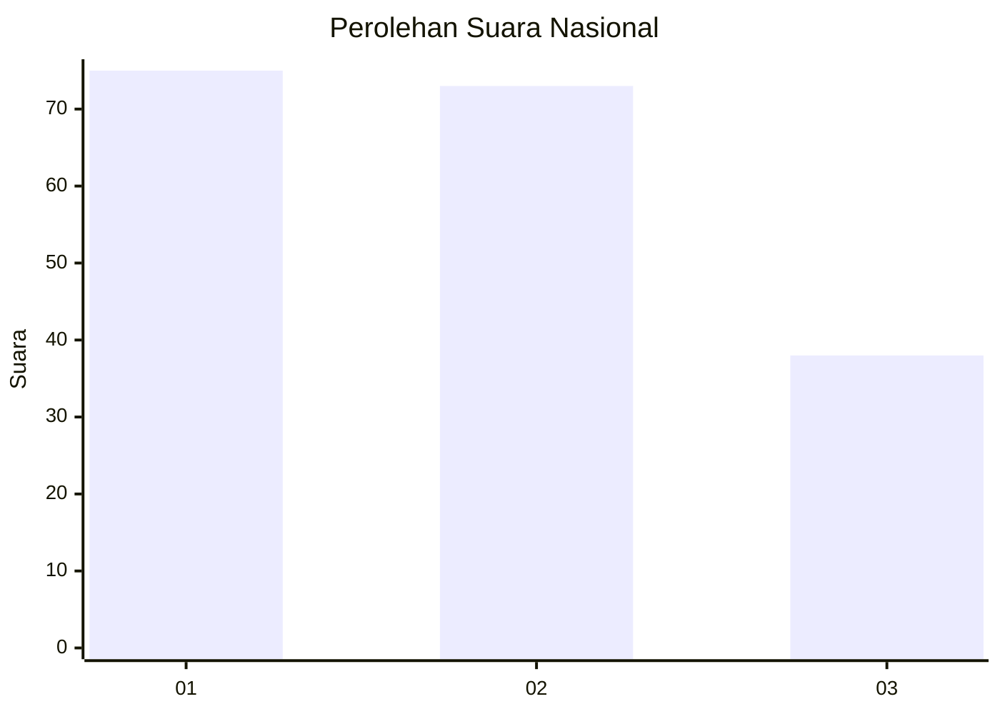
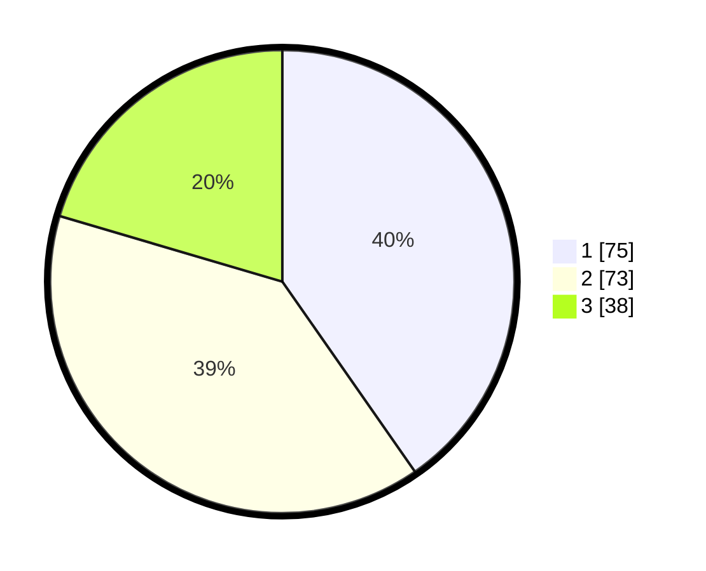

# Hasil

## Grafik

## Tabel

| No.    | Nama Paslon    | Suara | Suara (raw) | Persentase |
|:------ |:-------------- | -----:| -----------:| ----------:|
| 100025 | ANIES MUHAIMIN | 75    | [75][p-1]   | 40,32      |
| 100026 | PRABOWO GIBRAN | 73    | [73][p-2]   | 39,25      |
| 100027 | GANJAR MAHFUD  | 38    | [38][p-3]   | 20,43      |

[p-1]: https://github.com/gigit-pemilu/pemilu-2024/blob/main/pilpres/hitung-suara/sub/31-dki-jakarta/sub/73-jakarta-barat/sub/08-kembangan/sub/1005-joglo/sub/130-tps/sub/paslon-1.txt
[p-2]: https://github.com/gigit-pemilu/pemilu-2024/blob/main/pilpres/hitung-suara/sub/31-dki-jakarta/sub/73-jakarta-barat/sub/08-kembangan/sub/1005-joglo/sub/130-tps/sub/paslon-2.txt
[p-3]: https://github.com/gigit-pemilu/pemilu-2024/blob/main/pilpres/hitung-suara/sub/31-dki-jakarta/sub/73-jakarta-barat/sub/08-kembangan/sub/1005-joglo/sub/130-tps/sub/paslon-3.txt

## Foto C Plano

https://sirekap-obj-formc.kpu.go.id/2087/pemilu/ppwp/31/73/08/10/05/3173081005130-20240214-204942--086b80b4-515b-4e3d-a34d-82e82701f92a.jpg

https://sirekap-obj-formc.kpu.go.id/2087/pemilu/ppwp/31/73/08/10/05/3173081005130-20240216-212346--fb2c22d4-dafa-4324-9fd3-717ed2efa3a7.jpg

https://sirekap-obj-formc.kpu.go.id/2087/pemilu/ppwp/31/73/08/10/05/3173081005130-20240214-210008--c45c91c4-1da7-4d26-9b15-a8c6cb2e4b2b.jpg

## Metadata

| Key        | Value               |
| ---------- | ------------------- |
| Time Stamp | 2024-02-19 06:16:00 |

