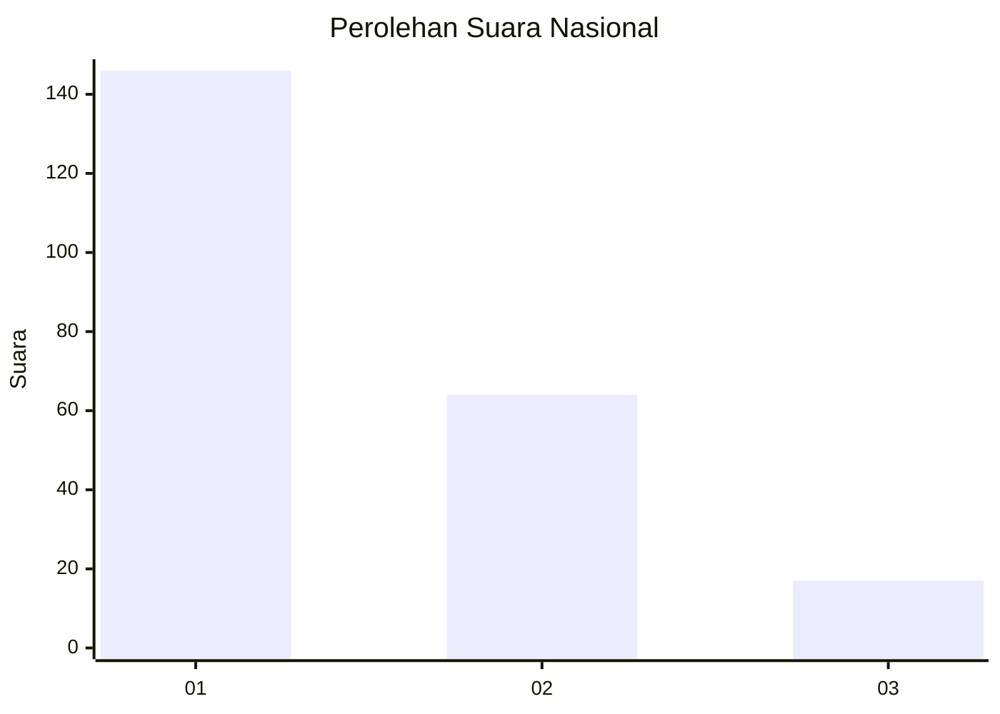
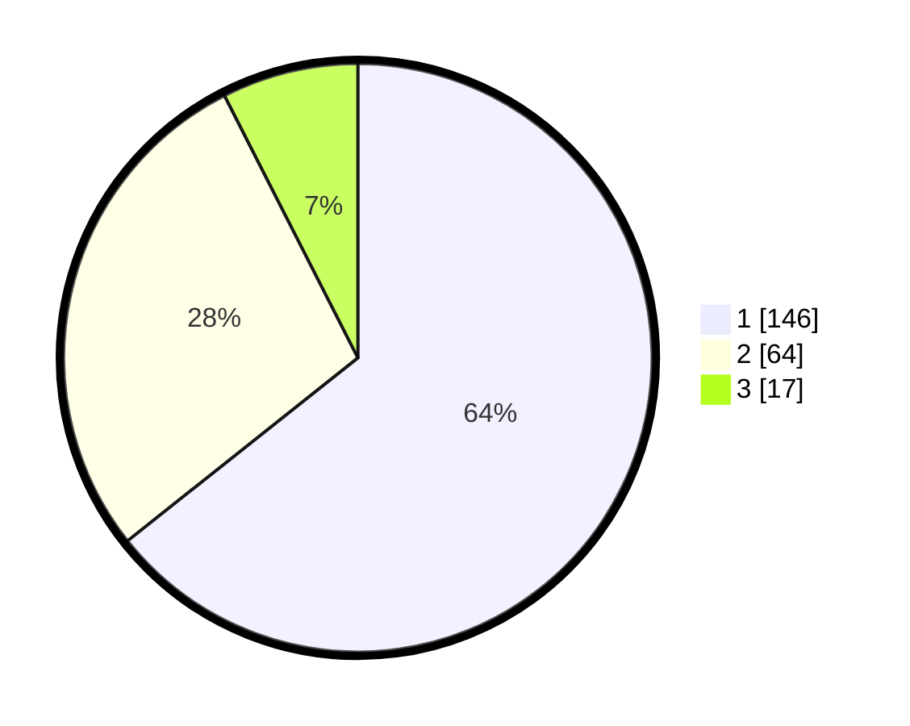

# Hasil

## Grafik

## Tabel

| No.    | Nama Paslon    | Suara | Suara (raw) | Persentase |
|:------ |:-------------- | -----:| -----------:| ----------:|
| 100025 | ANIES MUHAIMIN | 146   | [146][p-1]  | 64,32      |
| 100026 | PRABOWO GIBRAN | 64    | [64][p-2]   | 28,19      |
| 100027 | GANJAR MAHFUD  | 17    | [17][p-3]   | 7,49       |

[p-1]: https://github.com/gigit-pemilu/pemilu-2024/blob/main/pilpres/hitung-suara/sub/31-dki-jakarta/sub/73-jakarta-barat/sub/08-kembangan/sub/1006-kembangan-selatan/sub/013-tps/sub/paslon-1.txt
[p-2]: https://github.com/gigit-pemilu/pemilu-2024/blob/main/pilpres/hitung-suara/sub/31-dki-jakarta/sub/73-jakarta-barat/sub/08-kembangan/sub/1006-kembangan-selatan/sub/013-tps/sub/paslon-2.txt
[p-3]: https://github.com/gigit-pemilu/pemilu-2024/blob/main/pilpres/hitung-suara/sub/31-dki-jakarta/sub/73-jakarta-barat/sub/08-kembangan/sub/1006-kembangan-selatan/sub/013-tps/sub/paslon-3.txt

## Foto C Plano

https://sirekap-obj-formc.kpu.go.id/ee6a/pemilu/ppwp/31/73/08/10/06/3173081006013-20240214-233242--c2a3b7c8-f544-458e-beef-15d88701f523.jpg

https://sirekap-obj-formc.kpu.go.id/ee6a/pemilu/ppwp/31/73/08/10/06/3173081006013-20240214-160119--2cfdbd98-608e-405a-83e3-610bc6c35bbc.jpg

https://sirekap-obj-formc.kpu.go.id/ee6a/pemilu/ppwp/31/73/08/10/06/3173081006013-20240214-233254--af23545e-7035-4e01-9d0d-d522425533c3.jpg

## Metadata

| Key        | Value               |
| ---------- | ------------------- |
| Time Stamp | 2024-02-16 16:25:10 |

