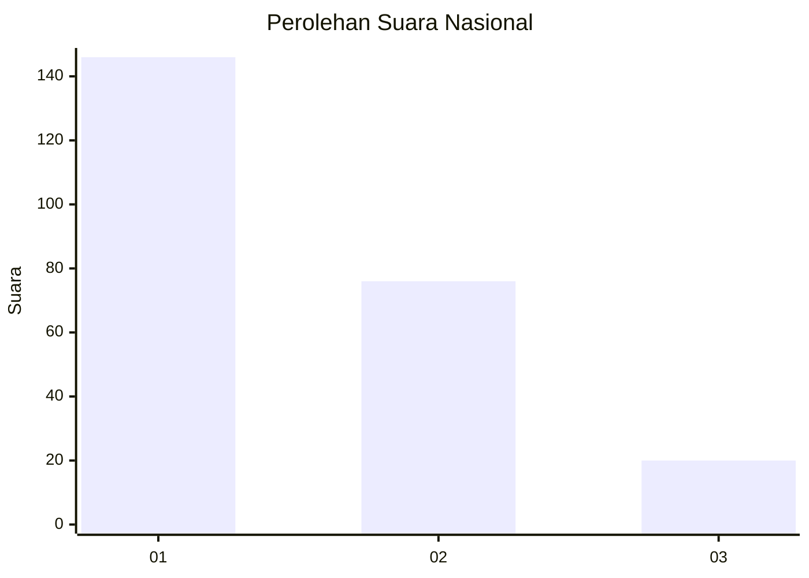
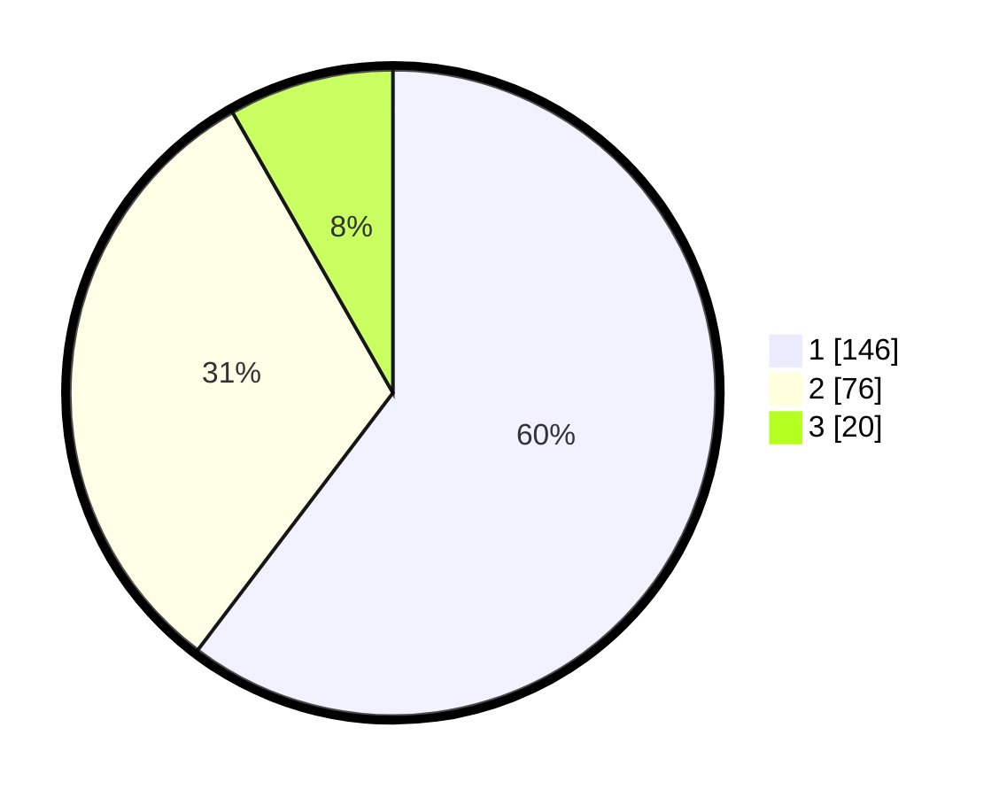

# Hasil

## Grafik

## Tabel

| No.    | Nama Paslon    | Suara | Suara (raw) | Persentase |
|:------ |:-------------- | -----:| -----------:| ----------:|
| 100025 | ANIES MUHAIMIN | 146   | [146][p-1]  | 60,33      |
| 100026 | PRABOWO GIBRAN | 76    | [76][p-2]   | 31,40      |
| 100027 | GANJAR MAHFUD  | 20    | [20][p-3]   | 8,26       |

[p-1]: https://github.com/gigit-pemilu/pemilu-2024/blob/main/pilpres/hitung-suara/sub/31-dki-jakarta/sub/73-jakarta-barat/sub/08-kembangan/sub/1006-kembangan-selatan/sub/021-tps/sub/paslon-1.txt
[p-2]: https://github.com/gigit-pemilu/pemilu-2024/blob/main/pilpres/hitung-suara/sub/31-dki-jakarta/sub/73-jakarta-barat/sub/08-kembangan/sub/1006-kembangan-selatan/sub/021-tps/sub/paslon-2.txt
[p-3]: https://github.com/gigit-pemilu/pemilu-2024/blob/main/pilpres/hitung-suara/sub/31-dki-jakarta/sub/73-jakarta-barat/sub/08-kembangan/sub/1006-kembangan-selatan/sub/021-tps/sub/paslon-3.txt

## Foto C Plano

https://sirekap-obj-formc.kpu.go.id/2b9b/pemilu/ppwp/31/73/08/10/06/3173081006021-20240214-215109--a877b570-8d42-48e4-b1be-40720351577e.jpg

https://sirekap-obj-formc.kpu.go.id/2b9b/pemilu/ppwp/31/73/08/10/06/3173081006021-20240214-215441--6e73897c-ba03-47b5-b5cd-fc5649c74bac.jpg

https://sirekap-obj-formc.kpu.go.id/2b9b/pemilu/ppwp/31/73/08/10/06/3173081006021-20240214-215548--536c5373-f1b5-4a46-9f4a-11cda7bed171.jpg

## Metadata

| Key        | Value               |
| ---------- | ------------------- |
| Time Stamp | 2024-02-16 16:25:10 |

