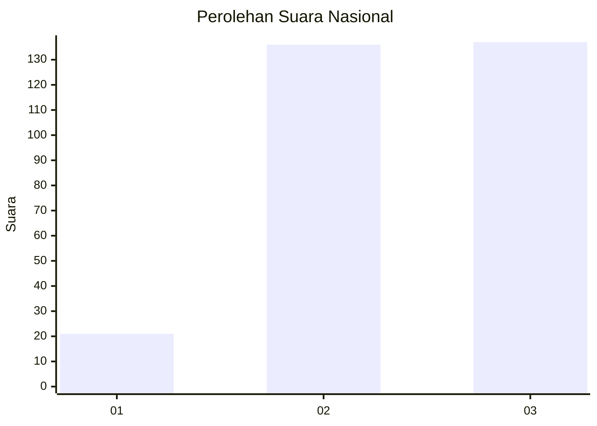
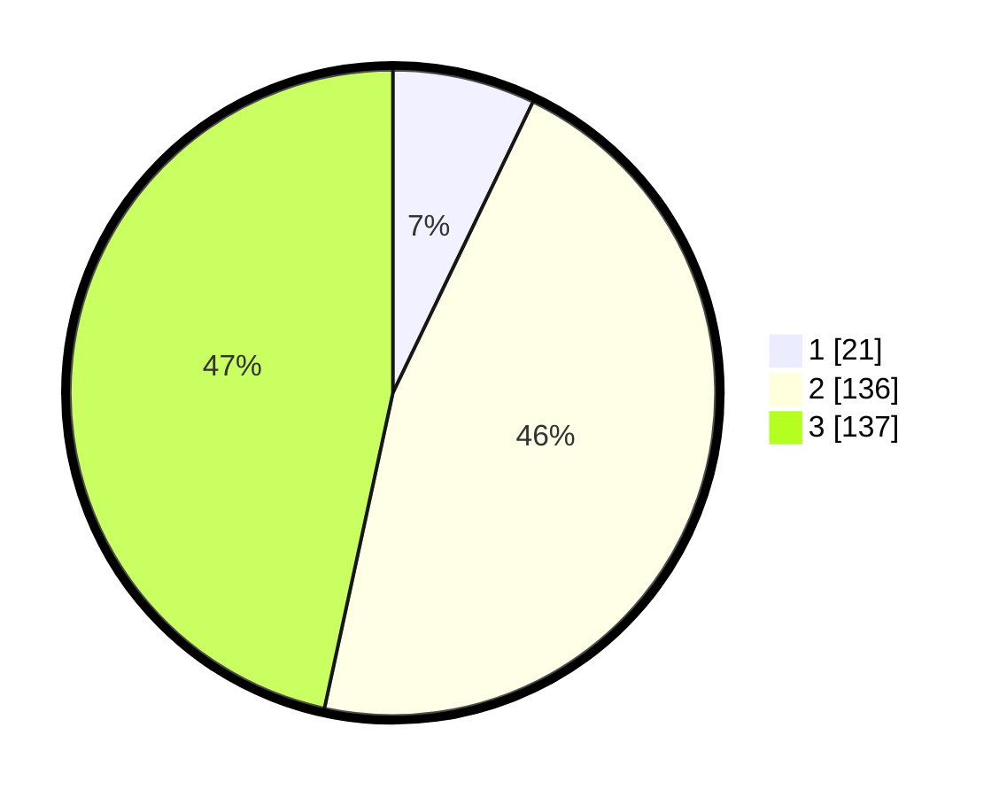

# Hasil

## Grafik

## Tabel

| No.    | Nama Paslon    | Suara | Suara (raw) | Persentase |
|:------ |:-------------- | -----:| -----------:| ----------:|
| 100025 | ANIES MUHAIMIN | 21    | [21][p-1]   | 7,14       |
| 100026 | PRABOWO GIBRAN | 136   | [136][p-2]  | 46,26      |
| 100027 | GANJAR MAHFUD  | 137   | [137][p-3]  | 46,60      |

[p-1]: https://github.com/gigit-pemilu/pemilu-2024/blob/main/pilpres/hitung-suara/sub/31-dki-jakarta/sub/73-jakarta-barat/sub/08-kembangan/sub/1006-kembangan-selatan/sub/027-tps/sub/paslon-1.txt
[p-2]: https://github.com/gigit-pemilu/pemilu-2024/blob/main/pilpres/hitung-suara/sub/31-dki-jakarta/sub/73-jakarta-barat/sub/08-kembangan/sub/1006-kembangan-selatan/sub/027-tps/sub/paslon-2.txt
[p-3]: https://github.com/gigit-pemilu/pemilu-2024/blob/main/pilpres/hitung-suara/sub/31-dki-jakarta/sub/73-jakarta-barat/sub/08-kembangan/sub/1006-kembangan-selatan/sub/027-tps/sub/paslon-3.txt

## Foto C Plano

https://sirekap-obj-formc.kpu.go.id/b50d/pemilu/ppwp/31/73/08/10/06/3173081006027-20240214-234420--f27f653d-41b3-49af-9b96-347c173e7032.jpg

https://sirekap-obj-formc.kpu.go.id/b50d/pemilu/ppwp/31/73/08/10/06/3173081006027-20240214-234502--b1306e5a-7e94-4f42-acc9-b004c27918ab.jpg

https://sirekap-obj-formc.kpu.go.id/b50d/pemilu/ppwp/31/73/08/10/06/3173081006027-20240214-234619--835a926c-04d7-4758-ae3e-d98f2e68751c.jpg

## Metadata

| Key        | Value               |
| ---------- | ------------------- |
| Time Stamp | 2024-02-17 16:52:47 |

