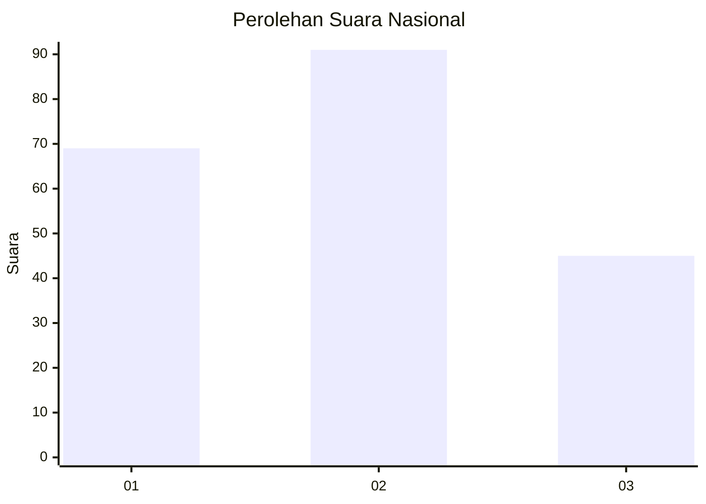
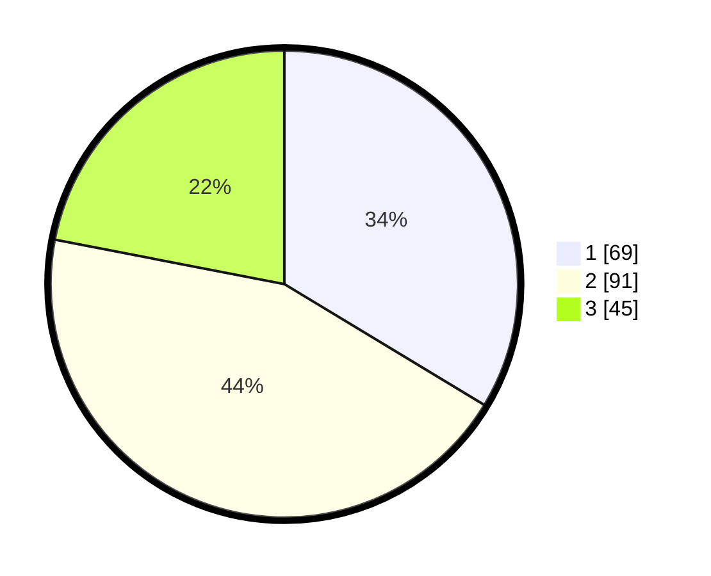

# Hasil

## Grafik

## Tabel

| No.    | Nama Paslon    | Suara | Suara (raw) | Persentase |
|:------ |:-------------- | -----:| -----------:| ----------:|
| 100025 | ANIES MUHAIMIN | 69    | [69][p-1]   | 33,66      |
| 100026 | PRABOWO GIBRAN | 91    | [91][p-2]   | 44,39      |
| 100027 | GANJAR MAHFUD  | 45    | [45][p-3]   | 21,95      |

[p-1]: https://github.com/gigit-pemilu/pemilu-2024/blob/main/pilpres/hitung-suara/sub/31-dki-jakarta/sub/73-jakarta-barat/sub/08-kembangan/sub/1006-kembangan-selatan/sub/032-tps/sub/paslon-1.txt
[p-2]: https://github.com/gigit-pemilu/pemilu-2024/blob/main/pilpres/hitung-suara/sub/31-dki-jakarta/sub/73-jakarta-barat/sub/08-kembangan/sub/1006-kembangan-selatan/sub/032-tps/sub/paslon-2.txt
[p-3]: https://github.com/gigit-pemilu/pemilu-2024/blob/main/pilpres/hitung-suara/sub/31-dki-jakarta/sub/73-jakarta-barat/sub/08-kembangan/sub/1006-kembangan-selatan/sub/032-tps/sub/paslon-3.txt

## Foto C Plano

https://sirekap-obj-formc.kpu.go.id/c69d/pemilu/ppwp/31/73/08/10/06/3173081006032-20240215-010816--c3c7c68d-353c-4bcd-8926-a6e99157411b.jpg

https://sirekap-obj-formc.kpu.go.id/c69d/pemilu/ppwp/31/73/08/10/06/3173081006032-20240215-010923--6fc80ff3-5532-4a9c-873b-f9055f13e00b.jpg

https://sirekap-obj-formc.kpu.go.id/c69d/pemilu/ppwp/31/73/08/10/06/3173081006032-20240215-011023--87f9cfd3-f635-48cc-b244-c563c6a4eb0d.jpg

## Metadata

| Key        | Value               |
| ---------- | ------------------- |
| Time Stamp | 2024-02-16 16:25:10 |

