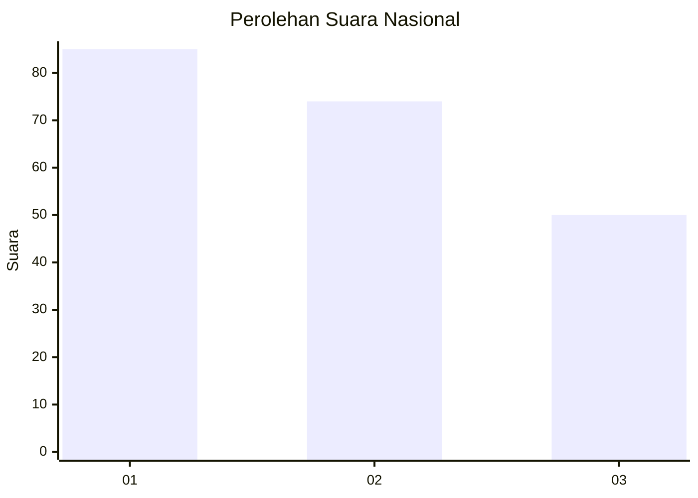
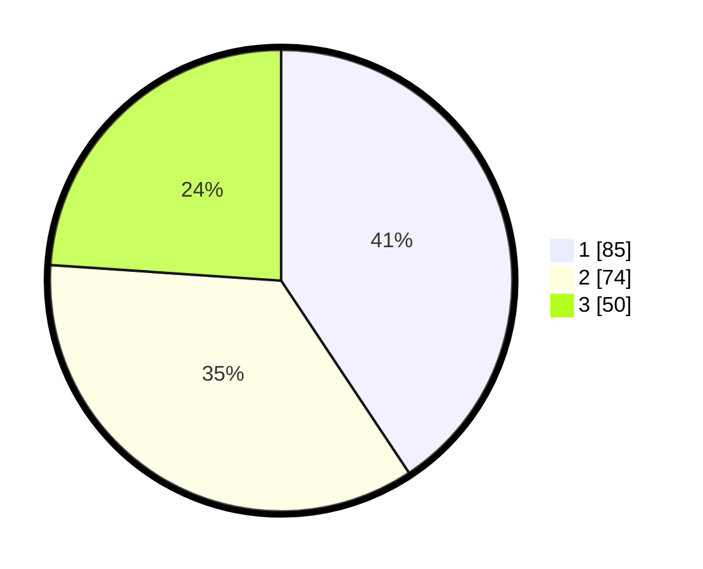

# Hasil

## Grafik

## Tabel

| No.    | Nama Paslon    | Suara | Suara (raw) | Persentase |
|:------ |:-------------- | -----:| -----------:| ----------:|
| 100025 | ANIES MUHAIMIN | 85    | [85][p-1]   | 40,67      |
| 100026 | PRABOWO GIBRAN | 74    | [74][p-2]   | 35,41      |
| 100027 | GANJAR MAHFUD  | 50    | [50][p-3]   | 23,92      |

[p-1]: https://github.com/gigit-pemilu/pemilu-2024/blob/main/pilpres/hitung-suara/sub/31-dki-jakarta/sub/73-jakarta-barat/sub/08-kembangan/sub/1006-kembangan-selatan/sub/033-tps/sub/paslon-1.txt
[p-2]: https://github.com/gigit-pemilu/pemilu-2024/blob/main/pilpres/hitung-suara/sub/31-dki-jakarta/sub/73-jakarta-barat/sub/08-kembangan/sub/1006-kembangan-selatan/sub/033-tps/sub/paslon-2.txt
[p-3]: https://github.com/gigit-pemilu/pemilu-2024/blob/main/pilpres/hitung-suara/sub/31-dki-jakarta/sub/73-jakarta-barat/sub/08-kembangan/sub/1006-kembangan-selatan/sub/033-tps/sub/paslon-3.txt

## Foto C Plano

https://sirekap-obj-formc.kpu.go.id/c53a/pemilu/ppwp/31/73/08/10/06/3173081006033-20240214-224409--85111b3d-f52b-4a8b-b945-3c6f28deebb7.jpg

https://sirekap-obj-formc.kpu.go.id/c53a/pemilu/ppwp/31/73/08/10/06/3173081006033-20240214-224739--f7668b45-b4c9-43e0-9c8a-d08948a68877.jpg

https://sirekap-obj-formc.kpu.go.id/c53a/pemilu/ppwp/31/73/08/10/06/3173081006033-20240214-224824--59404249-c369-45e6-abd3-a168751276d0.jpg

## Metadata

| Key        | Value               |
| ---------- | ------------------- |
| Time Stamp | 2024-02-16 16:25:10 |

