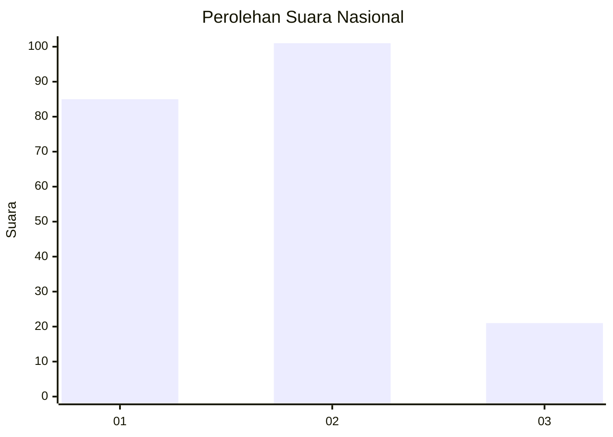
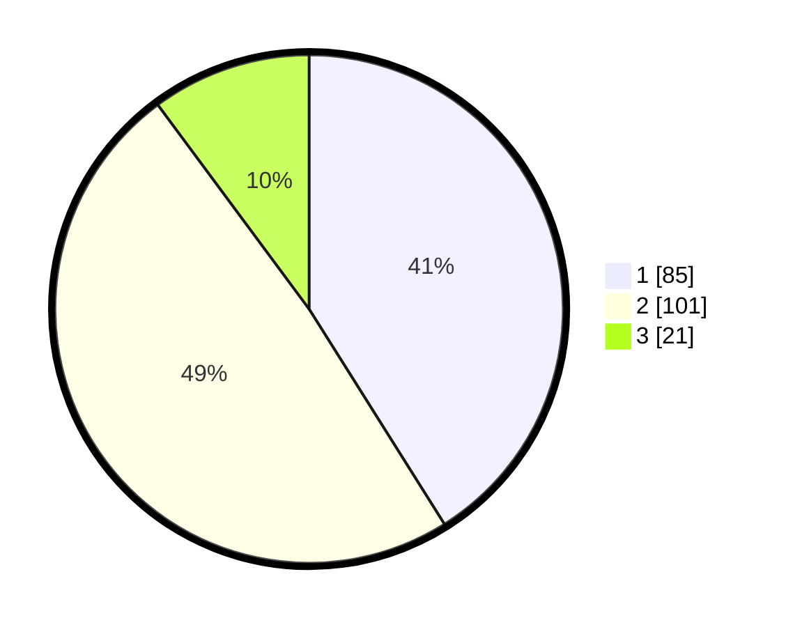

# Hasil

## Grafik

## Tabel

| No.    | Nama Paslon    | Suara | Suara (raw) | Persentase |
|:------ |:-------------- | -----:| -----------:| ----------:|
| 100025 | ANIES MUHAIMIN | 85    | [85][p-1]   | 41,06      |
| 100026 | PRABOWO GIBRAN | 101   | [101][p-2]  | 48,79      |
| 100027 | GANJAR MAHFUD  | 21    | [21][p-3]   | 10,14      |

[p-1]: https://github.com/gigit-pemilu/pemilu-2024/blob/main/pilpres/hitung-suara/sub/31-dki-jakarta/sub/73-jakarta-barat/sub/08-kembangan/sub/1006-kembangan-selatan/sub/041-tps/sub/paslon-1.txt
[p-2]: https://github.com/gigit-pemilu/pemilu-2024/blob/main/pilpres/hitung-suara/sub/31-dki-jakarta/sub/73-jakarta-barat/sub/08-kembangan/sub/1006-kembangan-selatan/sub/041-tps/sub/paslon-2.txt
[p-3]: https://github.com/gigit-pemilu/pemilu-2024/blob/main/pilpres/hitung-suara/sub/31-dki-jakarta/sub/73-jakarta-barat/sub/08-kembangan/sub/1006-kembangan-selatan/sub/041-tps/sub/paslon-3.txt

## Foto C Plano

https://sirekap-obj-formc.kpu.go.id/6b5b/pemilu/ppwp/31/73/08/10/06/3173081006041-20240214-205500--89fada5d-20da-4018-a9e2-3e25e889d3ed.jpg

https://sirekap-obj-formc.kpu.go.id/6b5b/pemilu/ppwp/31/73/08/10/06/3173081006041-20240214-204802--48772ac1-66f4-44c1-8e25-933f389e5df6.jpg

https://sirekap-obj-formc.kpu.go.id/6b5b/pemilu/ppwp/31/73/08/10/06/3173081006041-20240214-205217--cd5a0aff-9ddd-4ddd-8c99-984ee2359fb2.jpg

## Metadata

| Key        | Value               |
| ---------- | ------------------- |
| Time Stamp | 2024-02-16 16:25:10 |

