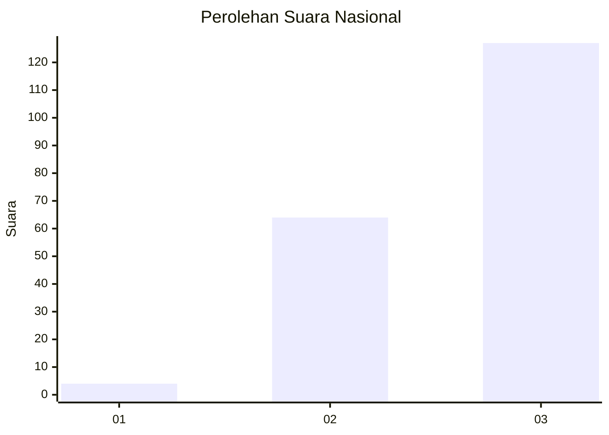
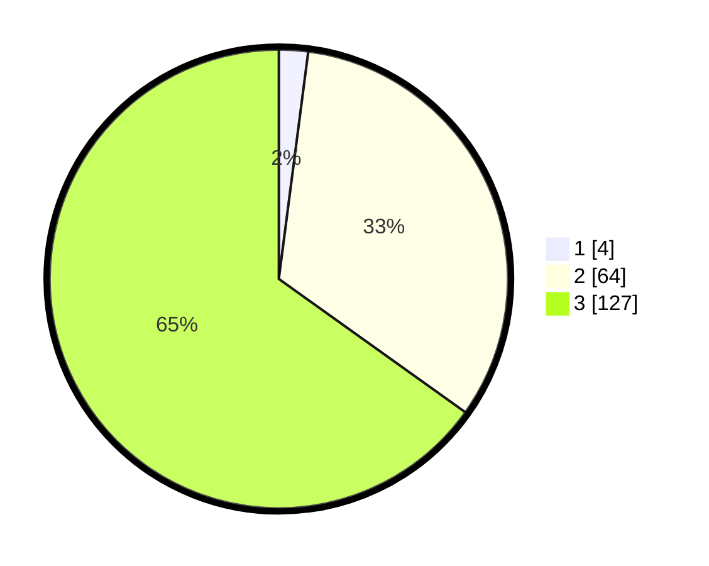

# Hasil

## Grafik

## Tabel

| No.    | Nama Paslon    | Suara | Suara (raw) | Persentase |
|:------ |:-------------- | -----:| -----------:| ----------:|
| 100025 | ANIES MUHAIMIN | 4     | [4][p-1]    | 2,05       |
| 100026 | PRABOWO GIBRAN | 64    | [64][p-2]   | 32,82      |
| 100027 | GANJAR MAHFUD  | 127   | [127][p-3]  | 65,13      |

[p-1]: https://github.com/gigit-pemilu/pemilu-2024/blob/main/pilpres/hitung-suara/sub/31-dki-jakarta/sub/73-jakarta-barat/sub/08-kembangan/sub/1006-kembangan-selatan/sub/056-tps/sub/paslon-1.txt
[p-2]: https://github.com/gigit-pemilu/pemilu-2024/blob/main/pilpres/hitung-suara/sub/31-dki-jakarta/sub/73-jakarta-barat/sub/08-kembangan/sub/1006-kembangan-selatan/sub/056-tps/sub/paslon-2.txt
[p-3]: https://github.com/gigit-pemilu/pemilu-2024/blob/main/pilpres/hitung-suara/sub/31-dki-jakarta/sub/73-jakarta-barat/sub/08-kembangan/sub/1006-kembangan-selatan/sub/056-tps/sub/paslon-3.txt

## Foto C Plano

https://sirekap-obj-formc.kpu.go.id/b8db/pemilu/ppwp/31/73/08/10/06/3173081006056-20240214-203041--f78579e1-435e-4851-bb62-274876995078.jpg

https://sirekap-obj-formc.kpu.go.id/b8db/pemilu/ppwp/31/73/08/10/06/3173081006056-20240214-203116--1efdcfa8-f353-4cbe-a4fc-9b2cc237fa0f.jpg

https://sirekap-obj-formc.kpu.go.id/b8db/pemilu/ppwp/31/73/08/10/06/3173081006056-20240214-203136--e175a8f9-20cd-4815-89ee-580259cc79a3.jpg

## Metadata

| Key        | Value               |
| ---------- | ------------------- |
| Time Stamp | 2024-02-15 00:41:44 |

