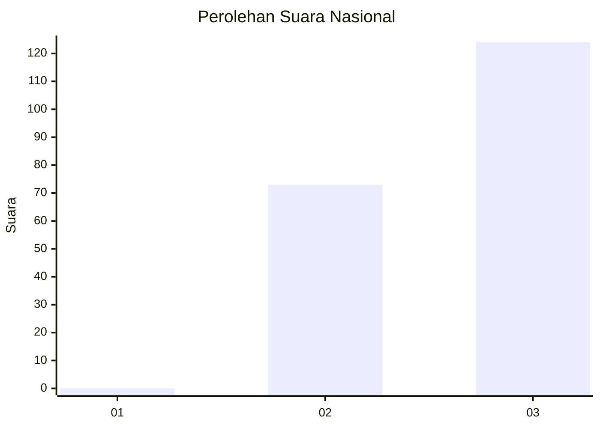
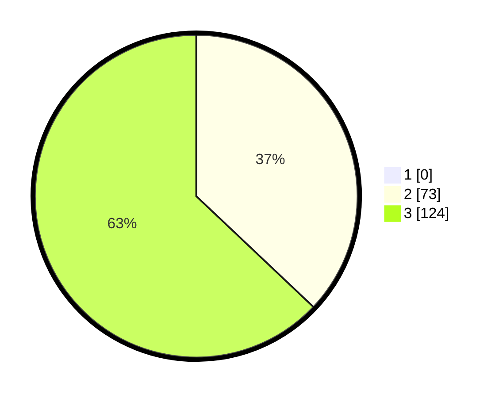

# Hasil

## Grafik

## Tabel

| No.    | Nama Paslon    | Suara | Suara (raw) | Persentase |
|:------ |:-------------- | -----:| -----------:| ----------:|
| 100025 | ANIES MUHAIMIN | 0     | [0][p-1]    | 0,00       |
| 100026 | PRABOWO GIBRAN | 73    | [73][p-2]   | 37,06      |
| 100027 | GANJAR MAHFUD  | 124   | [124][p-3]  | 62,94      |

[p-1]: https://github.com/gigit-pemilu/pemilu-2024/blob/main/pilpres/hitung-suara/sub/31-dki-jakarta/sub/73-jakarta-barat/sub/08-kembangan/sub/1006-kembangan-selatan/sub/057-tps/sub/paslon-1.txt
[p-2]: https://github.com/gigit-pemilu/pemilu-2024/blob/main/pilpres/hitung-suara/sub/31-dki-jakarta/sub/73-jakarta-barat/sub/08-kembangan/sub/1006-kembangan-selatan/sub/057-tps/sub/paslon-2.txt
[p-3]: https://github.com/gigit-pemilu/pemilu-2024/blob/main/pilpres/hitung-suara/sub/31-dki-jakarta/sub/73-jakarta-barat/sub/08-kembangan/sub/1006-kembangan-selatan/sub/057-tps/sub/paslon-3.txt

## Foto C Plano

https://sirekap-obj-formc.kpu.go.id/9d87/pemilu/ppwp/31/73/08/10/06/3173081006057-20240214-211041--9b9a5fae-e377-44a3-88e3-7d0c0afe3012.jpg

https://sirekap-obj-formc.kpu.go.id/9d87/pemilu/ppwp/31/73/08/10/06/3173081006057-20240214-211242--5ca965c8-d749-4a8b-87a5-f12b4dd00080.jpg

https://sirekap-obj-formc.kpu.go.id/9d87/pemilu/ppwp/31/73/08/10/06/3173081006057-20240214-211308--ec3d97ce-e172-409f-978d-0b90cdbed6c9.jpg

## Metadata

| Key        | Value               |
| ---------- | ------------------- |
| Time Stamp | 2024-02-19 06:16:00 |

