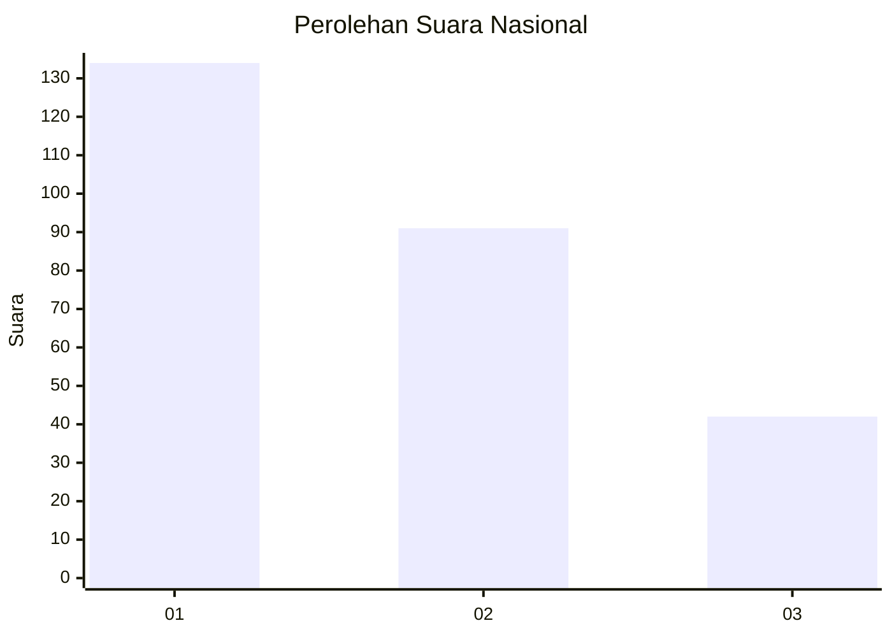
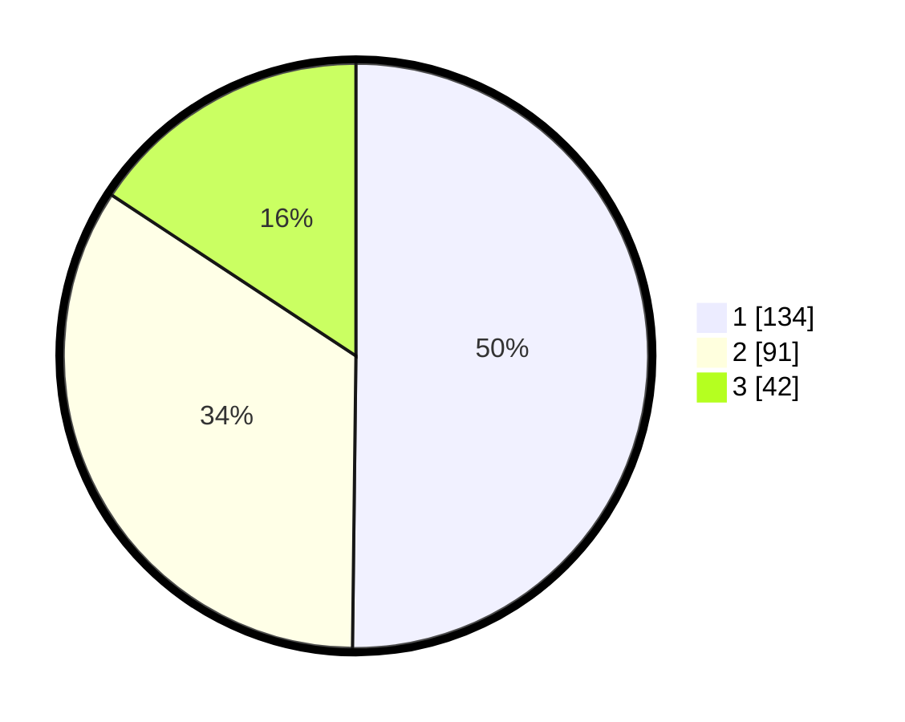

# Hasil

## Grafik

## Tabel

| No.    | Nama Paslon    | Suara | Suara (raw) | Persentase |
|:------ |:-------------- | -----:| -----------:| ----------:|
| 100025 | ANIES MUHAIMIN | 134   | [134][p-1]  | 50,19      |
| 100026 | PRABOWO GIBRAN | 91    | [91][p-2]   | 34,08      |
| 100027 | GANJAR MAHFUD  | 42    | [42][p-3]   | 15,73      |

[p-1]: https://github.com/gigit-pemilu/pemilu-2024/blob/main/pilpres/hitung-suara/sub/31-dki-jakarta/sub/73-jakarta-barat/sub/08-kembangan/sub/1006-kembangan-selatan/sub/059-tps/sub/paslon-1.txt
[p-2]: https://github.com/gigit-pemilu/pemilu-2024/blob/main/pilpres/hitung-suara/sub/31-dki-jakarta/sub/73-jakarta-barat/sub/08-kembangan/sub/1006-kembangan-selatan/sub/059-tps/sub/paslon-2.txt
[p-3]: https://github.com/gigit-pemilu/pemilu-2024/blob/main/pilpres/hitung-suara/sub/31-dki-jakarta/sub/73-jakarta-barat/sub/08-kembangan/sub/1006-kembangan-selatan/sub/059-tps/sub/paslon-3.txt

## Foto C Plano

https://sirekap-obj-formc.kpu.go.id/0ecf/pemilu/ppwp/31/73/08/10/06/3173081006059-20240214-195954--54d7368d-0a31-471e-b890-20291a30201d.jpg

https://sirekap-obj-formc.kpu.go.id/0ecf/pemilu/ppwp/31/73/08/10/06/3173081006059-20240214-192128--cf0fdb1a-838f-4d19-ad18-7b77d70f6b12.jpg

https://sirekap-obj-formc.kpu.go.id/0ecf/pemilu/ppwp/31/73/08/10/06/3173081006059-20240214-200109--42114e7c-eadd-45dc-ba19-ed65ae4d27c0.jpg

## Metadata

| Key        | Value               |
| ---------- | ------------------- |
| Time Stamp | 2024-02-15 00:41:44 |

