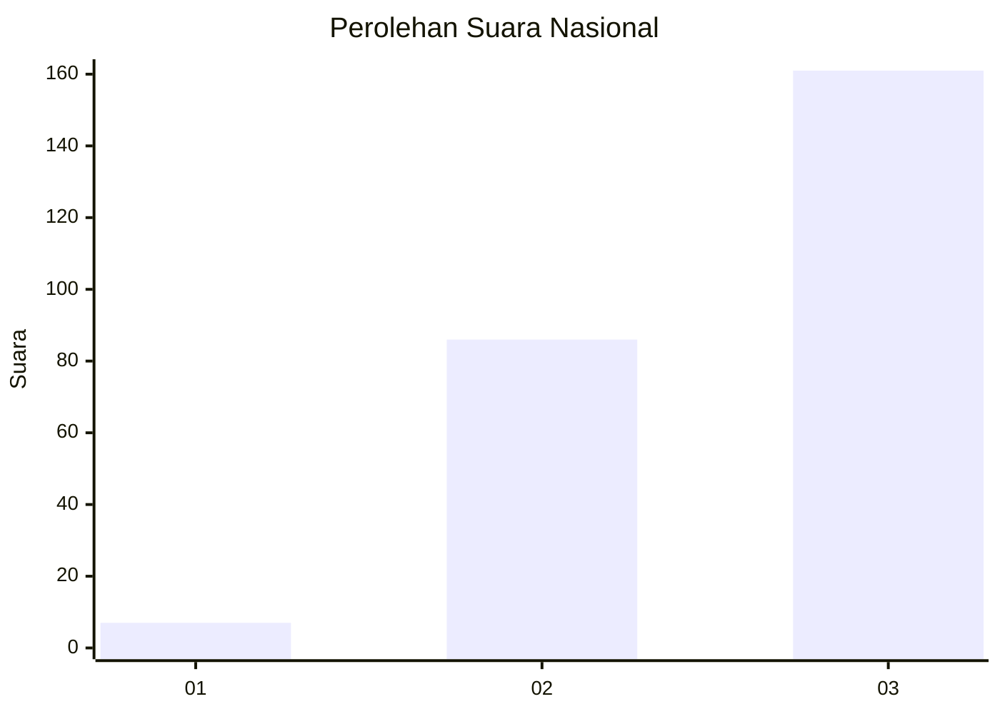
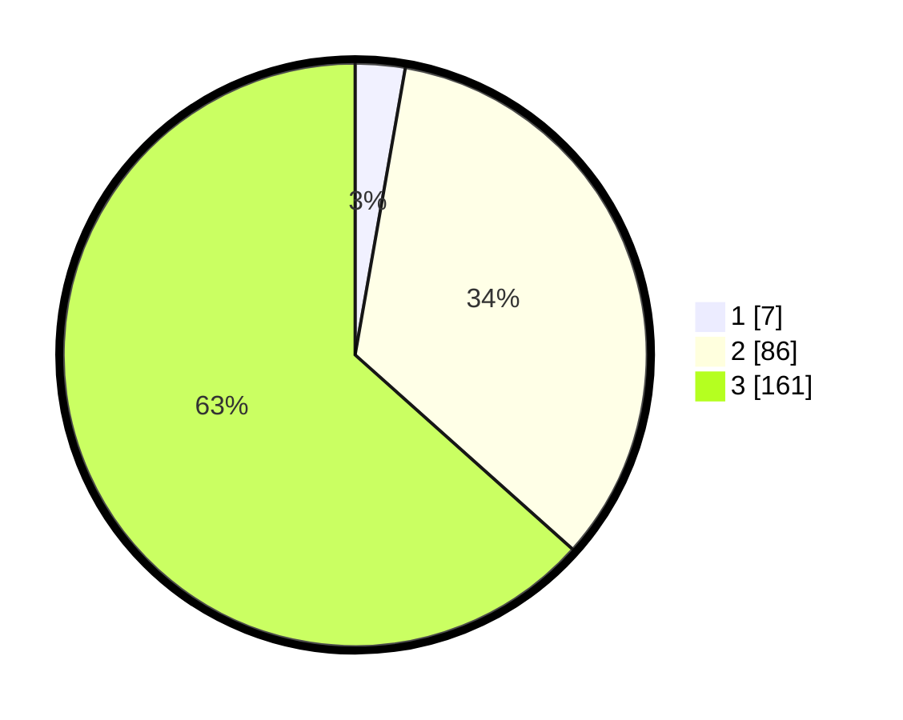

# Hasil

## Grafik

## Tabel

| No.    | Nama Paslon    | Suara | Suara (raw) | Persentase |
|:------ |:-------------- | -----:| -----------:| ----------:|
| 100025 | ANIES MUHAIMIN | 7     | [7][p-1]    | 2,76       |
| 100026 | PRABOWO GIBRAN | 86    | [86][p-2]   | 33,86      |
| 100027 | GANJAR MAHFUD  | 161   | [161][p-3]  | 63,39      |

[p-1]: https://github.com/gigit-pemilu/pemilu-2024/blob/main/pilpres/hitung-suara/sub/31-dki-jakarta/sub/73-jakarta-barat/sub/08-kembangan/sub/1006-kembangan-selatan/sub/068-tps/sub/paslon-1.txt
[p-2]: https://github.com/gigit-pemilu/pemilu-2024/blob/main/pilpres/hitung-suara/sub/31-dki-jakarta/sub/73-jakarta-barat/sub/08-kembangan/sub/1006-kembangan-selatan/sub/068-tps/sub/paslon-2.txt
[p-3]: https://github.com/gigit-pemilu/pemilu-2024/blob/main/pilpres/hitung-suara/sub/31-dki-jakarta/sub/73-jakarta-barat/sub/08-kembangan/sub/1006-kembangan-selatan/sub/068-tps/sub/paslon-3.txt

## Foto C Plano

https://sirekap-obj-formc.kpu.go.id/54d1/pemilu/ppwp/31/73/08/10/06/3173081006068-20240214-211029--793bd5ec-2aa4-40c6-8e11-c933a432deb6.jpg

https://sirekap-obj-formc.kpu.go.id/54d1/pemilu/ppwp/31/73/08/10/06/3173081006068-20240214-155859--caf756cb-2d9e-40e6-a17b-03ad30638b65.jpg

https://sirekap-obj-formc.kpu.go.id/54d1/pemilu/ppwp/31/73/08/10/06/3173081006068-20240214-211043--f4a33c80-e39d-4056-b369-f543fef234c7.jpg

## Metadata

| Key        | Value               |
| ---------- | ------------------- |
| Time Stamp | 2024-02-15 00:41:44 |

