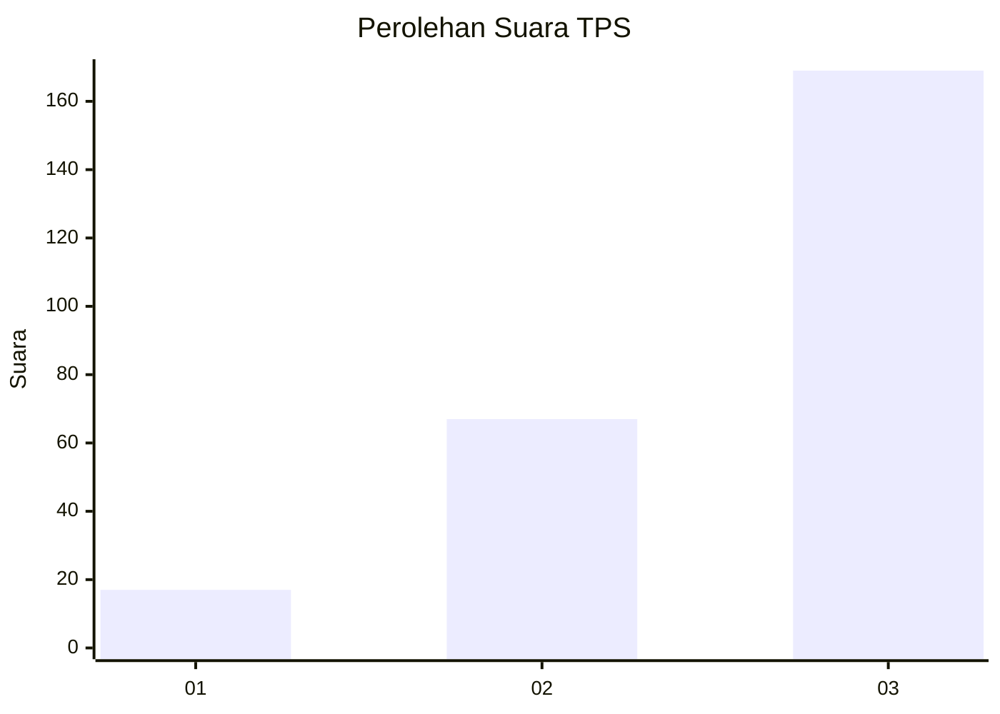
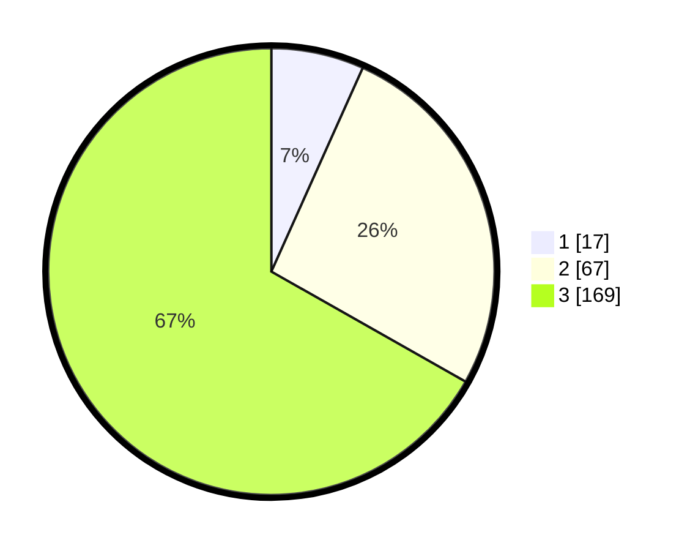

# Hasil

## Grafik

## Tabel

| No. | Nama Paslon    | Suara | Suara (raw) | Persentase |
|:--- |:-------------- | -----:| -----------:| ----------:|
| 1   | ANIES MUHAIMIN | 17    | [17][p-1]   | 6,72       |
| 2   | PRABOWO GIBRAN | 67    | [67][p-2]   | 26,48      |
| 3   | GANJAR MAHFUD  | 169   | [169][p-3]  | 66,80      |

[p-1]: https://github.com/gigit-pemilu/pemilu-2024-31-dki-jakarta/blob/main/pilpres/hitung-suara/sub/31-dki-jakarta/sub/73-jakarta-barat/sub/08-kembangan/sub/1006-kembangan-selatan/sub/078-tps/sub/paslon-1.txt
[p-2]: https://github.com/gigit-pemilu/pemilu-2024-31-dki-jakarta/blob/main/pilpres/hitung-suara/sub/31-dki-jakarta/sub/73-jakarta-barat/sub/08-kembangan/sub/1006-kembangan-selatan/sub/078-tps/sub/paslon-2.txt
[p-3]: https://github.com/gigit-pemilu/pemilu-2024-31-dki-jakarta/blob/main/pilpres/hitung-suara/sub/31-dki-jakarta/sub/73-jakarta-barat/sub/08-kembangan/sub/1006-kembangan-selatan/sub/078-tps/sub/paslon-3.txt

## Foto C Plano

https://sirekap-obj-formc.kpu.go.id/7e65/pemilu/ppwp/31/73/08/10/06/3173081006078-20240214-141648--aaa805c9-9cae-44be-8cb3-9daf745192d0.jpg

https://sirekap-obj-formc.kpu.go.id/7e65/pemilu/ppwp/31/73/08/10/06/3173081006078-20240214-141749--83373012-0155-4d82-8d89-c5c61a276a62.jpg

https://sirekap-obj-formc.kpu.go.id/7e65/pemilu/ppwp/31/73/08/10/06/3173081006078-20240214-141842--b3268043-6418-4180-909e-80360cd4a966.jpg

## Metadata

| Key        | Value               |
| ---------- | ------------------- |
| Time Stamp | 2024-02-16 16:25:10 |

