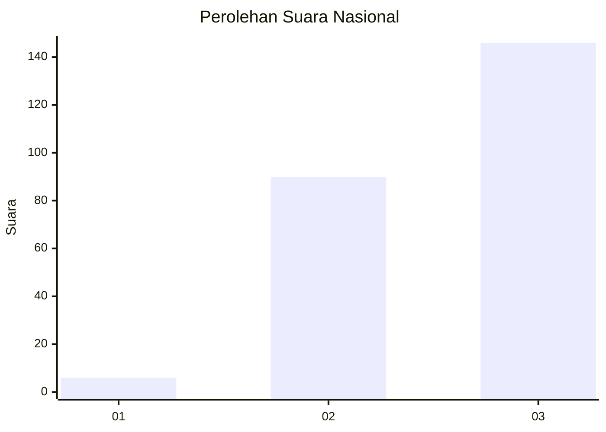
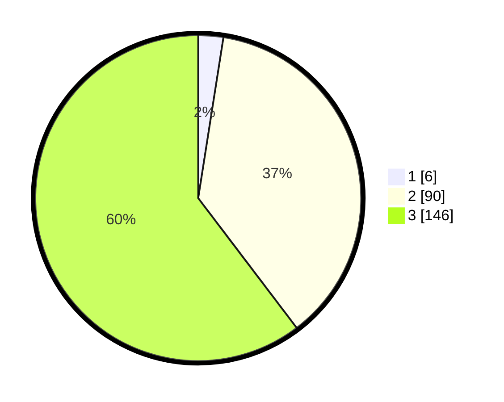

# Hasil

## Grafik

## Tabel

| No.    | Nama Paslon    | Suara | Suara (raw) | Persentase |
|:------ |:-------------- | -----:| -----------:| ----------:|
| 100025 | ANIES MUHAIMIN | 6     | [6][p-1]    | 2,48       |
| 100026 | PRABOWO GIBRAN | 90    | [90][p-2]   | 37,19      |
| 100027 | GANJAR MAHFUD  | 146   | [146][p-3]  | 60,33      |

[p-1]: https://github.com/gigit-pemilu/pemilu-2024/blob/main/pilpres/hitung-suara/sub/31-dki-jakarta/sub/73-jakarta-barat/sub/08-kembangan/sub/1006-kembangan-selatan/sub/083-tps/sub/paslon-1.txt
[p-2]: https://github.com/gigit-pemilu/pemilu-2024/blob/main/pilpres/hitung-suara/sub/31-dki-jakarta/sub/73-jakarta-barat/sub/08-kembangan/sub/1006-kembangan-selatan/sub/083-tps/sub/paslon-2.txt
[p-3]: https://github.com/gigit-pemilu/pemilu-2024/blob/main/pilpres/hitung-suara/sub/31-dki-jakarta/sub/73-jakarta-barat/sub/08-kembangan/sub/1006-kembangan-selatan/sub/083-tps/sub/paslon-3.txt

## Foto C Plano

https://sirekap-obj-formc.kpu.go.id/bcf1/pemilu/ppwp/31/73/08/10/06/3173081006083-20240215-141516--ffbecf44-966e-4f22-8e9d-347bcbe0fee5.jpg

https://sirekap-obj-formc.kpu.go.id/bcf1/pemilu/ppwp/31/73/08/10/06/3173081006083-20240215-152140--0d5b4624-f73b-4ae6-90ac-c6c045f8f11b.jpg

https://sirekap-obj-formc.kpu.go.id/bcf1/pemilu/ppwp/31/73/08/10/06/3173081006083-20240215-155657--4ebbd0bc-ad82-42d5-b660-6b95e9385817.jpg

## Metadata

| Key        | Value               |
| ---------- | ------------------- |
| Time Stamp | 2024-02-16 16:25:10 |

