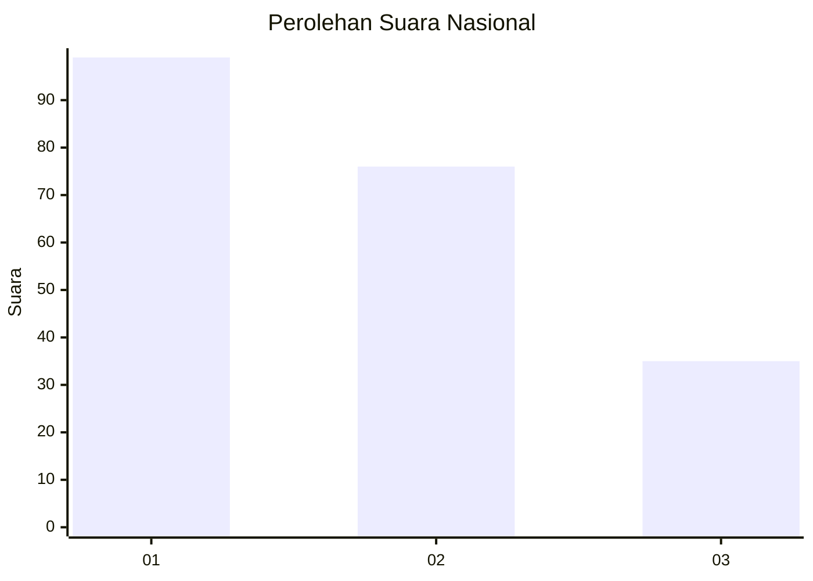
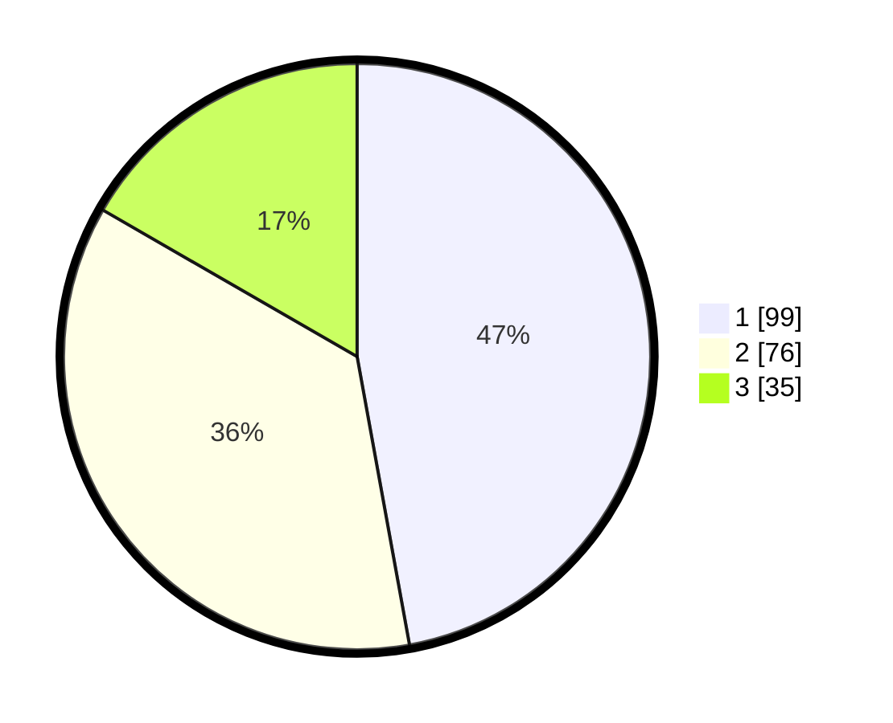

# Hasil

## Grafik

## Tabel

| No.    | Nama Paslon    | Suara | Suara (raw) | Persentase |
|:------ |:-------------- | -----:| -----------:| ----------:|
| 100025 | ANIES MUHAIMIN | 99    | [99][p-1]   | 47,14      |
| 100026 | PRABOWO GIBRAN | 76    | [76][p-2]   | 36,19      |
| 100027 | GANJAR MAHFUD  | 35    | [35][p-3]   | 16,67      |

[p-1]: https://github.com/gigit-pemilu/pemilu-2024/blob/main/pilpres/hitung-suara/sub/31-dki-jakarta/sub/73-jakarta-barat/sub/08-kembangan/sub/1006-kembangan-selatan/sub/090-tps/sub/paslon-1.txt
[p-2]: https://github.com/gigit-pemilu/pemilu-2024/blob/main/pilpres/hitung-suara/sub/31-dki-jakarta/sub/73-jakarta-barat/sub/08-kembangan/sub/1006-kembangan-selatan/sub/090-tps/sub/paslon-2.txt
[p-3]: https://github.com/gigit-pemilu/pemilu-2024/blob/main/pilpres/hitung-suara/sub/31-dki-jakarta/sub/73-jakarta-barat/sub/08-kembangan/sub/1006-kembangan-selatan/sub/090-tps/sub/paslon-3.txt

## Foto C Plano

https://sirekap-obj-formc.kpu.go.id/90ca/pemilu/ppwp/31/73/08/10/06/3173081006090-20240214-235203--9afd9c9c-74cb-4459-9de3-dfae3f066f59.jpg

https://sirekap-obj-formc.kpu.go.id/90ca/pemilu/ppwp/31/73/08/10/06/3173081006090-20240215-000804--34da5dcd-7e36-4413-8fe6-8c5034e3c0cc.jpg

https://sirekap-obj-formc.kpu.go.id/90ca/pemilu/ppwp/31/73/08/10/06/3173081006090-20240215-000455--26876abf-bddd-4c55-b7d2-910049b3bf75.jpg

## Metadata

| Key        | Value               |
| ---------- | ------------------- |
| Time Stamp | 2024-02-16 16:25:10 |

