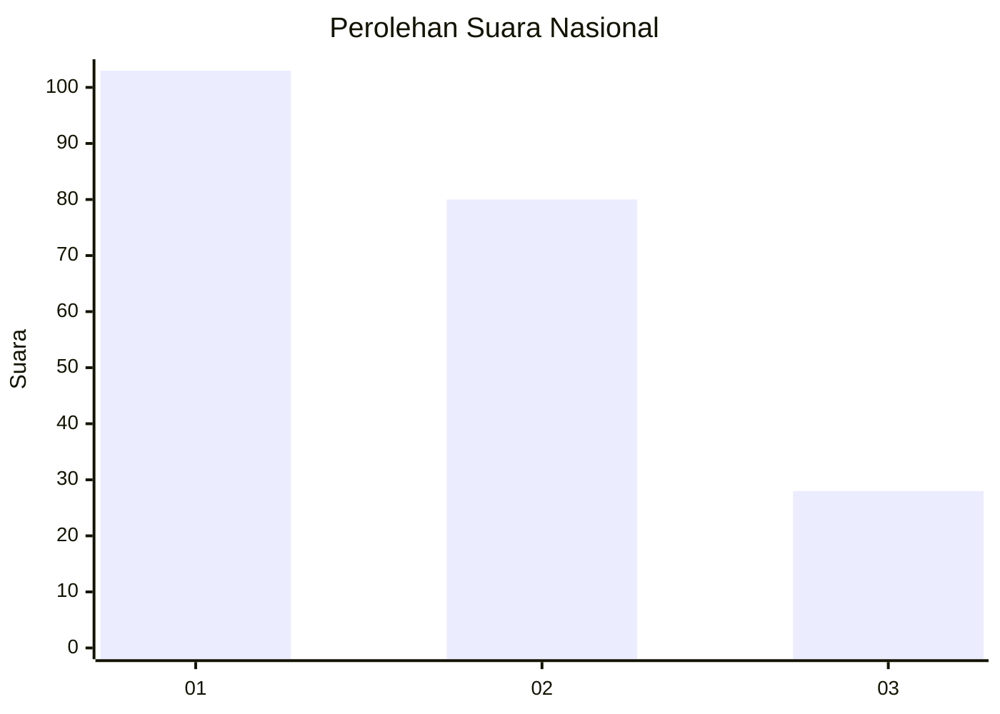
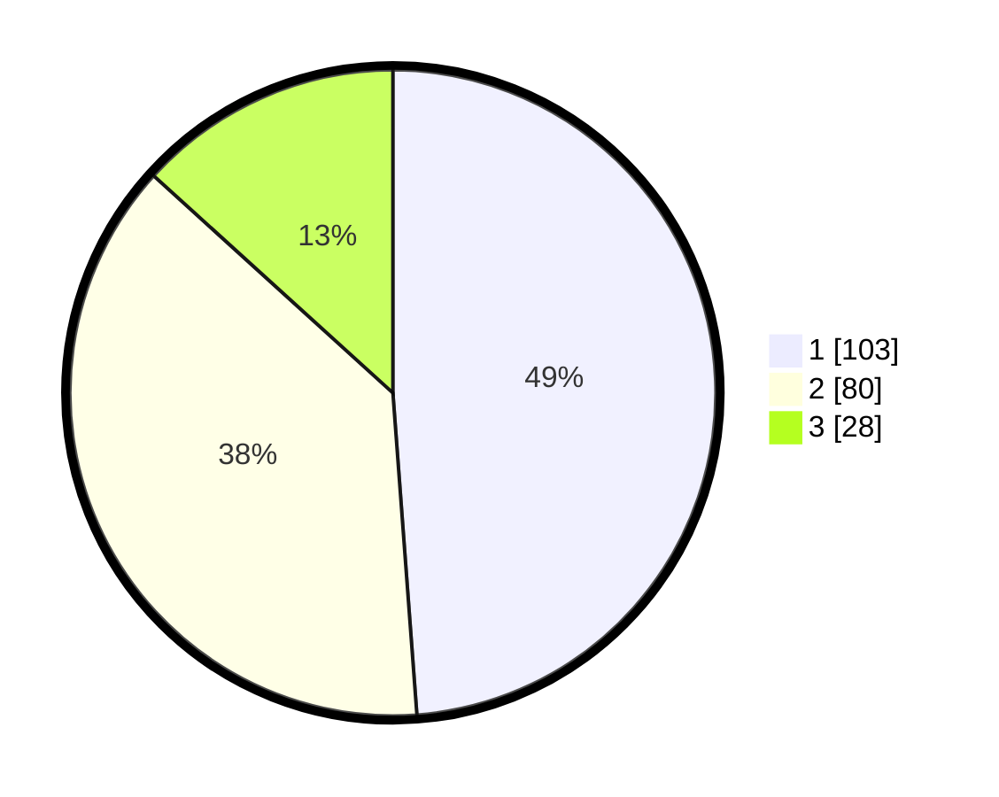

# Hasil

## Grafik

## Tabel

| No.    | Nama Paslon    | Suara | Suara (raw) | Persentase |
|:------ |:-------------- | -----:| -----------:| ----------:|
| 100025 | ANIES MUHAIMIN | 103   | [103][p-1]  | 48,82      |
| 100026 | PRABOWO GIBRAN | 80    | [80][p-2]   | 37,91      |
| 100027 | GANJAR MAHFUD  | 28    | [28][p-3]   | 13,27      |

[p-1]: https://github.com/gigit-pemilu/pemilu-2024/blob/main/pilpres/hitung-suara/sub/31-dki-jakarta/sub/73-jakarta-barat/sub/08-kembangan/sub/1006-kembangan-selatan/sub/091-tps/sub/paslon-1.txt
[p-2]: https://github.com/gigit-pemilu/pemilu-2024/blob/main/pilpres/hitung-suara/sub/31-dki-jakarta/sub/73-jakarta-barat/sub/08-kembangan/sub/1006-kembangan-selatan/sub/091-tps/sub/paslon-2.txt
[p-3]: https://github.com/gigit-pemilu/pemilu-2024/blob/main/pilpres/hitung-suara/sub/31-dki-jakarta/sub/73-jakarta-barat/sub/08-kembangan/sub/1006-kembangan-selatan/sub/091-tps/sub/paslon-3.txt

## Foto C Plano

https://sirekap-obj-formc.kpu.go.id/9f39/pemilu/ppwp/31/73/08/10/06/3173081006091-20240215-001405--0a5cf0bf-834d-475c-8c09-c5e4764a4858.jpg

https://sirekap-obj-formc.kpu.go.id/9f39/pemilu/ppwp/31/73/08/10/06/3173081006091-20240215-001502--b3d9bd2e-9336-44f2-a68a-7bd672022756.jpg

https://sirekap-obj-formc.kpu.go.id/9f39/pemilu/ppwp/31/73/08/10/06/3173081006091-20240215-002129--81fc2d66-68a0-4876-ae06-62336afc46f9.jpg

## Metadata

| Key        | Value               |
| ---------- | ------------------- |
| Time Stamp | 2024-02-16 16:25:10 |

