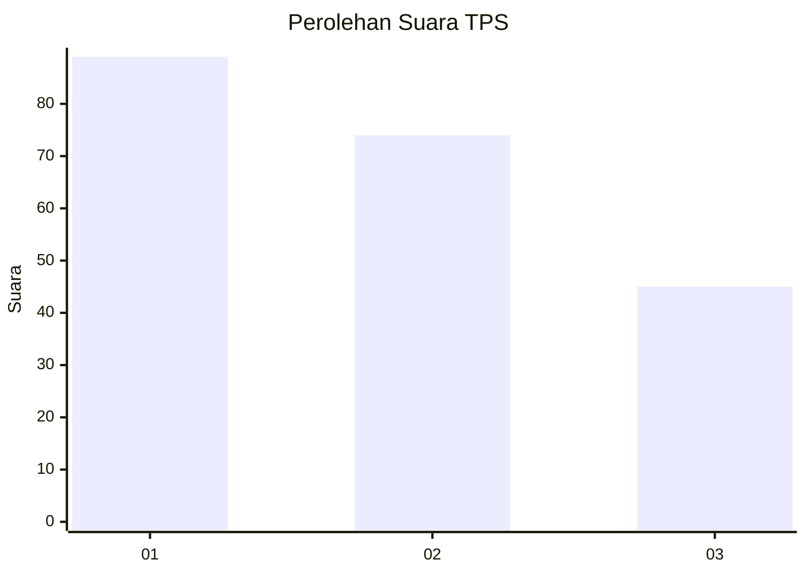
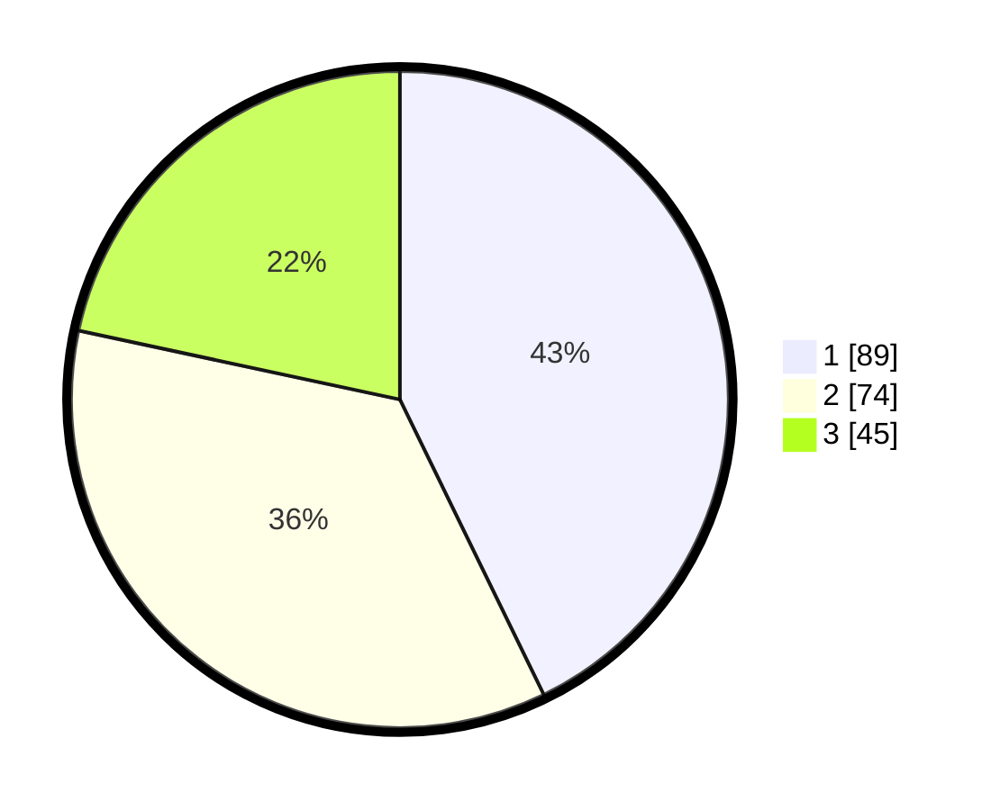

# Hasil

## Grafik

## Tabel

| No. | Nama Paslon    | Suara | Suara (raw) | Persentase |
|:--- |:-------------- | -----:| -----------:| ----------:|
| 1   | ANIES MUHAIMIN | 89    | [89][p-1]   | 42,79      |
| 2   | PRABOWO GIBRAN | 74    | [74][p-2]   | 35,58      |
| 3   | GANJAR MAHFUD  | 45    | [45][p-3]   | 21,63      |

[p-1]: https://github.com/gigit-pemilu/pemilu-2024-31-dki-jakarta/blob/main/pilpres/hitung-suara/sub/31-dki-jakarta/sub/74-jakarta-selatan/sub/01-tebet/sub/1001-tebet-timur/sub/001-tps/sub/paslon-1.txt
[p-2]: https://github.com/gigit-pemilu/pemilu-2024-31-dki-jakarta/blob/main/pilpres/hitung-suara/sub/31-dki-jakarta/sub/74-jakarta-selatan/sub/01-tebet/sub/1001-tebet-timur/sub/001-tps/sub/paslon-2.txt
[p-3]: https://github.com/gigit-pemilu/pemilu-2024-31-dki-jakarta/blob/main/pilpres/hitung-suara/sub/31-dki-jakarta/sub/74-jakarta-selatan/sub/01-tebet/sub/1001-tebet-timur/sub/001-tps/sub/paslon-3.txt

## Foto C Plano

https://sirekap-obj-formc.kpu.go.id/68bc/pemilu/ppwp/31/74/01/10/01/3174011001001-20240221-110907--2935bab8-012d-4eec-84c0-ac7a95e49666.jpg

https://sirekap-obj-formc.kpu.go.id/68bc/pemilu/ppwp/31/74/01/10/01/3174011001001-20240221-111023--b08bf476-94ce-4e9b-bc82-8f3ed94ba093.jpg

https://sirekap-obj-formc.kpu.go.id/68bc/pemilu/ppwp/31/74/01/10/01/3174011001001-20240221-111040--4b6fcc93-0a3a-46fd-92ff-45b8cd2fed28.jpg

## Metadata

| Key        | Value               |
| ---------- | ------------------- |
| Time Stamp | 2024-02-24 22:31:28 |

