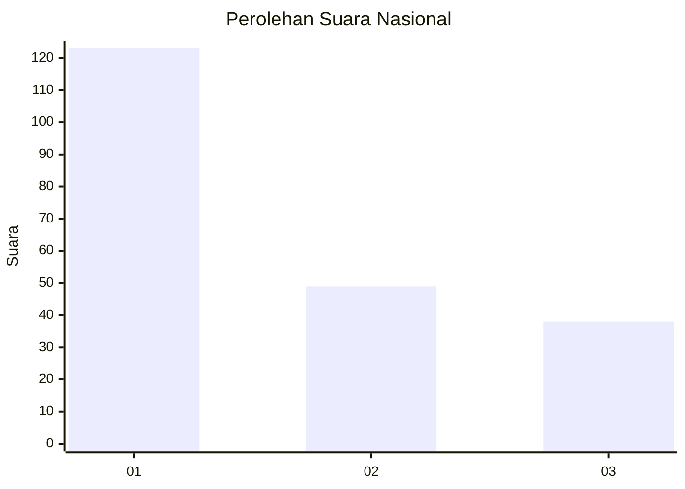
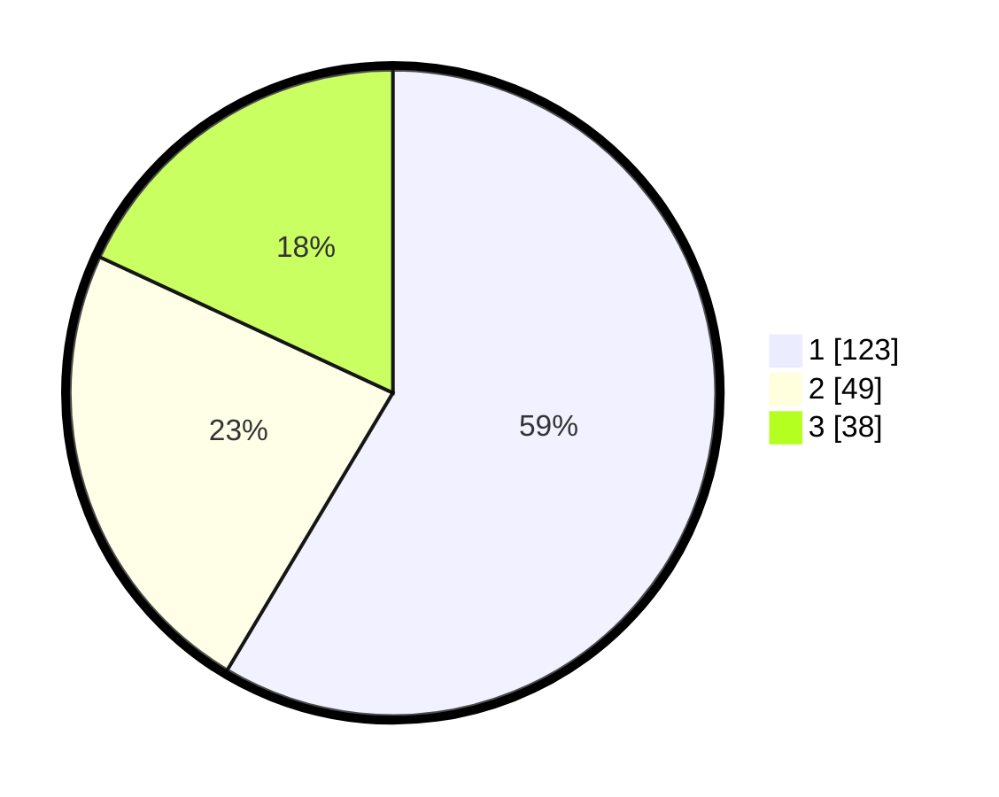

# Hasil

## Grafik

## Tabel

| No.    | Nama Paslon    | Suara | Suara (raw) | Persentase |
|:------ |:-------------- | -----:| -----------:| ----------:|
| 100025 | ANIES MUHAIMIN | 123   | [123][p-1]  | 58,57      |
| 100026 | PRABOWO GIBRAN | 49    | [49][p-2]   | 23,33      |
| 100027 | GANJAR MAHFUD  | 38    | [38][p-3]   | 18,10      |

[p-1]: https://github.com/gigit-pemilu/pemilu-2024/blob/main/pilpres/hitung-suara/sub/31-dki-jakarta/sub/74-jakarta-selatan/sub/01-tebet/sub/1001-tebet-timur/sub/003-tps/sub/paslon-1.txt
[p-2]: https://github.com/gigit-pemilu/pemilu-2024/blob/main/pilpres/hitung-suara/sub/31-dki-jakarta/sub/74-jakarta-selatan/sub/01-tebet/sub/1001-tebet-timur/sub/003-tps/sub/paslon-2.txt
[p-3]: https://github.com/gigit-pemilu/pemilu-2024/blob/main/pilpres/hitung-suara/sub/31-dki-jakarta/sub/74-jakarta-selatan/sub/01-tebet/sub/1001-tebet-timur/sub/003-tps/sub/paslon-3.txt

## Foto C Plano

https://sirekap-obj-formc.kpu.go.id/2213/pemilu/ppwp/31/74/01/10/01/3174011001003-20240215-103357--e5955a3b-0b55-4eaf-b4ab-ba0b31f3af04.jpg

https://sirekap-obj-formc.kpu.go.id/2213/pemilu/ppwp/31/74/01/10/01/3174011001003-20240215-103422--5dce3fbb-9fa2-45bd-b058-3b4005a1ee68.jpg

https://sirekap-obj-formc.kpu.go.id/2213/pemilu/ppwp/31/74/01/10/01/3174011001003-20240215-103411--1e478404-4641-461b-8c4c-a3ec3ca92cdc.jpg

## Metadata

| Key        | Value               |
| ---------- | ------------------- |
| Time Stamp | 2024-02-15 15:00:29 |

## DATA PEMILIH TETAP

Jumlah pemilih dalam DPT: **246**.
 * L: **111**.
 * P: **135**.

## DATA PENGGUNA HAK PILIH

Jumlah pengguna hak pilih dalam DPT: **199**.
 * L: **88**.
 * P: **111**.

Jumlah pengguna hak pilih dalam DPTb: **15**.
 * L: **4**.
 * P: **11**.

Jumlah pengguna hak pilih dalam DPK: **2**.
 * L: **0**.
 * P: **2**.

Jumlah pengguna hak pilih: **216**.
 * L: **92**.
 * P: **124**.

## JUMLAH SUARA SAH DAN TIDAK SAH

JUMLAH SELURUH SUARA SAH: **210**.

JUMLAH SUARA TIDAK SAH: **6**.

JUMLAH SELURUH SUARA SAH DAN SUARA TIDAK SAH: **216**.

