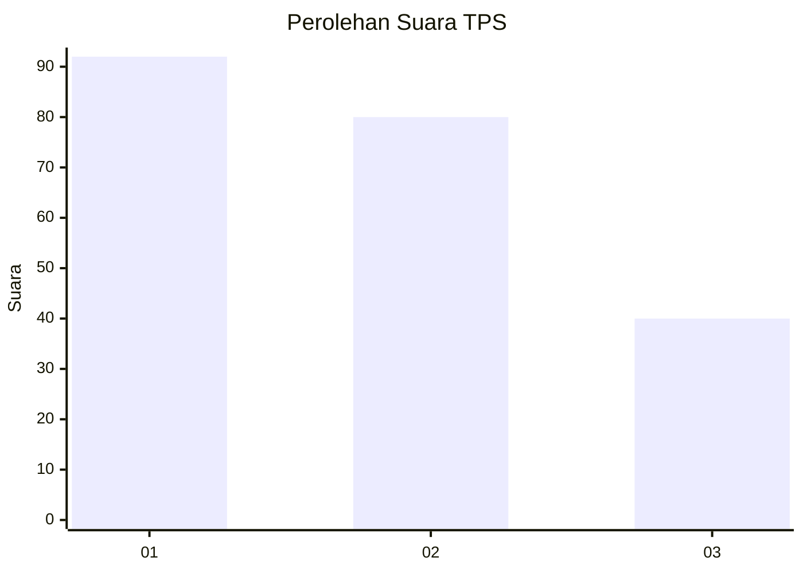
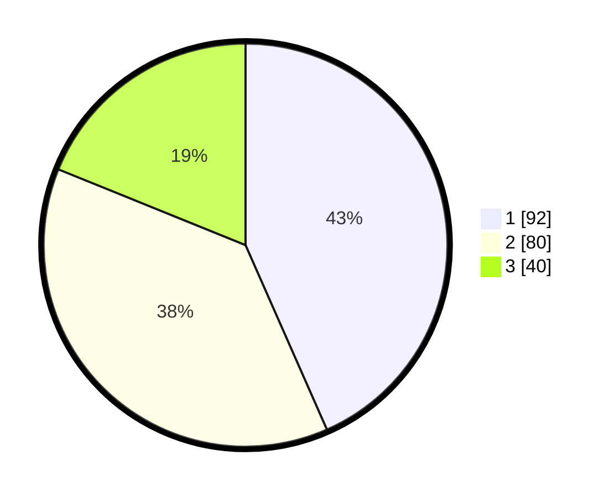

# Hasil

## Grafik

## Tabel

| No. | Nama Paslon    | Suara | Suara (raw) | Persentase |
|:--- |:-------------- | -----:| -----------:| ----------:|
| 1   | ANIES MUHAIMIN | 92    | [92][p-1]   | 43,40      |
| 2   | PRABOWO GIBRAN | 80    | [80][p-2]   | 37,74      |
| 3   | GANJAR MAHFUD  | 40    | [40][p-3]   | 18,87      |

[p-1]: https://github.com/gigit-pemilu/pemilu-2024-31-dki-jakarta/blob/main/pilpres/hitung-suara/sub/31-dki-jakarta/sub/74-jakarta-selatan/sub/01-tebet/sub/1001-tebet-timur/sub/010-tps/sub/paslon-1.txt
[p-2]: https://github.com/gigit-pemilu/pemilu-2024-31-dki-jakarta/blob/main/pilpres/hitung-suara/sub/31-dki-jakarta/sub/74-jakarta-selatan/sub/01-tebet/sub/1001-tebet-timur/sub/010-tps/sub/paslon-2.txt
[p-3]: https://github.com/gigit-pemilu/pemilu-2024-31-dki-jakarta/blob/main/pilpres/hitung-suara/sub/31-dki-jakarta/sub/74-jakarta-selatan/sub/01-tebet/sub/1001-tebet-timur/sub/010-tps/sub/paslon-3.txt

## Foto C Plano

https://sirekap-obj-formc.kpu.go.id/84a9/pemilu/ppwp/31/74/01/10/01/3174011001010-20240215-190833--8694ca1e-b96c-4901-89be-06025076e6e7.jpg

https://sirekap-obj-formc.kpu.go.id/84a9/pemilu/ppwp/31/74/01/10/01/3174011001010-20240214-155410--6f356b9e-67f2-4845-84ea-8cbd943b4dff.jpg

https://sirekap-obj-formc.kpu.go.id/84a9/pemilu/ppwp/31/74/01/10/01/3174011001010-20240214-155545--18f68da3-0b3b-4739-88a7-840556ee98cd.jpg

## Metadata

| Key        | Value               |
| ---------- | ------------------- |
| Time Stamp | 2024-02-24 22:31:28 |

