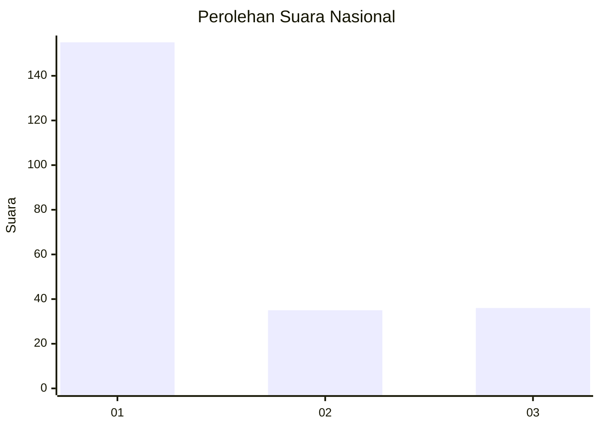
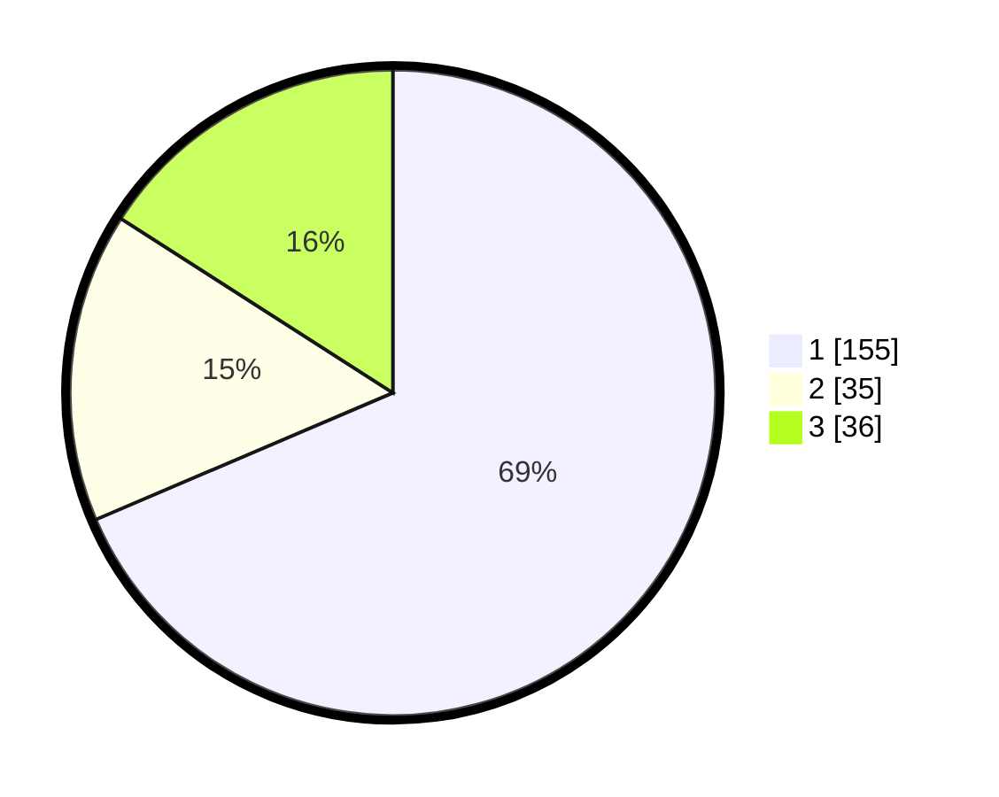

# Hasil

## Grafik

## Tabel

| No.    | Nama Paslon    | Suara | Suara (raw) | Persentase |
|:------ |:-------------- | -----:| -----------:| ----------:|
| 100025 | ANIES MUHAIMIN | 155   | [155][p-1]  | 68,58      |
| 100026 | PRABOWO GIBRAN | 35    | [35][p-2]   | 15,49      |
| 100027 | GANJAR MAHFUD  | 36    | [36][p-3]   | 15,93      |

[p-1]: https://github.com/gigit-pemilu/pemilu-2024/blob/main/pilpres/hitung-suara/sub/31-dki-jakarta/sub/74-jakarta-selatan/sub/01-tebet/sub/1001-tebet-timur/sub/017-tps/sub/paslon-1.txt
[p-2]: https://github.com/gigit-pemilu/pemilu-2024/blob/main/pilpres/hitung-suara/sub/31-dki-jakarta/sub/74-jakarta-selatan/sub/01-tebet/sub/1001-tebet-timur/sub/017-tps/sub/paslon-2.txt
[p-3]: https://github.com/gigit-pemilu/pemilu-2024/blob/main/pilpres/hitung-suara/sub/31-dki-jakarta/sub/74-jakarta-selatan/sub/01-tebet/sub/1001-tebet-timur/sub/017-tps/sub/paslon-3.txt

## Foto C Plano

https://sirekap-obj-formc.kpu.go.id/b7c2/pemilu/ppwp/31/74/01/10/01/3174011001017-20240214-200653--56de00cd-8d22-49e8-b352-f2e12b1deb70.jpg

https://sirekap-obj-formc.kpu.go.id/b7c2/pemilu/ppwp/31/74/01/10/01/3174011001017-20240214-192611--3d20dfc2-8ab0-45fd-a767-6cb49d963a27.jpg

https://sirekap-obj-formc.kpu.go.id/b7c2/pemilu/ppwp/31/74/01/10/01/3174011001017-20240214-192635--00194f2e-9a7a-489b-bc77-e571515d341b.jpg

## Metadata

| Key        | Value               |
| ---------- | ------------------- |
| Time Stamp | 2024-02-15 15:00:29 |

