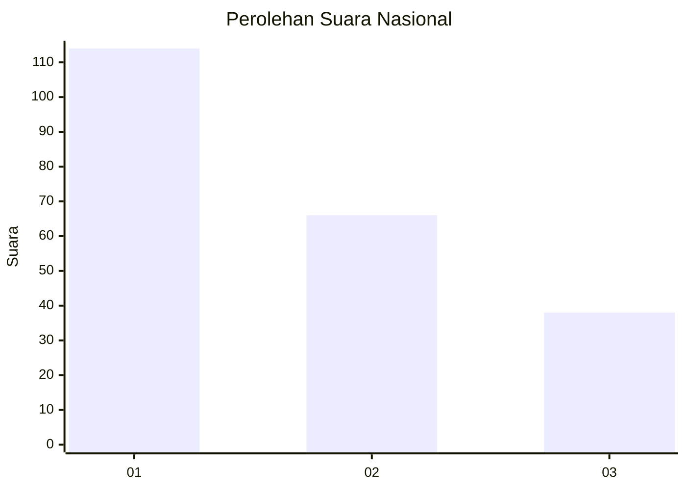
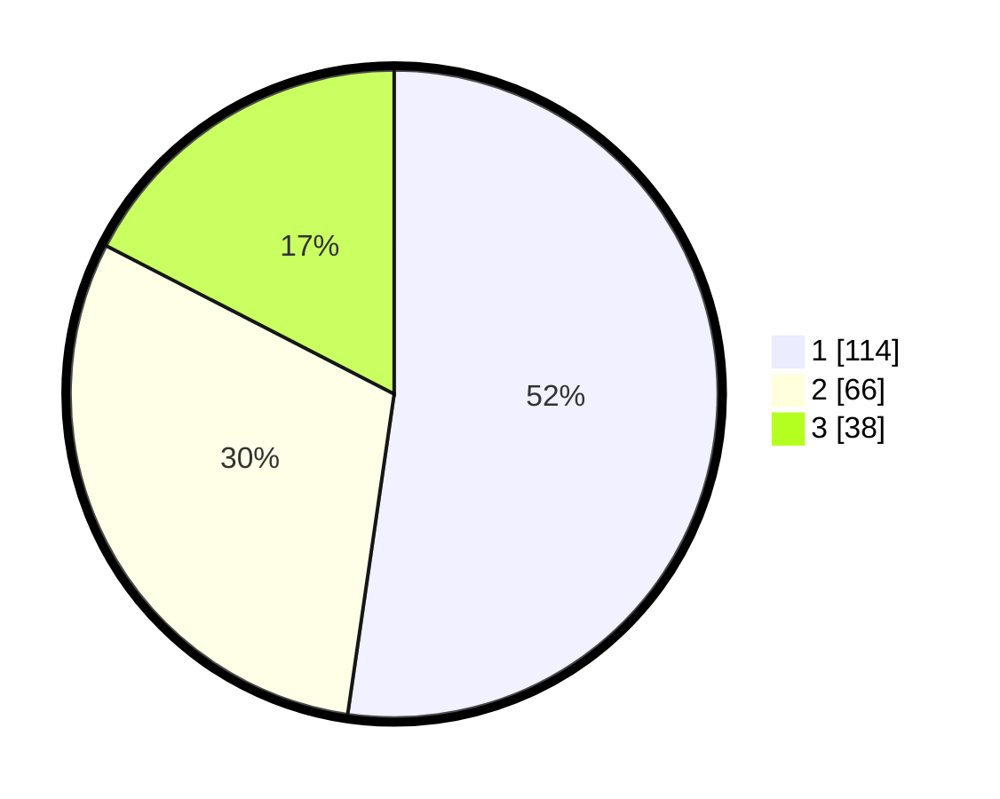

# Hasil

## Grafik

## Tabel

| No.    | Nama Paslon    | Suara | Suara (raw) | Persentase |
|:------ |:-------------- | -----:| -----------:| ----------:|
| 100025 | ANIES MUHAIMIN | 114   | [114][p-1]  | 52,29      |
| 100026 | PRABOWO GIBRAN | 66    | [66][p-2]   | 30,28      |
| 100027 | GANJAR MAHFUD  | 38    | [38][p-3]   | 17,43      |

[p-1]: https://github.com/gigit-pemilu/pemilu-2024/blob/main/pilpres/hitung-suara/sub/31-dki-jakarta/sub/74-jakarta-selatan/sub/01-tebet/sub/1001-tebet-timur/sub/020-tps/sub/paslon-1.txt
[p-2]: https://github.com/gigit-pemilu/pemilu-2024/blob/main/pilpres/hitung-suara/sub/31-dki-jakarta/sub/74-jakarta-selatan/sub/01-tebet/sub/1001-tebet-timur/sub/020-tps/sub/paslon-2.txt
[p-3]: https://github.com/gigit-pemilu/pemilu-2024/blob/main/pilpres/hitung-suara/sub/31-dki-jakarta/sub/74-jakarta-selatan/sub/01-tebet/sub/1001-tebet-timur/sub/020-tps/sub/paslon-3.txt

## Foto C Plano

https://sirekap-obj-formc.kpu.go.id/d43f/pemilu/ppwp/31/74/01/10/01/3174011001020-20240214-193158--b4e188ab-0c23-4aed-90e1-3c6f0e14b1ed.jpg

https://sirekap-obj-formc.kpu.go.id/d43f/pemilu/ppwp/31/74/01/10/01/3174011001020-20240214-193554--af9f04ad-7042-4590-81f1-43704ccb4dd5.jpg

https://sirekap-obj-formc.kpu.go.id/d43f/pemilu/ppwp/31/74/01/10/01/3174011001020-20240214-193651--343463b9-d92b-45ee-8711-3bb7ce2f506f.jpg

## Metadata

| Key        | Value               |
| ---------- | ------------------- |
| Time Stamp | 2024-02-24 22:31:28 |

