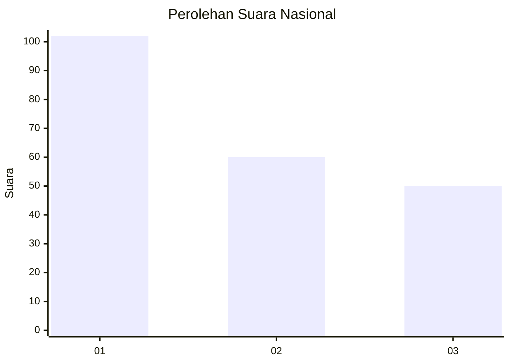
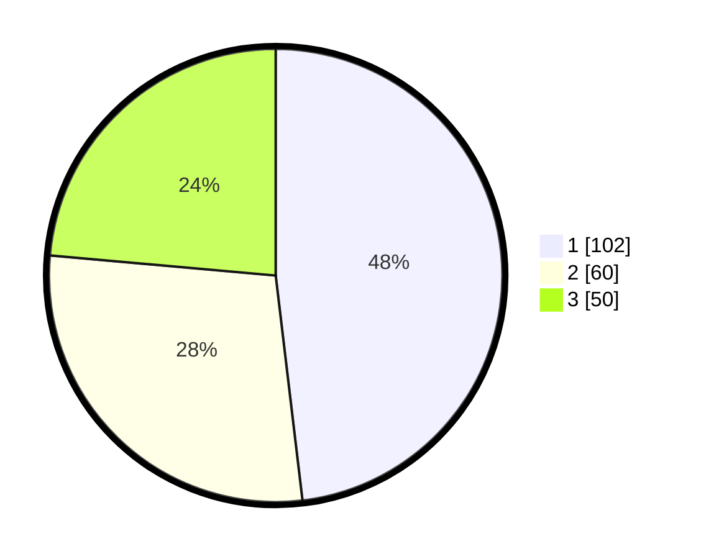

# Hasil

## Grafik

## Tabel

| No.    | Nama Paslon    | Suara | Suara (raw) | Persentase |
|:------ |:-------------- | -----:| -----------:| ----------:|
| 100025 | ANIES MUHAIMIN | 102   | [102][p-1]  | 48,11      |
| 100026 | PRABOWO GIBRAN | 60    | [60][p-2]   | 28,30      |
| 100027 | GANJAR MAHFUD  | 50    | [50][p-3]   | 23,58      |

[p-1]: https://github.com/gigit-pemilu/pemilu-2024/blob/main/pilpres/hitung-suara/sub/31-dki-jakarta/sub/74-jakarta-selatan/sub/01-tebet/sub/1001-tebet-timur/sub/038-tps/sub/paslon-1.txt
[p-2]: https://github.com/gigit-pemilu/pemilu-2024/blob/main/pilpres/hitung-suara/sub/31-dki-jakarta/sub/74-jakarta-selatan/sub/01-tebet/sub/1001-tebet-timur/sub/038-tps/sub/paslon-2.txt
[p-3]: https://github.com/gigit-pemilu/pemilu-2024/blob/main/pilpres/hitung-suara/sub/31-dki-jakarta/sub/74-jakarta-selatan/sub/01-tebet/sub/1001-tebet-timur/sub/038-tps/sub/paslon-3.txt

## Foto C Plano

https://sirekap-obj-formc.kpu.go.id/faa5/pemilu/ppwp/31/74/01/10/01/3174011001038-20240214-185919--db895e02-ed1d-4f30-bb12-032d5b140756.jpg

https://sirekap-obj-formc.kpu.go.id/faa5/pemilu/ppwp/31/74/01/10/01/3174011001038-20240214-184603--5f3662bc-1b14-429c-bf8b-50eb3ad0027e.jpg

https://sirekap-obj-formc.kpu.go.id/faa5/pemilu/ppwp/31/74/01/10/01/3174011001038-20240214-190211--e5944af1-0d47-42ba-92f9-0be34f791df6.jpg

## Metadata

| Key        | Value               |
| ---------- | ------------------- |
| Time Stamp | 2024-02-26 09:00:00 |

