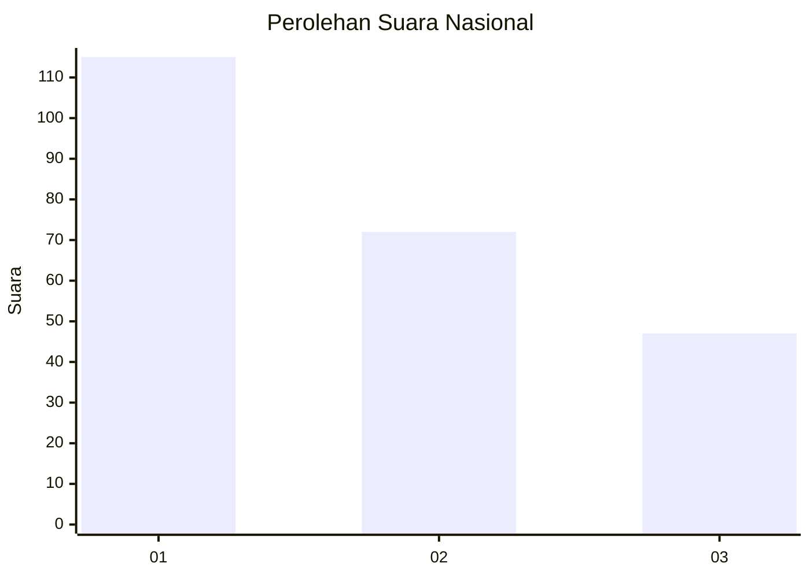
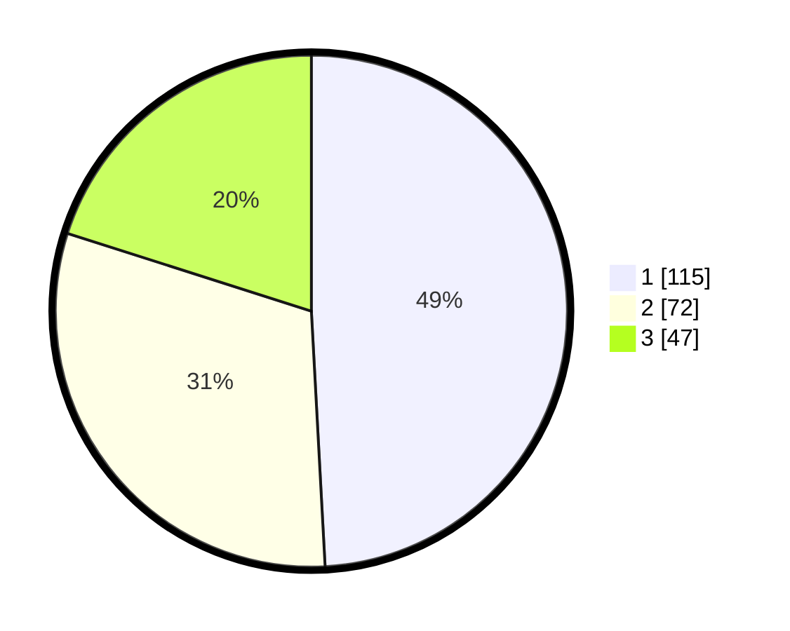

# Hasil

## Grafik

## Tabel

| No.    | Nama Paslon    | Suara | Suara (raw) | Persentase |
|:------ |:-------------- | -----:| -----------:| ----------:|
| 100025 | ANIES MUHAIMIN | 115   | [115][p-1]  | 49,15      |
| 100026 | PRABOWO GIBRAN | 72    | [72][p-2]   | 30,77      |
| 100027 | GANJAR MAHFUD  | 47    | [47][p-3]   | 20,09      |

[p-1]: https://github.com/gigit-pemilu/pemilu-2024/blob/main/pilpres/hitung-suara/sub/31-dki-jakarta/sub/74-jakarta-selatan/sub/01-tebet/sub/1001-tebet-timur/sub/049-tps/sub/paslon-1.txt
[p-2]: https://github.com/gigit-pemilu/pemilu-2024/blob/main/pilpres/hitung-suara/sub/31-dki-jakarta/sub/74-jakarta-selatan/sub/01-tebet/sub/1001-tebet-timur/sub/049-tps/sub/paslon-2.txt
[p-3]: https://github.com/gigit-pemilu/pemilu-2024/blob/main/pilpres/hitung-suara/sub/31-dki-jakarta/sub/74-jakarta-selatan/sub/01-tebet/sub/1001-tebet-timur/sub/049-tps/sub/paslon-3.txt

## Foto C Plano

https://sirekap-obj-formc.kpu.go.id/a61f/pemilu/ppwp/31/74/01/10/01/3174011001049-20240215-015317--1abbfe39-1ee9-4133-8c78-c3789ba6d2ed.jpg

https://sirekap-obj-formc.kpu.go.id/a61f/pemilu/ppwp/31/74/01/10/01/3174011001049-20240215-015403--f3ad8842-11e0-49ab-a301-3cc1c54c472b.jpg

https://sirekap-obj-formc.kpu.go.id/a61f/pemilu/ppwp/31/74/01/10/01/3174011001049-20240215-015431--eb6b716a-71d1-4ed8-ab48-8a50d6af2133.jpg

## Metadata

| Key        | Value               |
| ---------- | ------------------- |
| Time Stamp | 2024-02-25 12:00:00 |

