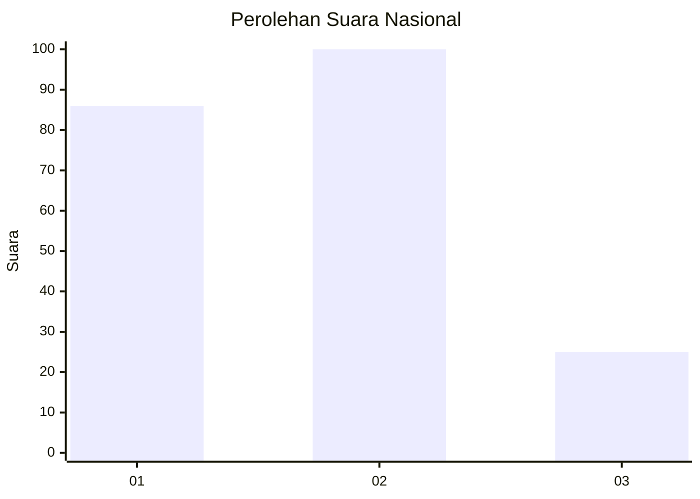
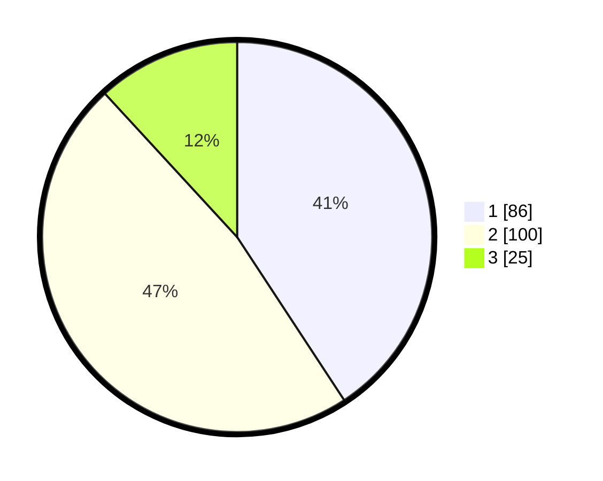

# Hasil

## Grafik

## Tabel

| No.    | Nama Paslon    | Suara | Suara (raw) | Persentase |
|:------ |:-------------- | -----:| -----------:| ----------:|
| 100025 | ANIES MUHAIMIN | 86    | [86][p-1]   | 40,76      |
| 100026 | PRABOWO GIBRAN | 100   | [100][p-2]  | 47,39      |
| 100027 | GANJAR MAHFUD  | 25    | [25][p-3]   | 11,85      |

[p-1]: https://github.com/gigit-pemilu/pemilu-2024/blob/main/pilpres/hitung-suara/sub/31-dki-jakarta/sub/74-jakarta-selatan/sub/01-tebet/sub/1001-tebet-timur/sub/053-tps/sub/paslon-1.txt
[p-2]: https://github.com/gigit-pemilu/pemilu-2024/blob/main/pilpres/hitung-suara/sub/31-dki-jakarta/sub/74-jakarta-selatan/sub/01-tebet/sub/1001-tebet-timur/sub/053-tps/sub/paslon-2.txt
[p-3]: https://github.com/gigit-pemilu/pemilu-2024/blob/main/pilpres/hitung-suara/sub/31-dki-jakarta/sub/74-jakarta-selatan/sub/01-tebet/sub/1001-tebet-timur/sub/053-tps/sub/paslon-3.txt

## Foto C Plano

https://sirekap-obj-formc.kpu.go.id/8aa4/pemilu/ppwp/31/74/01/10/01/3174011001053-20240214-220503--6de8525c-24df-4e42-9f29-1e08cb5cced2.jpg

https://sirekap-obj-formc.kpu.go.id/8aa4/pemilu/ppwp/31/74/01/10/01/3174011001053-20240214-220850--dcf76e42-8f5d-4ff8-a18c-1606eb883ac8.jpg

https://sirekap-obj-formc.kpu.go.id/8aa4/pemilu/ppwp/31/74/01/10/01/3174011001053-20240214-221030--bb5c6e13-92e8-4796-9a25-930ad137a094.jpg

## Metadata

| Key        | Value               |
| ---------- | ------------------- |
| Time Stamp | 2024-02-25 14:00:00 |

