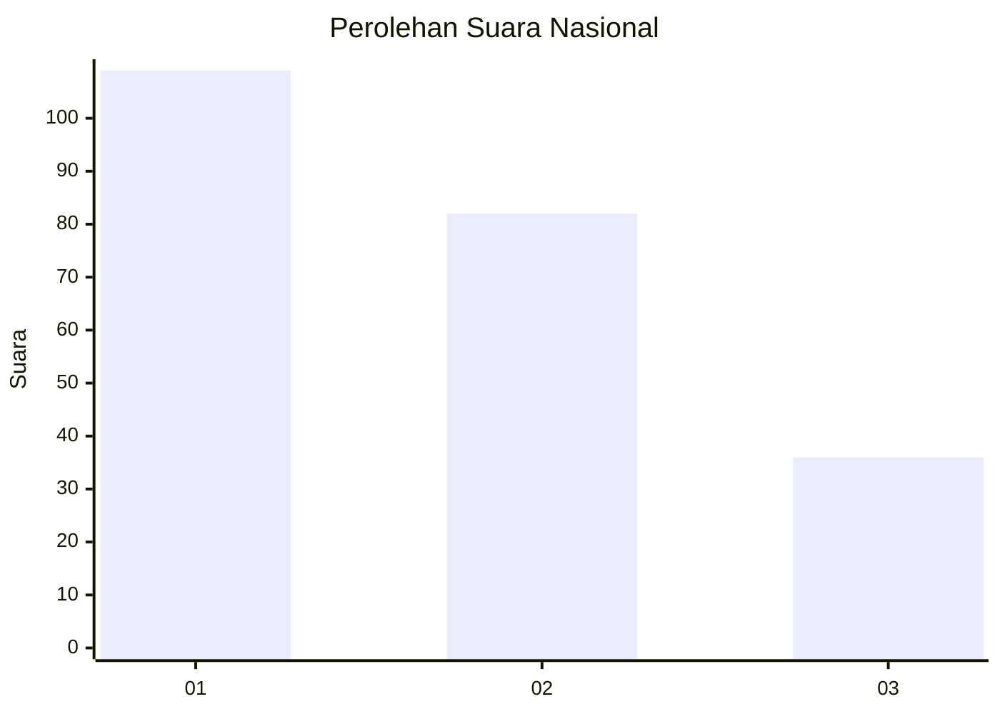
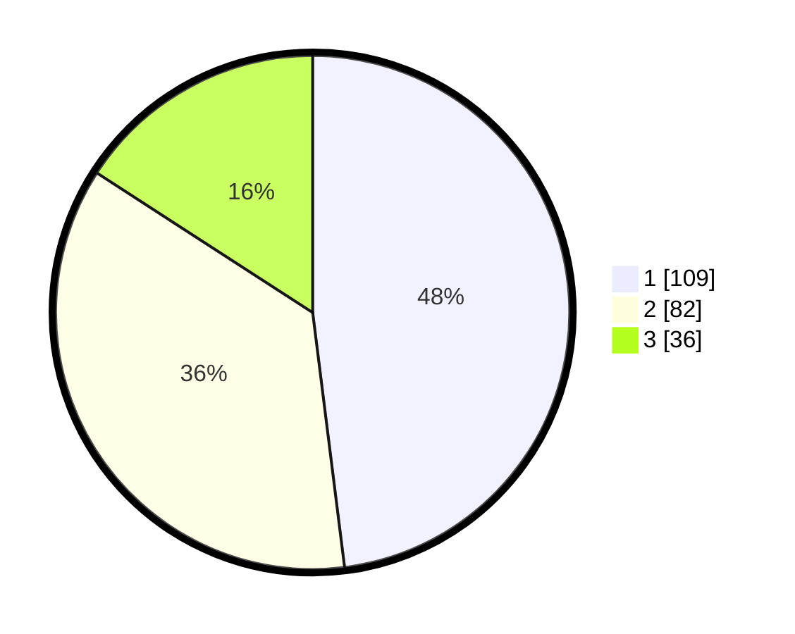

# Hasil

## Grafik

## Tabel

| No.    | Nama Paslon    | Suara | Suara (raw) | Persentase |
|:------ |:-------------- | -----:| -----------:| ----------:|
| 100025 | ANIES MUHAIMIN | 109   | [109][p-1]  | 48,02      |
| 100026 | PRABOWO GIBRAN | 82    | [82][p-2]   | 36,12      |
| 100027 | GANJAR MAHFUD  | 36    | [36][p-3]   | 15,86      |

[p-1]: https://github.com/gigit-pemilu/pemilu-2024/blob/main/pilpres/hitung-suara/sub/31-dki-jakarta/sub/74-jakarta-selatan/sub/01-tebet/sub/1002-tebet-barat/sub/012-tps/sub/paslon-1.txt
[p-2]: https://github.com/gigit-pemilu/pemilu-2024/blob/main/pilpres/hitung-suara/sub/31-dki-jakarta/sub/74-jakarta-selatan/sub/01-tebet/sub/1002-tebet-barat/sub/012-tps/sub/paslon-2.txt
[p-3]: https://github.com/gigit-pemilu/pemilu-2024/blob/main/pilpres/hitung-suara/sub/31-dki-jakarta/sub/74-jakarta-selatan/sub/01-tebet/sub/1002-tebet-barat/sub/012-tps/sub/paslon-3.txt

## Foto C Plano

https://sirekap-obj-formc.kpu.go.id/c580/pemilu/ppwp/31/74/01/10/02/3174011002012-20240215-030023--cc13d3d8-d787-4d6b-9686-0c16da4f7304.jpg

https://sirekap-obj-formc.kpu.go.id/c580/pemilu/ppwp/31/74/01/10/02/3174011002012-20240215-033451--5b1f12e2-1f14-4ef5-9d8d-c8c7b47ed6b1.jpg

https://sirekap-obj-formc.kpu.go.id/c580/pemilu/ppwp/31/74/01/10/02/3174011002012-20240215-033657--e95e856e-87c5-4c7e-a8f7-b2410f6494d3.jpg

## Metadata

| Key        | Value               |
| ---------- | ------------------- |
| Time Stamp | 2024-02-25 18:00:00 |

