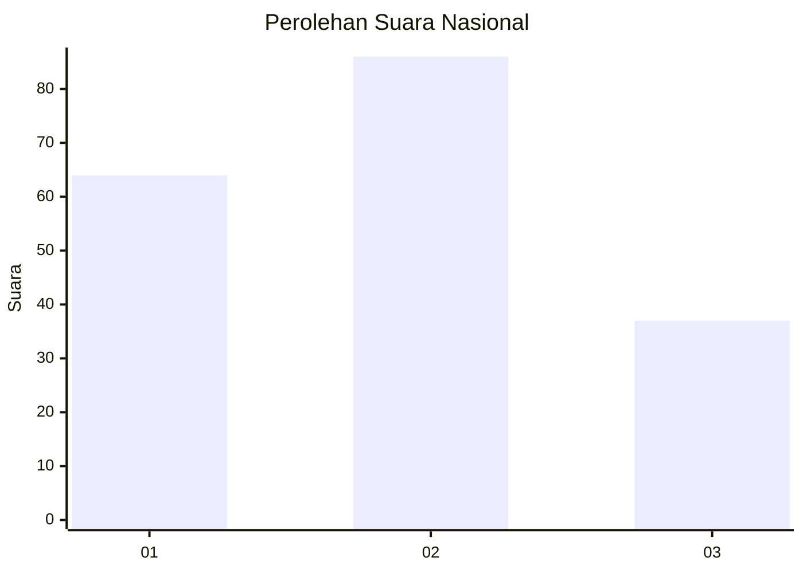
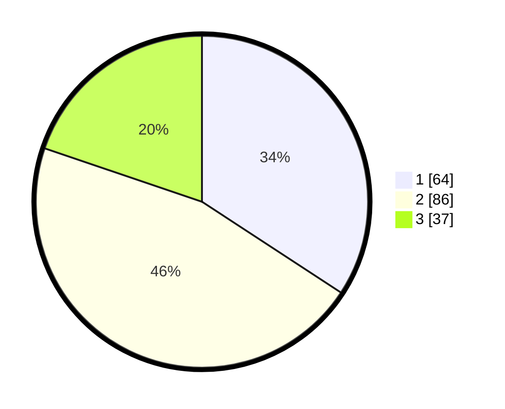

# Hasil

## Grafik

## Tabel

| No.    | Nama Paslon    | Suara | Suara (raw) | Persentase |
|:------ |:-------------- | -----:| -----------:| ----------:|
| 100025 | ANIES MUHAIMIN | 64    | [64][p-1]   | 34,22      |
| 100026 | PRABOWO GIBRAN | 86    | [86][p-2]   | 45,99      |
| 100027 | GANJAR MAHFUD  | 37    | [37][p-3]   | 19,79      |

[p-1]: https://github.com/gigit-pemilu/pemilu-2024/blob/main/pilpres/hitung-suara/sub/31-dki-jakarta/sub/74-jakarta-selatan/sub/01-tebet/sub/1002-tebet-barat/sub/032-tps/sub/paslon-1.txt
[p-2]: https://github.com/gigit-pemilu/pemilu-2024/blob/main/pilpres/hitung-suara/sub/31-dki-jakarta/sub/74-jakarta-selatan/sub/01-tebet/sub/1002-tebet-barat/sub/032-tps/sub/paslon-2.txt
[p-3]: https://github.com/gigit-pemilu/pemilu-2024/blob/main/pilpres/hitung-suara/sub/31-dki-jakarta/sub/74-jakarta-selatan/sub/01-tebet/sub/1002-tebet-barat/sub/032-tps/sub/paslon-3.txt

## Foto C Plano

https://sirekap-obj-formc.kpu.go.id/648f/pemilu/ppwp/31/74/01/10/02/3174011002032-20240214-234616--298cff0b-346c-4d6e-ab9a-643c4d2ed0e0.jpg

https://sirekap-obj-formc.kpu.go.id/648f/pemilu/ppwp/31/74/01/10/02/3174011002032-20240214-234734--84b243a6-9355-4480-8f21-24038a6df2af.jpg

https://sirekap-obj-formc.kpu.go.id/648f/pemilu/ppwp/31/74/01/10/02/3174011002032-20240214-235117--678bbf98-a01c-41e0-a9b9-0a05adebe05a.jpg

## Metadata

| Key        | Value               |
| ---------- | ------------------- |
| Time Stamp | 2024-02-19 06:16:00 |

